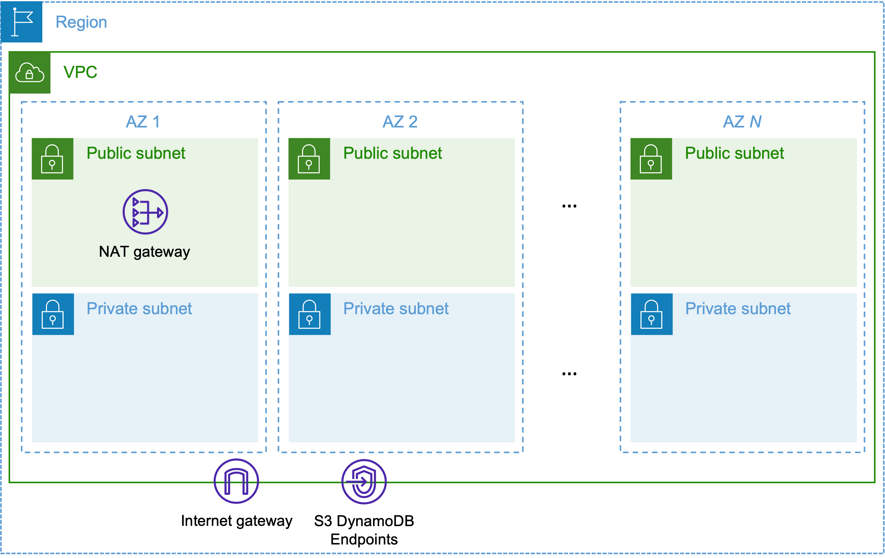
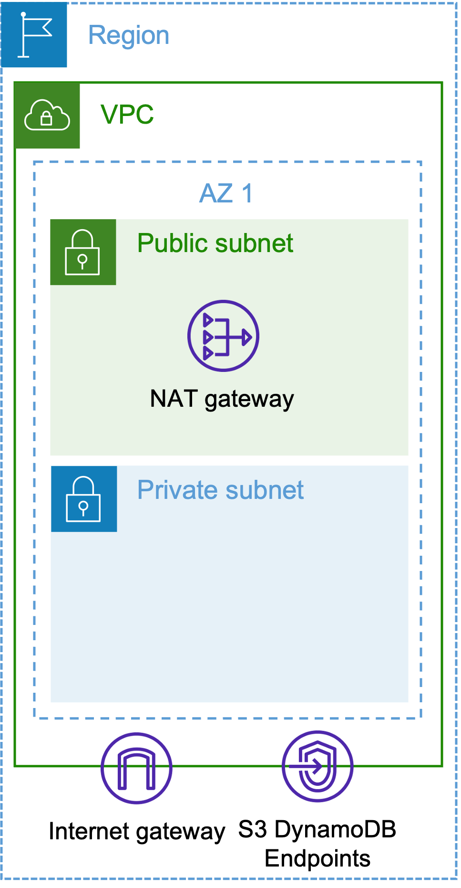

# VPC CloudFormation Stacks

You will find here a collection of cloudformation templates to deploy a VPC with all the network resources to run distributed training workloads with [AWS ParallelCluster](https://docs.aws.amazon.com/parallelcluster/latest/ug/troubleshooting-v3.html), [Amazon EKS](https://docs.aws.amazon.com/eks/latest/userguide/what-is-eks.html) or [AWS Batch](https://docs.aws.amazon.com/batch/latest/userguide/what-is-batch.html). These VPC templates can be deployed in all AWS regions.

## Architectures

The architectures each deploy a VPC, public and private subnets, gateways and endpoints. You can deploy them through the AWS Console or AWS CLI.

### 1. Quick Create


[<kbd> <br> 1-Click Deploy 🚀 <br> </kbd>](https://console.aws.amazon.com/cloudformation/home?#/stacks/quickcreate?templateURL=https%3A%2F%2Fawsome-distributed-training.s3.amazonaws.com%2Ftemplates%2F1.vpc-multi-az.yaml&stackName=ML-VPC)


### 1. Template VPC Multiple AZs

This template deploys a VPC with private subnets in multiple Availability zones. Public subnets can be optionally created in every AZ (done by default). This template serves most use cases.

- **Template file**: [`1.vpc-multi-az.yaml`](./1.vpc-multi-az.yaml)


#### List of Parameters

The templates takes parameters that are mandatory and optional, see below for more details.

| Name                    | Type        | Details                                                           |
|-------------------------|-------------|-------------------------------------------------------------------|
| `AvailabilityZones`     | Required    | Pick the AZs in which to deploy a private and a public subnet.   |
| `NumberOfAZs`           | Required    | Number of AZs in which you will deploy subnets, it must be equal to the number of AZs selected for `AvailabilityZones`.|
| `VPCName`               | Optional    | Name of the VPC and subnets you will deploy, defaults to *ML VPC*.|
| `CreatePublicSubnet`    | Optional    | Create public subnets in every selected AZ, defaults to `true`.   |
| `CreateS3Endpoint`      | Optional    | Create an S3 VPC endpoint, defaults to `true`.                    |
| `CreateDynamoDBEndpoint`| Optional    | Create a DynamoDB VPC endpoint, defaults to `true`.               |

Please note that the deployment of public subnets is optional.

#### Deploy with the AWS CLI

The command to deploy the template through the CLI is shown below. Feel free to edit for your own configuration and parameters. Please ensure that the `NumberOfAZs` parameter value matches the number of AZs that you specified.


```bash
aws cloudformation create-stack --stack-name vpc-stack-ml\
                                --template-body file://1.vpc-multi-az.yaml \
                                --parameters ParameterKey=AvailabilityZones,ParameterValue=us-east-1a\\,us-east-1b\\,us-east-1c\\,us-east-1d\\,us-east-1e\\,us-east-1f\
                                    ParameterKey=NumberOfAZs,ParameterValue=6 \
                                    ParameterKey=VPCName,ParameterValue="ML HPC VPC" \
                                --capabilities CAPABILITY_IAM
```

#### Architecture Diagram



### 2. Template VPC One AZs

This template deploys a VPC with a private subnet and a public subnet in a specific Availability Zone. This template is recommended if you want to deploy subnets in a single specific AZ.

- **Template file**: [`2.vpc-one-az.yaml`](./2.vpc-one-az.yaml)

#### List of Parameters

The templates takes parameters that are mandatory and optional, see below for more details.

| Name                    | Type        | Details                                                           |
|-------------------------|-------------|-------------------------------------------------------------------|
| `SubnetsAZ`             | Required    | Availability zone in which to deploy subnets. |
| `VPCName`               | Optional    | Name of the VPC and subnets you will deploy, defaults to *ML VPC*.|
| `CreateS3Endpoint`      | Optional    | Create an S3 VPC endpoint, defaults to `true`.                    |
| `CreateDynamoDBEndpoint`| Optional    | Create a DynamoDB VPC endpoint, defaults to `true`.               |


#### Deploy with the AWS CLI

The command to deploy the template through the CLI is shown below. Feel free to edit for your own configuration and parameters.


```bash
aws cloudformation create-stack --stack-name vpc-stack-ml\
                                --template-body file://2.vpc-one-az.yaml \
                                --parameters ParameterKey=SubnetsAZ,ParameterValue=us-east-1a \
                                             ParameterKey=VPCName,ParameterValue="ML HPC VPC" \
                                --capabilities CAPABILITY_IAM
```

#### Architecture Diagram


