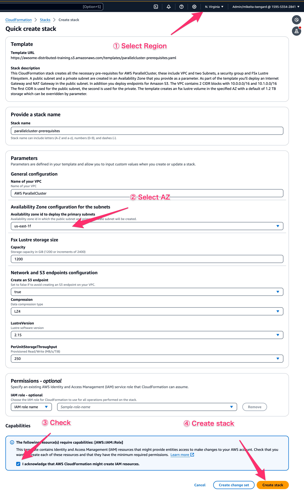

# AWS ParallelCluster Distributed Training Reference Architectures <!-- omit in toc -->

## 1. Architectures

Clusters in AWS ParallelCluster share similar components: a head-node, compute nodes (typically P or Trn EC2 family of instances) and one or multiple shared filesystems (FSx for Lustre). You will find below a section on the architectures themselves and how to deploy them. After this section, you will be brief on key elements of these templates (or things you wanna know to avoid potential mistakes).

To get started, clone this repository and navigate to this directory:

```bash
git clone -b geniac https://github.com/aws-samples/awsome-distributed-training.git
cd awsome-distributed-training/1.architectures/2.aws-parallelcluster
```

## 2. Pre-requisites

Before deploying a cluster, let's ensure you have installed the AWS ParallelCluster (PCluster) CLI, and that you have generated an EC2 key pair for the head node later on. If you have both PC installed and the key pair generated then skip this section and go [deploy-a-cluster section](#3-deploy-clusters).

### 2.1. Install AWS ParallelCluster CLI

Run the script below to install AWS ParallelCluster CLI in a Python virtual environment and access this environment.

```bash
export VIRTUAL_ENV_PATH=~/pcluster_env # change the path to your liking
export AWS_REGION=us-east-1
export KEYPAIR_NAME=keypair
```

```bash
#!/bin/bash

# Update pip and the virtual env module
python3 -m pip install --upgrade pip
python3 -m pip install --user --upgrade virtualenv
python3 -m virtualenv ${VIRTUAL_ENV_PATH} # create the virtual env
source ${VIRTUAL_ENV_PATH}/bin/activate # activate the environment
pip3 install awscli # install the AWS CLI
pip3 install aws-parallelcluster==3.11.1 # then AWS ParallelCluster
```

You can follow the [documentation](https://docs.aws.amazon.com/parallelcluster/latest/ug/commands-v3.html) to review the list of all AWS ParallelCluster commands.

### 2.2. Create your EC2 Keypair (if needed)

The EC2 key pair enables your to connect to your cluster on the head-node through ssh or [AWS Systems Manager](https://docs.aws.amazon.com/systems-manager/latest/userguide/session-manager-working-with-sessions-start.html). We will cover for SSH here.

You can list your public keys on your [AWS Console](https://console.aws.amazon.com/ec2/home?#KeyPairs:) and you may also check your SSH directory for the private keys (`~/ssh` if using Linux or OSX).

If you do not have a keypair that you can use then we will create one with the command below (see [this documentation](https://docs.aws.amazon.com/parallelcluster/latest/ug/set-up-keypair.html)).

```bash
#!/bin/bash

cd ~/.ssh
# Create the key pair using the AWS CLI and retrieve the private part (.pem file)
aws ec2 create-key-pair --key-name ${KEYPAIR_NAME} \
                        --query KeyMaterial \
                        --key-type ed25519 \
                        --region $AWS_REGION \
                        --output text > ${KEYPAIR_NAME}.pem

# The above command will also generate a private key in the current directory.
# We must change the access rights to the current user only, otherwise the ssh
# client refuses to use this private key to open an ssh connection.
sudo chmod 600 ${KEYPAIR_NAME}.pem
```

### 2.3 Check compute resource

You need following information before proceed:

* An ODCR (usually P5 or Trn1) on the account. You can check 
    * AZ for the capacity `AZ`.
    * Number of instances in the CR `ODCR_ID`.
* (Optional, but recommended) Name for the data S3 bucket. This bucket will be used to persist all the data/model checkpoints throughout 6 months of the cluster operation. Please refer to the [Cloudformation template](https://github.com/aws-samples/awsome-distributed-training/blob/main/1.architectures/0.s3/0.private-bucket.yaml) for the deployment. The bucket name is referred to as `DATA_BUCKET_NAME`.

Click on this link to deploy the S3 bucket:

[<kbd> <br> 1-Click Deploy 🚀 <br> </kbd>](https://ap-northeast-1.console.aws.amazon.com/cloudformation/home?region=ap-northeast-1#/stacks/quickcreate?templateUrl=https://awsome-distributed-training.s3.amazonaws.com/templates/0.private-bucket.yaml&stackName=cluster-data-bucket)

### 2.4 Deploy parallelcluster-prerequisites

In this section, you deploy a custom [_Amazon Virtual Private Cloud_](https://aws.amazon.com/vpc/) (Amazon VPC) network and security groups, as well as supporting services such as FSx for Lustre using the CloudFormation template called `parallelcluster-prerequisites.yaml`. This template is region agnostic and enables you to create a VPC with the required network architecture to run your workloads.

Please follow the steps below to deploy your resources:

1. Click on this link to deploy to CloudFormation:

[<kbd> <br> 1-Click Deploy 🚀 <br> </kbd>](https://ap-northeast-1.console.aws.amazon.com/cloudformation/home?region=ap-northeast-1#/stacks/quickcreate?templateUrl=https://awsome-distributed-training.s3.amazonaws.com/templates/parallelcluster-prerequisites.yaml&stackName=parallelcluster-prerequisites)

The cloudformation stack uses FSx for Lustre Persistent_2 deployment type. If you wish to use Persistent_1 deployment type please use the link below:

[<kbd> <br> 1-Click Deploy 🚀 <br> </kbd>](https://ap-northeast-1.console.aws.amazon.com/cloudformation/home?region=ap-northeast-1#/stacks/quickcreate?templateUrl=https://awsome-distributed-training.s3.amazonaws.com/templates/parallelcluster-prerequisites-p1.yaml&stackName=parallelcluster-prerequisites)

They need to open the link and specify the region and availability zone where they have their compute resources. Fill out “Availability Zone configuration for the subnets”, and create the stack. 



### 2.5 Associate Lustre storage with S3 bucket with data-repository-association (DRA)

In this step, you will create a [Data Repository Association (DRA)](https://docs.aws.amazon.com/fsx/latest/LustreGuide/create-dra-linked-data-repo.html) between the S3 bucket and FSx Lustre Filesystem.

```bash
export AWS_REGION=ap-northeast-1
export STACK_ID_VPC=parallelcluster-prerequisites 
export FSX_ID=`aws cloudformation describe-stacks \
    --stack-name ${STACK_ID_VPC} \
    --query 'Stacks[0].Outputs[?OutputKey==\`FSxLustreFilesystemId\`].OutputValue' \
    --region ${AWS_REGION} \
    --output text`
```

Note: `DATA_BUCKET_NAME`  is the bucket created in [Step0: Check resource info](https://quip-amazon.com/wDrEAxaBEI3A#temp:C:fdV996b34e8ad4e4dc3ac2ef128b). 
Create DRA as follows:

```bash
aws fsx create-data-repository-association \
    --file-system-id ${FSX_ID} \
    --file-system-path "/data" \
    --data-repository-path s3://${DATA_BUCKET_NAME} \
    --s3 AutoImportPolicy='{Events=[NEW,CHANGED,DELETED]},AutoExportPolicy={Events=[NEW,CHANGED,DELETED]}' \
    --batch-import-meta-data-on-create \
    --region ${AWS_REGION}
```

You shall see output like below:

```
{
    "Association": {
        "AssociationId": "dra-0295ef8c2a0e78886",
        "ResourceARN": "arn:aws:fsx:ap-northeast-1:483026362307:association/fs-0160ebe1881498442/dra-0295ef8c2a0e78886",
        "FileSystemId": "fs-0160ebe1881498442",
        "Lifecycle": "CREATING",
        "FileSystemPath": "/data",
        "DataRepositoryPath": "s3://genica-cluster-data-483026362307",
        "BatchImportMetaDataOnCreate": true,
        "ImportedFileChunkSize": 1024,
        "S3": {
            "AutoImportPolicy": {
                "Events": [
                    "NEW",
                    "CHANGED",
                    "DELETED"
                ]
            },
            "AutoExportPolicy": {
                "Events": [
                    "NEW",
                    "CHANGED",
                    "DELETED"
                ]
            }
        },
        "Tags": [],
        "CreationTime": "2024-10-22T09:06:57.151000+09:00"
    }
}
```

You can query the status of the DRA creation as below:

```bash
aws fsx describe-data-repository-associations \
    --filters "Name=file-system-id,Values=${FSX_ID}" --query "Associations[0].Lifecycle" --output text
    --region ${AWS_REGION}
```

Wait until the output becomes `AVAILABLE` . You also can check the status of DRA on AWS console:


## 3. Deploy a Cluster

To create cluster, please refer to [deployment-guides](./deployment-guides). Under the directory we have instructions for following patterns of cluster deployments:

* [Vanilla cluster deployment](./deployment-guides/vanilla-pcluster.md)
* [Pcluster with observability stack deployment](./deployment-guides/vanilla-pcluster.md)

## 4. (For Reference) Anatomy of AWS Parallel Cluster


### 4.1. Compute

Compute is represented through the following:

- **Head-node**: login and controller node that users will use to submit jobs. It is set to an [m5.8xlarge](https://aws.amazon.com/ec2/instance-types/m5/)..
- **Compute-gpu**: is the queue (or partition) to run your ML training jobs. The instances are either [p4de.24xlarge](https://aws.amazon.com/ec2/instance-types/p4/) or [trn1.32xlarge](https://aws.amazon.com/ec2/instance-types/trn1/) which are recommended for training, especially for LLMs or large models. The default number of instances in the queue has been set to *4* and can be changed as necessary.
- **Inference-gpu**: is an optional queue that can be used to run inference workloads and uses [g5.12xlarge](https://aws.amazon.com/ec2/instance-types/m5/).

### 4.2. On-Demand Capacity Reservation (ODCR)

On-Demand Capacity Reservation (ODCR) is a tool for reserving capacity without having to launch and run the EC2 instances. ODCR is practically **the only way** to launch capacity-constrained instances like `p4d.24xlarge`, `p4de.24xlarge`, or `p5.48xlarge`. In addition, the CRs for these instance types are typically *created by AWS*, not by users, which affects how to correctly configure the cluster networking (section [4.3](#43-network-efa-elastic-fabric-adapter)).

AWS ParallelCluster supports specifying the [CapacityReservationId](https://docs.aws.amazon.com/parallelcluster/latest/ug/Scheduling-v3.html#yaml-Scheduling-SlurmQueues-CapacityReservationTarget) in the cluster's config file. If using a capacity reservation put the ID i.e. `cr-12356790abcd` in your config file by substituting the variable `PLACEHOLDER_CAPACITY_RESERVATION_ID`. It should look like the following:

  ```yaml
  CapacityReservationTarget:
      CapacityReservationId: cr-12356790abcd
  ```

If you have multiple ODCR's you can group them together into a [*Capacity Reservation Group*](https://docs.aws.amazon.com/AWSEC2/latest/UserGuide/create-cr-group.html), this allows you to launch instances from multiple ODCR's as part of the **same queue** of the cluster.

1. First create a group, this will return a group arn like: `arn:aws:resource-groups:us-east-2:123456789012:group/MyCRGroup`. Save that for later.

    ```bash
    aws resource-groups create-group --name MyCRGroup --configuration '{"Type":"AWS::EC2::CapacityReservationPool"}' '{"Type":"AWS::ResourceGroups::Generic", "Parameters": [{"Name": "allowed-resource-types", "Values": ["AWS::EC2::CapacityReservation"]}]}'
    ```

2. Next add your capacity reservations to that group:

    ```bash
    aws resource-groups group-resources --group MyCRGroup --resource-arns arn:aws:ec2:sa-east-1:123456789012:capacity-reservation/cr-1234567890abcdef1 arn:aws:ec2:sa-east-1:123456789012:capacity-reservation/cr-54321abcdef567890
    ```

3. Then add the group to your cluster's config like so:

    ```yaml
        CapacityReservationTarget:
            CapacityReservationResourceGroupArn: arn:aws:resource-groups:us-east-2:123456789012:group/MyCRGroup
    ```

### 4.3. Network: EFA (Elastic Fabric Adapter)

Applications will make use of [Elastic Fabric Adapter (EFA)](https://docs.aws.amazon.com/AWSEC2/latest/UserGuide/efa.html) for enhanced networking during distributed training. To achieve optimal network latency instances should be placed in a placement groups using either the `PlacementGroup` flag or by specifying a targeted [On-Demand Capacity reservation (ODCR)](#42-on-demand-capacity-reservation-odcr).

It is important to note the targeted ODCR for `p4` or `p5` are typically not created by users. Instead, AWS will create the CR with placement group assigned, then deliver (i.e., share) the CR to users. Users must accept the CR (e.g., via their AWS console) before they can use it to launch the `p4` or `p5` instances.

When using the AWS-assisted targeted ODCR, you're strongly recommended to disable the `PlacementGroup` setting for AWS Parallel Cluster, otherwise this placement group option creates a specific placement group that may conflict with the placement group assigned in your ODCR, causing instance launch failures *Insufficient Capacity Error* (*ICE*).

Placement groups are only relevant for distributed training, not inference.

In both cases, for `p4` or `p5` with AWS-assisted CR, the rule-of-thumb is to set the following parameter to `false`:

```yaml
PlacementGroup:
  Enabled: false
```

### 4.4. Storage

Storage comes in 3 flavors:

- **Local**: head and compute nodes have 200GiB of EBS volume mounted on `/`. In addition, the headnode has an EBS volume of `200GiB` mounted on `/apps` The compute nodes have NVMe drives striped in RAID0 and mounted as `/local_scratch`.
- **File network storage**: The head-node shares `/home` and `/apps` to the whole cluster through NFS. These directories are automatically mounted on every instance in the cluster and accessible through the same path. `/home` is a regular home directory, `/apps` is a shared directory where applications or shared files can be stored. Please note that none should be used for data intensive tasks.
- **High performance filesystem**: An [FSx for Lustre](https://docs.aws.amazon.com/fsx/latest/LustreGuide/what-is.html) filesystem can be accessed from every cluster node on `/fsx`. This is where users would store their datasets. This file system has been sized to 4.8TiB and provides 1.2GB/s of aggregated throughput. You can modify its size and the throughput per TB provisioned in the config file following the service [documentation](https://docs.aws.amazon.com/fsx/latest/LustreGuide/performance.html).

### 4.5. Installing applications & libraries

You can chose to use a custom image or post-install scripts to install your application stack.

- **Custom images**: the image needs to be pre-built before creating a cluster. They are preferred for drivers, kernel modules or libraries regularly used and seeing little to no updates. This option is preferred to ensure repeatability. You can use custom images as follows:

    ```yaml
    Image:
      Os: alinux2 #system type
      CustomAmi: PLACEHOLDER_CUSTOM_AMI_ID #replace by custom imageAMI ID
    ```

    If not using a custom image, remove the `CustomAmi` field.

- **Post-install scripts**: these scripts will be executed at instance boot (head+compute). This option is recommended for quick testing and will increase instance boot time. You can run post-install scripts through `CustomActions` for the head node and the compute nodes. The `distributed-training-p4de_postinstall_scripts.yaml` uses the post-install scripts from this [repo](https://github.com/aws-samples/aws-parallelcluster-post-install-scripts) to enable the container support.

### 4.6. Troubleshooting

A common issue we see customer face is a problem with the post install scripts or issue to access capacity due to a mis-configuration. This can manifest itself through a `HeadNodeWaitCondition` that'll cause the ParallelCluster to fail a cluster deployment.

To solve that, you can look at the cluster logs in CloudWatch in the cluster log group, otherwise use the option `--rollback-on-failure false` to keep resources up upon failure for further troubleshooting.


## Tips and tricks
### 2.2 Connect to your cluster

To easily login to your cluster via [AWS Systems Manager](https://docs.aws.amazon.com/systems-manager/latest/userguide/session-manager-working-with-sessions-start.html) we've included a script `easy-ssh.sh` that you can run like so, assuming `ml-cluster` is the name of your cluster:

```bash
./easy-ssh.sh ml-cluster
```

You'll need a few pre-requisites for this script:
* JQ: `brew install jq`
* aws cli
* `pcluster` cli
* [Session Manager Plugin](https://docs.aws.amazon.com/systems-manager/latest/userguide/session-manager-working-with-install-plugin.html)

Once you've run the script you'll see the following output:

```
Instance Id: i-0096542c11ccb02b5
Os: ubuntu2004
User: ubuntu
Add the following to your ~/.ssh/config to easily connect:

cat <<EOF >> ~/.ssh/config
Host ml-cluster
  User ubuntu
  ProxyCommand sh -c "aws ssm start-session --target i-0095542c11ccb02b5 --document-name AWS-StartSSHSession --parameters 'portNumber=%p'"
EOF

Add your ssh keypair and then you can do:

$ ssh ml-cluster

Connecting to ml-cluster...

Starting session with SessionId: ...
root@ip-10-0-24-126:~#
```

1. Add your public key to the file `~/.ssh/authorized_keys`

2. Now paste in the lines from the output of to your terminal, this will add them to your `~/.ssh/config`.

```
cat <<EOF >> ~/.ssh/config
Host ml-cluster
  User ubuntu
  ProxyCommand sh -c "aws ssm start-session --target i-0095542c11ccb02b5 --document-name AWS-StartSSHSession --parameters 'portNumber=%p'"
EOF
```
3. Now you ssh in, assuming `ml-cluster` is the name of your cluster with:

```
ssh ml-cluster
```

## 5. Appendix

Parallel Cluster, as of this writing (v3.8.0), does not automatically set the correct number of sockets and cores-per-socket in Slurm partitions. For ML training on multiple GPUs, this should not have adverse impact on performance since NCCL does the topology detection. However, it might have impact on the training performance for single-GPU training or inference, or in the rare case to support Slurm affinity/binding feature.

Using the example from [here](https://github.com/aws/aws-parallelcluster/issues/5797), a `p5.48xlarge` should have just two sockets, but Slurm shows the partition to have more than that.

```bash
$ ssh p5-st-p5-1 /opt/slurm/sbin/slurmd -C
NodeName=p5-st-p5-1 CPUs=192 Boards=1 SocketsPerBoard=2 CoresPerSocket=48 ThreadsPerCore=2 RealMemory=2047961 UpTime=2-00:08:02

$ sinfo -o '%9P %4c %8z %8X %8Y %8Z'
PARTITION CPUS S:C:T    SOCKETS  CORES    THREADS
p5*       192  192:1:1  192      1        1
```

Should you want to correct the partition configuration, edit your cluster configuration file (e.g., the `distributed-training-*.yaml` file) and a new entry `Scheduling` / `SlurmQueues` / `ComputeResources` / `CustomSlurmSettings` similar to below.

```yaml
Scheduling:
  SlurmQueues:
    - Name: compute-gpu
      ...
      ComputeResources:
        - Name: distributed-ml
          InstanceType: p5.48xlarge
          ...
          CustomSlurmSettings:
            Sockets: 2
            CoresPerSocket: 48
```

Each instance type has its own `Sockets` and `CoresPerSocket` values. Below are for instance types commonly used for distributed training.

| Instance type | `Sockets` | `CoresPerSocket` |
| ------------- | --------- | ---------------- |
| p5.48xlarge   | 2         | 48               |
| p4de.24xlarge | 2         | 24               |
| p4d.24xlarge  | 2         | 24               |

For other instance types, you'd need to run an instance to check the values.