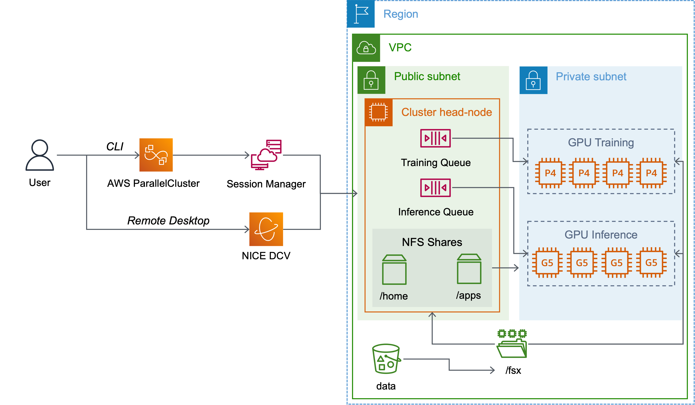

# AWS ParallelCluster Distributed Training Reference Architectures <!-- omit in toc -->

## 1. Architectures

Clusters in AWS ParallelCluster share similar components: a head-node, compute nodes (typically P or Trn EC2 family of instances) and one or multiple shared filesystems (FSx for Lustre). You will find below a section on the architectures themselves and how to deploy them. After this section, you will be brief on key elements of these templates (or things you wanna know to avoid potential mistakes).

## 2. Pre-requisites

Before deploying a cluster, let's ensure you have installed the AWS ParallelCluster (PC) CLI, and that you have generated an EC2 key pair for the head node later on. If you have both PC installed and the key pair generated then skip this section and go [deploy-a-cluster section](#3-deploy-clusters).

### 2.1. Install AWS ParallelCluster CLI

Run the script below to install AWS ParallelCluster in a Python virtual environment and access this environment.

```bash
#!/bin/bash

VIRTUAL_ENV_PATH=~/apc-ve # change the path to your liking

# Update pip and the virtual env module
python3 -m pip install --upgrade pip
python3 -m pip install --user --upgrade virtualenv

python3 -m virtualenv $VIRTUAL_ENV_PATH # create the virtual env

source $VIRTUAL_ENV_PATH/bin/activate # activate the environment
pip3 install awscli # install the AWS CLI
pip3 install aws-parallelcluster # then AWS ParallelCluster
```

> **Note**: you can use virtual environments to test different versions of AWS ParallelCluster by setting the version during the installation. For example to use 3.7.1, change the command `pip3 install aws-parallelcluster==3.7.1`.

### 2.2. Create your EC2 Keypair (if needed)

The EC2 key pair enables your to connect to your cluster on the head-node through ssh or [AWS Systems Manager](https://docs.aws.amazon.com/systems-manager/latest/userguide/session-manager-working-with-sessions-start.html). We will cover for SSH here.

You can list your public keys on your [AWS Console](https://console.aws.amazon.com/ec2/home?#KeyPairs:) and you may also check your SSH directory for the private keys (`~/ssh` if using Linux or OSX).

If you do not have a keypair that you can use then we will create one with the command below (see [this documentation](https://docs.aws.amazon.com/parallelcluster/latest/ug/set-up-keypair.html)).

```bash
#!/bin/bash

AWS_TARGET_REGION=us-east-1
KEYPAIR_NAME=pcluster-workshop-key

# Create the key pair using the AWS CLI and retrieve the private part (.pem file)
aws ec2 create-key-pair --key-name pcluster-workshop-key \
                        --query KeyMaterial \
                        --region $AWS_TARGET_REGION \
                        --output text > $KEYPAIR_NAME.pem

# The above command will also generate a private key in the current directory.
# We must change the access rights to the current user only, otherwise the ssh
# client refuses to use this private key to open an ssh connection.
sudo chmod 600 $KEYPAIR_NAME.pem
```

## 3. Deploy a Cluster

To create the cluster use the command below and replace `CLUSTER_CONFIG_FILE` by the path to the cluster configuration file (see next section) and `NAME_OF_YOUR_CLUSTER` by the name of your cluster (`realpotato` is a cool name).

```bash
pcluster create-cluster --cluster-configuration CLUSTER_CONFIG_FILE --cluster-name NAME_OF_YOUR_CLUSTER --region us-east-1
```

You can follow the [documentation](https://docs.aws.amazon.com/parallelcluster/latest/ug/commands-v3.html) to review the list of all AWS ParallelCluster commands.

### 3.1. Cluster templates

Each reference architectures provides an example of cluster configuration (`.yaml`) for different use cases. The architectures most commonly used are:

- `distributed-training-gpu.yaml`: base template, uses the default AMI with no software installed.
- `distributed-training-p4de_custom_ami.yaml`: base cluster with a custom AMI to install custom software.
- `distributed-training-p4de_postinstall_scripts.yaml`: same as above but uses post-install scripts to install Docker, Pyxis and Enroot.

Alternatively you can refer to these architectures for more specific use cases:

- `distributed-training-p4de_batch-inference-g5_custom_ami.yaml`: multi-queue template with p4de for training and g5 for inference. It assumes a custom AMI.
- `distributed-training-trn1_custom_ami.yaml`: uses Trainium instances for distributed training. Assumes a custom AMI.

### 3.2. What to replace in the templates

The `.yaml` templates contain placeholder variables that you need to replace before use.

- `PLACEHOLDER_CUSTOM_AMI_ID`: if using a custom AMI then replace with the custom AMI ID (`ami-12356790abcd`).
- `PLACEHOLDER_PUBLIC_SUBNET`: change to the id of a public subnet to host the head-node (`subnet-12356790abcd`).
- `PLACEHOLDER_PRIVATE_SUBNET`: change to the id of a public subnet to host the compute nodes (`subnet-12356790abcd`).
- `PLACEHOLDER_SSH_KEY`: ID of the SSH key you'd like to use to connect to the head-node, use the name of the key. You can also use AWS Systems Manager Session Manager (SSM).
- `PLACEHOLDER_CAPACITY_RESERVATION_ID`: if using a capacity reservation put the ID here (`cr-12356790abcd`).

In some of the templates you may need to update these placeholders:

- `PLACEHOLDER_MIN_INSTANCES`: the minimum number of instances you want in your cluster at any point in time.
- `PLACEHOLDER_MAX_INSTANCES`: the maximum number of instances you anticipate to scale to.

If `MIN` = `MAX` then you keep a fixed amount of instances at any point in time. If `MIN` < `MAX` then the cluster will keep a `MIN` number of instances and scale up to `MAX` if capacity beyond `MIN` is required to run jobs. Update this values by updating your cluster ([documentation](https://docs.aws.amazon.com/parallelcluster/latest/ug/using-pcluster-update-cluster-v3.html))

## 4. Anatomy of AWS Parallel Cluster



### 4.1. Compute

Compute is represented through the following:

- **Head-node**: login and controller node that users will use to submit jobs. It is set to an [m5.8xlarge](https://aws.amazon.com/ec2/instance-types/m5/)..
- **Compute-gpu**: is the queue (or partition) to run your ML training jobs. The instances are either [p4de.24xlarge](https://aws.amazon.com/ec2/instance-types/p4/) or [trn1.32xlarge](https://aws.amazon.com/ec2/instance-types/trn1/) which are recommended for training, especially for LLMs or large models. The default number of instances in the queue has been set to *4* and can be changed as necessary.
- **Inference-gpu**: is an optional queue that can be used to run inference workloads and uses [g5.12xlarge](https://aws.amazon.com/ec2/instance-types/m5/).

### 4.2. On-Demand Capacity Reservation (ODCR)

On-Demand Capacity Reservation (ODCR) is a tool for reserving capacity without having to launch and run the EC2 instances. ODCR is practically **the only way** to launch capacity-constrained instances like `p4d.24xlarge`, `p4de.24xlarge`, or `p5.48xlarge`. In addition, the CRs for these instance types are typically *created by AWS*, not by users, which affects how to correctly configure the cluster networking (section [4.3](#43-network-efa-elastic-fabric-adapter)).

AWS ParallelCluster supports specifying the [CapacityReservationId](https://docs.aws.amazon.com/parallelcluster/latest/ug/Scheduling-v3.html#yaml-Scheduling-SlurmQueues-CapacityReservationTarget) in the cluster's config file. If using a capacity reservation put the ID i.e. `cr-12356790abcd` in your config file by substituting the variable `PLACEHOLDER_CAPACITY_RESERVATION_ID`. It should look like the following:

  ```yaml
  CapacityReservationTarget:
      CapacityReservationId: cr-12356790abcd
  ```

If you have multiple ODCR's you can group them together into a [*Capacity Reservation Group*](https://docs.aws.amazon.com/AWSEC2/latest/UserGuide/create-cr-group.html), this allows you to launch instances from multiple ODCR's as part of the **same queue** of the cluster.

1. First create a group, this will return a group arn like: `arn:aws:resource-groups:us-east-2:123456789012:group/MyCRGroup`. Save that for later.

    ```bash
    aws resource-groups create-group --name MyCRGroup --configuration '{"Type":"AWS::EC2::CapacityReservationPool"}' '{"Type":"AWS::ResourceGroups::Generic", "Parameters": [{"Name": "allowed-resource-types", "Values": ["AWS::EC2::CapacityReservation"]}]}'
    ```

2. Next add your capacity reservations to that group:

    ```bash
    aws resource-groups group-resources --group MyCRGroup --resource-arns arn:aws:ec2:sa-east-1:123456789012:capacity-reservation/cr-1234567890abcdef1 arn:aws:ec2:sa-east-1:123456789012:capacity-reservation/cr-54321abcdef567890
    ```

3. Then add the group to your cluster's config like so:

    ```yaml
        CapacityReservationTarget:
            CapacityReservationResourceGroupArn: arn:aws:resource-groups:us-east-2:123456789012:group/MyCRGroup
    ```

### 4.3. Network: EFA (Elastic Fabric Adapter)

Applications will make use of [Elastic Fabric Adapter (EFA)](https://docs.aws.amazon.com/AWSEC2/latest/UserGuide/efa.html) for enhanced networking during distributed training. To achieve optimal network latency instances should be placed in a placement groups using either the `PlacementGroup` flag or by specifying a targeted [On-Demand Capacity reservation (ODCR)](#42-on-demand-capacity-reservation-odcr).

It is important to note the targeted ODCR for `p4` or `p5` are typically not created by users. Instead, AWS will create the CR with placement group assigned, then deliver (i.e., share) the CR to users. Users must accept the CR (e.g., via their AWS console) before they can use it to launch the `p4` or `p5` instances.

When using the AWS-assisted targeted ODCR, you're strongly recommended to disable the `PlacementGroup` setting for AWS Parallel Cluster, otherwise this placement group option creates a specific placement group that may conflict with the placement group assigned in your ODCR, causing instance launch failures *Insufficient Capacity Error* (*ICE*).

Placement groups are only relevant for distributed training, not inference.

In both cases, for `p4` or `p5` with AWS-assisted CR, the rule-of-thumb is to set the following parameter to `false`:

```yaml
PlacementGroup:
  Enabled: false
```

### 4.4. Storage

Storage comes in 3 flavors:

- **Local**: head and compute nodes have 200GiB of EBS volume mounted on `/`. In addition, the headnode has an EBS volume of `200GiB` mounted on `/apps` The compute nodes have NVMe drives striped in RAID0 and mounted as `/local_scratch`.
- **File network storage**: The head-node shares `/home` and `/apps` to the whole cluster through NFS. These directories are automatically mounted on every instance in the cluster and accessible through the same path. `/home` is a regular home directory, `/apps` is a shared directory where applications or shared files can be stored. Please note that none should be used for data intensive tasks.
- **High performance filesystem**: An [FSx for Lustre](https://docs.aws.amazon.com/fsx/latest/LustreGuide/what-is.html) filesystem can be accessed from every cluster node on `/fsx`. This is where users would store their datasets. This file system has been sized to 4.8TiB and provides 1.2GB/s of aggregated throughput. You can modify its size and the throughput per TB provisioned in the config file following the service [documentation](https://docs.aws.amazon.com/fsx/latest/LustreGuide/performance.html).

### 4.5. Installing applications & libraries

You can chose to use a custom image or post-install scripts to install your application stack.

- **Custom images**: the image needs to be pre-built before creating a cluster. They are preferred for drivers, kernel modules or libraries regularly used and seeing little to no updates. This option is preferred to ensure repeatability. You can use custom images as follows:

    ```yaml
    Image:
      Os: alinux2 #system type
      CustomAmi: PLACEHOLDER_CUSTOM_AMI_ID #replace by custom imageAMI ID
    ```

    If not using a custom image, remove the `CustomAmi` field.

- **Post-install scripts**: these scripts will be executed at instance boot (head+compute). This option is recommended for quick testing and will increase instance boot time. You can run post-install scripts through `CustomActions` for the head node and the compute nodes. The `distributed-training-p4de_postintall_scripts.yaml` uses the post-install scripts from this [repo](https://github.com/aws-samples/aws-parallelcluster-post-install-scripts) to enable the container support.

### 4.6. Troubleshooting

A common issue we see customer face is a problem with the post install scripts or issue to access capacity due to a mis-configuration. This can manifest itself through a `HeadNodeWaitCondition` that'll cause the ParallelCluster to fail a cluster deployment.

To solve that, you can look at the cluster logs in CloudWatch in the cluster log group, otherwise use the option `--rollback-on-failure false` to keep resources up upon failure for further troubleshooting.
