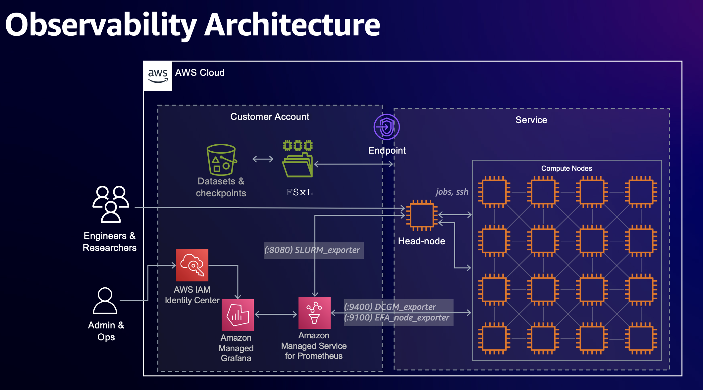
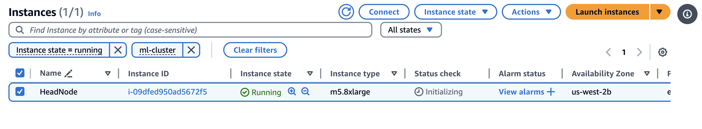
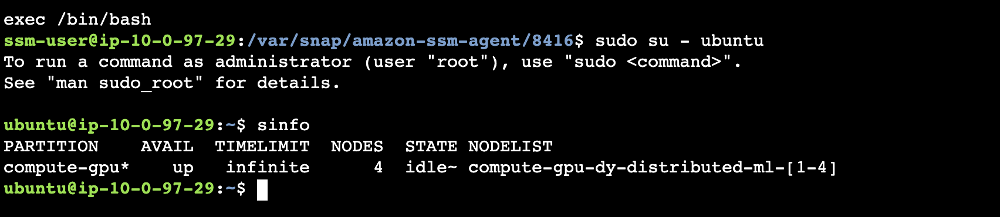

# PCluster + Observability Deployment

This runbook is to provide step-by-step guide on PCluster + Grafana observability deployment.

|Feature	|Enabled	|
|---	|---	|
|Multi-user support	|FALSE	|
|Accounting	|FALSE	|
|Observability	|TRUE	|


## Managed Observability stack deployment

AWS ParallelCluster can optionally be integrated with Amazon Managed Prometheus and Amazon Managed Grafana to export metrics about your cluster and cluster-nodes to an Amazon Managed Grafana dashboard.
The `Slurm-Observability` stack is used to monitor cluster metrics in real-time using Amazon Managed Prometheus and Amazon Managed Grafana workspaces. You can optionally deploy the observability stack following cluster deployment using these instructions.

### Prerequisites: Set up IAM Identity Center


### Deploy Managed Grafana and Managed Prometheus with CloudFormation

[<kbd> <br> 1-Click Deploy 🚀 <br> </kbd>](https://console.aws.amazon.com/cloudformation/home?#/stacks/quickcreate?templateURL=https://awsome-distributed-training.s3.amazonaws.com/templates/cluster-observability.yaml&stackName=Slurm-Observability)



## Cluster Deployment 

This section goes through all the steps necessary to deploy the architecture discussed in the previous section. Moreover, this section covers how to set up a [Data Repository Association (DRA)](https://docs.aws.amazon.com/fsx/latest/LustreGuide/create-dra-linked-data-repo.html) between the S3 bucket and FSx Lustre Filesystem. With DRA, user can access to the objects in Amazon S3 bucket through Lustre filesystem. **Make sure to check [prerequisites](https://github.com/aws-samples/awsome-distributed-training/tree/geniac/1.architectures/2.aws-parallelcluster#2-pre-requisites) before proceed.**


```bash
export KEY_PAIR_NAME=<your keypair name without .pem>
export CAPACITY_RESERVATION_ID=cr-<YOUR CRID>
export INSTANCE=p5.48xlarge
export NUM_INSTANCES=4
export AMPREMOTEWRITEURL=https://aps-workspaces.ap-northeast-1.amazonaws.com/workspaces/ws-xxxxxxxx-xxxx-xxxx-xxxx-xxxxxxxxxxxx/api/v1/remote_write
bash create_config.sh
```

then 

```bash
source env_vars
cat templates/cluster-observability.yaml | envsubst > configs/cluster-observability.yaml
```

> [!TIP]  
> If you are working on CloudShell, your environment might not have `envsubst`. In that case, please install the command with `sudo yum install gettext`

finally 

```bash
 pcluster create-cluster -n ml-cluster -c configs/cluster-observability.yaml -r ${AWS_REGION}  --rollback-on-failure false
```

You will see the output like follows:

```
{
  "cluster": {
    "clusterName": "ml-cluster-p5",
    "cloudformationStackStatus": "CREATE_IN_PROGRESS",
    "cloudformationStackArn": "arn:aws:cloudformation:ap-northeast-1:483026362307:stack/ml-cluster-p5/f0f12000-9012-11ef-8989-060ea463320f",
    "region": "ap-northeast-1",
    "version": "3.11.1",
    "clusterStatus": "CREATE_IN_PROGRESS",
    "scheduler": {
      "type": "slurm"
    }
  },
  "validationMessages": [
    {
      "level": "WARNING",
      "type": "DetailedMonitoringValidator",
      "message": "Detailed Monitoring is enabled for EC2 instances in your compute fleet. The Amazon EC2 console will display monitoring graphs with a 1-minute period for these instances. Note that this will increase the cost. If you want to avoid this and use basic monitoring instead, please set `Monitoring / DetailedMonitoring` to false."
    },
    {
      "level": "WARNING",
      "type": "PlacementGroupCapacityReservationValidator",
      "message": "When using an open or targeted capacity reservation with an unrelated placement group, insufficient capacity errors may occur due to placement constraints outside of the reservation even if the capacity reservation has remaining capacity. Please consider either not using a placement group for the compute resource or creating a new capacity reservation in a related placement group."
    }
  ]
}
```

Then you can check progress of cluster creation on Cloudformation console
Alternatively, you can check the progress through `pcluster` command as follows:

```bash
pcluster list-clusters -r ${AWS_REGION}
```

## Connect to the Cluster

Once the cluster goes into **CREATE COMPLETE**, we can connect to the head node in one of two ways, either through the SSM or SSH.

**SSM Session Manager** is ideal for quick terminal access to the head node, it doesn't require any ports to be open on the head node, however it does require you to authenticate with the AWS account the instance it running in.

**SSH** can be used to connect to the cluster from a standard SSH client. This can be configured to use your own key via adding the public key or a new key can be provisioned.

### SSM Connect 

You'll need to be authenticated to the AWS account that instance is running in and have permission to launch a SSM session . Once you're connected you'll have access to a terminal on the head node:

Now change to `ubuntu` user:

```bash
sudo su - ubuntu
```



### SSH access

Also, You can access to the headnode via SSH (if you set up keypair). You can retrieve IP address of the head node with the following command:

```bash
pcluster ssh --region ap-northeast-1 --cluster-name ml-cluster --identity_file ~/.ssh/ap-northeast-1.pem  --dryrun true 
```

It will show output like follows:

```bash
{
  "command": "ssh ubuntu@18.183.235.248 --identity_file /Users/mlkeita/.ssh/ap-northeast-1.pem"
}
```


### Cluster sanity checks

In this section, we'll go through cluster health check. 

#### NCCL tests

In this section we'll run the [NCCL Tests](https://github.com/NVIDIA/nccl-tests), specifically the *All Reduce* tests which are a suite of tests intended to validate the networking performance of the cluster. 

We'll check to see that EFA is enabled and the bandwidth matches the spec:

| Instance Type  | Network Bandwidth | GPU Peer to Peer  |
|----------------|-------------------|:-----------------:|
|  p4d.24xlarge  |  200 Gbps EFAv1   | 600 GB/s NVSwitch |
|  p4de.24xlarge |  400 Gbps EFAv1   | 600 GB/s NVSwitch |
|  p5.48xlarge   |  3200 Gbps EFAv2  | 900 GB/s NVSwitch |

We're going to run the [nccl-tests](https://github.com/NVIDIA/nccl-tests) which are installed in a container image and check to make sure NCCL and EFA are setup and working. This also serves as an quick example of how to submit jobs to Slurm.

1. Create a slurm submission file `nccl-efa-tests.sh` with the following content:

    ```bash
    git clone https://github.com/aws-samples/awsome-distributed-training.git
    cd awsome-distributed-training/micro-benchmarks/nccl-tests/slurm
    ```

    Take a look at the `nccl-tests-deep-learning-ami.sbatch` file and you'll see the following flags set:

    | Slurm Flag           | Description                                                  |
    |----------------------|--------------------------------------------------------------|
    | `--nodes=2`          | Run on two nodes                                             |
    | `--tasks-per-node=8` | Run on 8 gpus per node                                       |
    | `--job-name=nccl-all_reduce_perf` | call the job `nccl-all_reduce_perf`             |
    | `--output %x_%j.out` | Output stdout to a file `<job-name>_<job_id>.out`            |
    | `--error %x_%j.err` | Output stderr to a file `<job-name>_<job_id>.out`             |

2. Submit the job

    ```bash
    sbatch nccl-tests-ami.sbatch /opt/nccl-tests/build/all_reduce_perf /opt/nccl/build/lib
    watch squeue # wait for job to go into 'R' running
    ```

    You have to wait a couple of minutes for your compute instances to come up, once you see the job go from **PD** pending to **R** running state, you know the instances are up. Type **Ctrl-C** to exit squeue at any point.

3. After the job has completed, take a look at the output file, where `2` is the job id:

    ```bash
    cat nccl-all_reduce_perf_2.out
    ```

    Check for a line like `Selected Provider is efa`, this indicates EFA is enabled and selected. **Note:** for p5 instances it'll say 4 nics instead of 32.

    ```
    $ cat nccl-all_reduce_perf_2.out | grep "Selected Provider is"
    NCCL INFO NET/OFI Selected Provider is efa (found 32 nics)
    NCCL INFO Using network AWS Libfabric
    ```

    At the bottom of the file, you'll see the results of the NCCL *All Reduce* tests. This is for 2 x p5.48xlarge instances with 8B to 16GB buffer size. See [Results](https://github.com/aws-samples/awsome-distributed-training/tree/main/micro-benchmarks/nccl-tests#results) for more info.

    ```
    0: #       size         count      type   redop    root     time   algbw   busbw #wrong     time   algbw   busbw #wrong
    0: #        (B)    (elements)                               (us)  (GB/s)  (GB/s)            (us)  (GB/s)  (GB/s)       
    0:            8             2     float     sum      -1    69.12    0.00    0.00      0    72.43    0.00    0.00      0
    0:           16             4     float     sum      -1    72.64    0.00    0.00      0    73.91    0.00    0.00      0
    0:           32             8     float     sum      -1    74.06    0.00    0.00      0    64.75    0.00    0.00      0
    0:           64            16     float     sum      -1    65.48    0.00    0.00      0    74.40    0.00    0.00      0
    0:          128            32     float     sum      -1    74.92    0.00    0.00      0    65.43    0.00    0.00      0
    0:          256            64     float     sum      -1    74.12    0.00    0.01      0    65.70    0.00    0.01      0
    0:          512           128     float     sum      -1    69.50    0.01    0.01      0    66.88    0.01    0.01      0
    0:         1024           256     float     sum      -1    69.24    0.01    0.03      0    69.04    0.01    0.03      0
    0:         2048           512     float     sum      -1    72.22    0.03    0.05      0    71.29    0.03    0.05      0
    0:         4096          1024     float     sum      -1    78.58    0.05    0.10      0    78.55    0.05    0.10      0
    0:         8192          2048     float     sum      -1    81.44    0.10    0.19      0    80.47    0.10    0.19      0
    0:        16384          4096     float     sum      -1    94.36    0.17    0.33      0    82.35    0.20    0.37      0
    0:        32768          8192     float     sum      -1    111.7    0.29    0.55      0    89.75    0.37    0.68      0
    0:        65536         16384     float     sum      -1    135.1    0.48    0.91      0    103.8    0.63    1.18      0
    0:       131072         32768     float     sum      -1    108.9    1.20    2.26      0    96.55    1.36    2.55      0
    0:       262144         65536     float     sum      -1    128.0    2.05    3.84      0    104.7    2.50    4.70      0
    0:       524288        131072     float     sum      -1    123.7    4.24    7.95      0    113.3    4.63    8.67      0
    0:      1048576        262144     float     sum      -1    123.2    8.51   15.95      0    121.3    8.64   16.21      0
    0:      2097152        524288     float     sum      -1    147.2   14.24   26.70      0    147.1   14.25   26.72      0
    0:      4194304       1048576     float     sum      -1    168.6   24.87   46.64      0    167.7   25.02   46.91      0
    0:      8388608       2097152     float     sum      -1    204.8   40.96   76.80      0    201.1   41.71   78.20      0
    0:     16777216       4194304     float     sum      -1    298.1   56.28  105.52      0    298.3   56.24  105.45      0
    0:     33554432       8388608     float     sum      -1    439.7   76.31  143.09      0    417.7   80.33  150.62      0
    0:     67108864      16777216     float     sum      -1    601.5  111.57  209.19      0    604.2  111.07  208.26      0
    0:    134217728      33554432     float     sum      -1    870.3  154.22  289.16      0    876.8  153.07  287.01      0
    0:    268435456      67108864     float     sum      -1   1468.2  182.83  342.81      0   1452.7  184.78  346.46      0
    0:    536870912     134217728     float     sum      -1   2559.2  209.78  393.34      0   2554.9  210.14  394.00      0
    0:   1073741824     268435456     float     sum      -1   4607.6  233.04  436.95      0   4565.6  235.18  440.96      0
    0:   2147483648     536870912     float     sum      -1   9074.5  236.65  443.72      0   9108.5  235.77  442.06      0
    0:   4294967296    1073741824     float     sum      -1    17286  248.46  465.87      0    17343  247.64  464.33      0
    0:   8589934592    2147483648     float     sum      -1    33605  255.62  479.28      0    33628  255.44  478.95      0
    0:  17179869184    4294967296     float     sum      -1    66132  259.78  487.09      0    66109  259.87  487.26    
    ```

If we take a look at the `busbw` column for the largest message size we see the number `487.09` GBps. If you remember from our [table earlier](/04-verify-cluster), the `p5.48xlarge` instances has `3200Gbps` of network bandwidth so if we convert from Gib to GiB we get `3,896.72` Gbps. How can we get more bandwidth than expected?

The difference here is due to *inter-node NVlink* which has an aggregate bandwidth of `900GBps`. At two nodes NVLink plays are larger role in GPU to GPU communication than at larger number of instances.

#### Enroot/Pyxis

Optionally, you can test enroot/pyxis with the following command:

```bash
# Submitting an interactive job
srun -N 2 --container-image docker://ubuntu:22.04 hostname
```


## Configure observability stack


## References

* NCCL Tests — Understanding NCCL Bandwidth
    * https://github.com/aws-samples/awsome-distributed-training/tree/main/micro-benchmarks/nccl-tests#3-understanding-nccl-bandwidth
