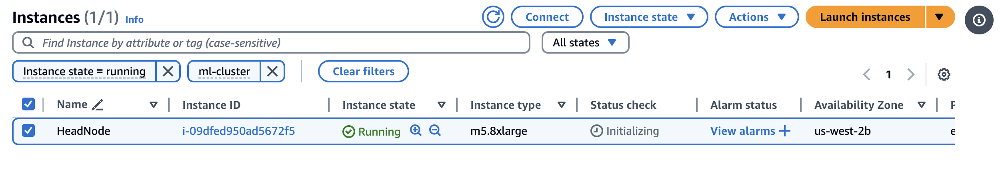

# Vanilla PCluster Deployment

This runbook is to provide step-by-step guide on vanilla [AWS ParallelCluster (PCluster)](https://github.com/aws/aws-parallelcluster) deployment which supports following features:

|Feature	|Enabled	|
|---	|---	|
|Multi-user support	|FALSE	|
|Accounting	|FALSE	|
|Observability	|FALSE	|

## Introduction

This setup involves two main infrastructure components, `parallelcluster-prerequisites`  (the base infrastructure stack including VPC, FSx for Lustre, FSx for Open ZFS) and a PCluster itself.  


## Cluster Deployment 

This section goes through all the steps necessary to deploy the architecture discussed in the previous section. *Make sure to check [prerequisites](https://github.com/aws-samples/awsome-distributed-training/tree/geniac/1.architectures/2.aws-parallelcluster#2-pre-requisites) before proceed.**


In this example, are going to deploy PCluster with P5 instances.


```bash
source env_vars
export KEY_PAIR_NAME=<your keypair name without .pem> # You need to create a keypair prior to this ste
export CAPACITY_RESERVATION_ID=cr-<YOUR CRID> # Please check EC2 console
export INSTANCE=p5.48xlarge
export NUM_INSTANCES=4
bash create_config.sh
```

This command will create a file called `env_vars`.

Then create cluster with the following command:

```bash
source env_vars
cat templates/cluster-vanilla.yaml | envsubst > configs/cluster-vanilla.yaml
```

> [!TIP]  
> If you are working on CloudShell, your environment might not have `envsubst`. In that case, please install the command with `sudo yum install gettext`

```bash
pcluster create-cluster -n ml-cluster -c configs/cluster-vanilla.yaml -r ${AWS_REGION} --rollback-on-failure false
```

You will see the output like follows:

```
{
  "cluster": {
    "clusterName": "ml-cluster-p5",
    "cloudformationStackStatus": "CREATE_IN_PROGRESS",
    "cloudformationStackArn": "arn:aws:cloudformation:ap-northeast-1:483026362307:stack/ml-cluster-p5/f0f12000-9012-11ef-8989-060ea463320f",
    "region": "ap-northeast-1",
    "version": "3.11.1",
    "clusterStatus": "CREATE_IN_PROGRESS",
    "scheduler": {
      "type": "slurm"
    }
  },
  "validationMessages": [
    {
      "level": "WARNING",
      "type": "DetailedMonitoringValidator",
      "message": "Detailed Monitoring is enabled for EC2 instances in your compute fleet. The Amazon EC2 console will display monitoring graphs with a 1-minute period for these instances. Note that this will increase the cost. If you want to avoid this and use basic monitoring instead, please set `Monitoring / DetailedMonitoring` to false."
    },
    {
      "level": "WARNING",
      "type": "PlacementGroupCapacityReservationValidator",
      "message": "When using an open or targeted capacity reservation with an unrelated placement group, insufficient capacity errors may occur due to placement constraints outside of the reservation even if the capacity reservation has remaining capacity. Please consider either not using a placement group for the compute resource or creating a new capacity reservation in a related placement group."
    }
  ]
}
```

Then you can check progress of cluster creation on Cloudformation console
Alternatively, you can check the progress through `pcluster` command as follows:

```bash
pcluster list-clusters -r ${AWS_REGION}
```

## Connect to the Cluster

Once the cluster goes into **CREATE COMPLETE**, we can connect to the head node in one of two ways, either through the SSM or SSH.

**SSM Session Manager** is ideal for quick terminal access to the head node, it doesn't require any ports to be open on the head node, however it does require you to authenticate with the AWS account the instance it running in.

**SSH** can be used to connect to the cluster from a standard SSH client. This can be configured to use your own key via adding the public key or a new key can be provisioned.

### SSM Connect 

You'll need to be authenticated to the AWS account that instance is running in and have permission to launch a SSM session . Once you're connected you'll have access to a terminal on the head node:

Now change to `ubuntu` user:

```bash
sudo su - ubuntu
```


### Step3:  Cluster sanity check

Access to the headnode via SSH over SSM or SSH (if you set up keypair). You can retrieve IP address of the head node with the following command

```
pcluster ssh --cluster-name ml-cluster --dry-run
```

If you want to access to the headnode SSH over SSM please refer to the workshop https://catalog.workshops.aws/ml-on-aws-parallelcluster/en-US/03-cluster/04-connect-cluster

Once login to the headnode, make sure you are working as a `ubuntu` user:
Then execute NCCL tests to make sure all the GPUs on the cluster functional:

```
git clone https://github.com/aws-samples/awsome-distributed-training.git
cd awsome-distributed-training/micro-benchmarks/nccl-tests/slurm
```

```bash
cd /fsx
enroot import -o /fsx/nccl.sqsh dockerd://public.ecr.aws/hpc-cloud/nccl-tests:latest
wget https://raw.githubusercontent.com/aws-samples/awsome-distributed-training/refs/heads/main/micro-benchmarks/nccl-tests/slurm/nccl-tests-container.sbatch
export APPS_PATH=/fsx
sbatch nccl-tests-container.sbatch 
watch squeue # wait for job to go into 'R' running
```


## References

* NCCL Tests — Understanding NCCL Bandwidth
    * https://github.com/aws-samples/awsome-distributed-training/tree/main/micro-benchmarks/nccl-tests#3-understanding-nccl-bandwidth

