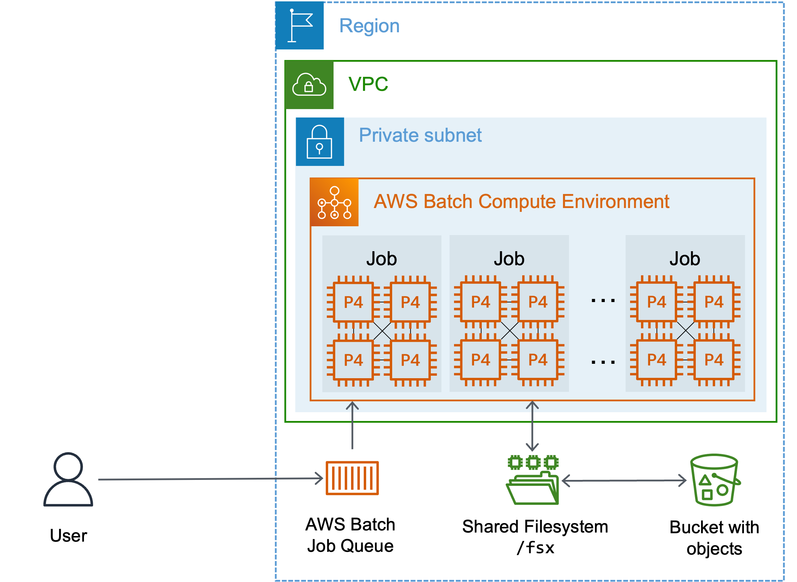

# AWS Batch Distributed Training Architectures

This repository provides CloudFormation templates and examples for running distributed training jobs on AWS Batch using GPU instances. The architecture can be easily modified to accommodate different instance types including Trainium (Trn) and other P-series instances.

## Table of Contents

- [Prerequisites](#prerequisites)
- [Architecture Overview](#architecture-overview)
- [Available Templates](#available-templates)
- [P4 Instance Deployment](#p4-instance-deployment)
- [P5 Instance Deployment](#p5-instance-deployment)
- [P6 Instance Deployment](#p6-instance-deployment)
- [Important Considerations](#important-considerations)

## Prerequisites

> **⚠️ Important**: You must deploy the VPC template [`2.vpc-one-az.yaml`](../../1.vpc_network/2.vpc-oneaz.yaml) before deploying any Batch template. The Batch templates automatically fetch the EFA Security Group ID and Subnet ID from the VPC template's exported values.

## Architecture Overview

This architecture consists of the following AWS resources:

| Component | Purpose | Documentation |
|-----------|---------|---------------|
| **AWS Batch Compute Environment** | Manages compute resources for multi-node parallel jobs (similar to a compute cluster) | [AWS Docs](https://docs.aws.amazon.com/batch/latest/userguide/compute_environments.html) |
| **AWS Batch Job Queue** | Queues jobs for execution (similar to Slurm/LSF schedulers) | [AWS Docs](https://docs.aws.amazon.com/batch/latest/userguide/job_queues.html) |
| **EC2 Launch Template** | Configures EFA network interfaces for high-performance networking | [AWS Docs](https://docs.aws.amazon.com/autoscaling/ec2/userguide/launch-templates.html) |
| **Job Definition** | Template for job execution, references container images | [AWS Docs](https://docs.aws.amazon.com/batch/latest/userguide/job_definitions.html) |
| **ECR Container Registry** | Stores Docker container images | [AWS Docs](https://docs.aws.amazon.com/AmazonECR/latest/userguide/what-is-ecr.html) |



## Available Templates

| Template | Instance Types | Features |
|----------|----------------|----------|
| [`0.aws-batch-distributed-training.yaml`](./0.aws-batch-distributed-training.yaml) | P4d.24xlarge (default) | Standard deployment with 4 EFA interfaces |
| [`0.aws-batch-distributed-training-p5.yaml`](./0.aws-batch-distributed-training-p5.yaml) | P5.48xlarge | Optimized for P5 instances |
| [`aws-batch-distributed-training-p6.yaml`](./aws-batch-distributed-training-p6.yaml) | P6-b200.48xlarge | P6 deployment with sample AWS Batch MNP job setup |

## P4 Instance Deployment

### Quick Deploy

Deploy the standard template with one click:

[<kbd> <br> 1-Click Deploy 🚀 <br> </kbd>](https://console.aws.amazon.com/cloudformation/home?#/stacks/quickcreate?templateURL=https://awsome-distributed-training.s3.amazonaws.com/templates/0.aws-batch-distributed-training.yaml&stackName=AWS-Batch)

### Parameters

| Parameter | Type | Description |
|-----------|------|-------------|
| `VPCStackParameter` | **Required** | Name of the VPC CloudFormation stack |
| `AMI` | Optional | Custom AMI ID (leave blank for default) |
| `CapacityReservationId` | Optional | EC2 Capacity Reservation ID |
| `CapacityReservationResourceGroup` | Optional | Alternative to CapacityReservationId |
| `EC2KeyPair` | Optional | EC2 key pair for SSH debugging |
| `CreatePlacementGroup` | Optional | Create placement group for instances |

### P5 Instance Deployment

```bash
aws cloudformation create-stack \
  --stack-name aws-batch-distributed-training \
  --template-body file://0.aws-batch-distributed-training.yaml \
  --parameters \
    ParameterKey=VPCStackParameter,ParameterValue="your-vpc-stack-name" \
    ParameterKey=CapacityReservationId,ParameterValue="cr-1234567890" \
  --capabilities CAPABILITY_NAMED_IAM
```

## P6 Instance Deployment

### Template Parameters

| Parameter | Type | Description |
|-----------|------|-------------|
| `VPCStackParameter` | **Required** | Name of the VPC CloudFormation stack |
| `CapacityReservationId` | **Required** | Capacity Reservation ID (e.g., cr-1234567890) |

### Deployment Steps

#### Step 1: Deploy CloudFormation Stack

```bash
aws cloudformation create-stack \
  --stack-name batch-p6 \
  --template-body file://aws-batch-distributed-training-p6.yaml \
  --parameters \
    ParameterKey=VPCStackParameter,ParameterValue="your-vpc-stack-name" \
    ParameterKey=CapacityReservationId,ParameterValue="cr-1234567890" \
  --capabilities CAPABILITY_NAMED_IAM
```

#### Step 2: Generate and Store SSH Key

```bash
# Generate SSH key pair
ssh-keygen -t rsa -b 2048 -N '' -f /tmp/batch_key

# Store private key in Secrets Manager
aws secretsmanager put-secret-value \
  --secret-id batch-p6-ssh-key \
  --secret-string file:///tmp/batch_key

# Clean up temporary files
rm /tmp/batch_key /tmp/batch_key.pub
```

### Testing Your Deployment

Submit a multi-node NCCL test job to verify the setup:

```bash
# Retrieve stack outputs
JOB_DEFINITION=$(aws cloudformation describe-stacks \
  --stack-name batch-p6 \
  --query 'Stacks[0].Outputs[?OutputKey==`JobDefinitionMultiInstance`].OutputValue' \
  --output text)

JOB_QUEUE=$(aws cloudformation describe-stacks \
  --stack-name batch-p6 \
  --query 'Stacks[0].Outputs[?OutputKey==`DistributedDeepLearningJQ`].OutputValue' \
  --output text)

# Submit test job
aws batch submit-job \
  --job-name nccl-test-2node \
  --job-queue ${JOB_QUEUE} \
  --job-definition ${JOB_DEFINITION} \
  --node-overrides numNodes=2

# Monitor job status
aws batch describe-jobs --jobs <job-id>

# View logs
aws logs tail /aws/batch/job --follow
```

### P6 Architecture Details

- **Container Image**: `public.ecr.aws/hpc-cloud/nccl-tests:latest`
- **Network Configuration**: 8 EFA interfaces per instance
- **SSH Setup**: Automated via inline bash script in Job Definition
- **Default Test**: `all_reduce_perf` with 8 GPUs per node (16 total processes for 2-node job)
- **Key Management**: SSH keys retrieved from Secrets Manager at container startup

## Important Considerations

### EFA Network Configuration

- EFA interfaces must be explicitly declared in the EC2 Launch Template
- The EFA security group must be provided and properly configured
- Network performance is critical for distributed training workloads

### VPC Dependencies

- The Compute Environment retrieves private subnet information from the VPC template
- Ensure the VPC template exports the required subnet and security group values
- Both templates must be deployed in the same AWS region

### Capacity Management

- Use Capacity Reservations for guaranteed instance availability
- Consider using Capacity Reservation Resource Groups for easier management
- Monitor your EC2 limits and request increases if needed

---

## Additional Resources

- [AWS Batch User Guide](https://docs.aws.amazon.com/batch/latest/userguide/)
- [Multi-node Parallel Jobs](https://docs.aws.amazon.com/batch/latest/userguide/multi-node-parallel-jobs.html)
- [EFA Documentation](https://docs.aws.amazon.com/AWSEC2/latest/UserGuide/efa.html)
