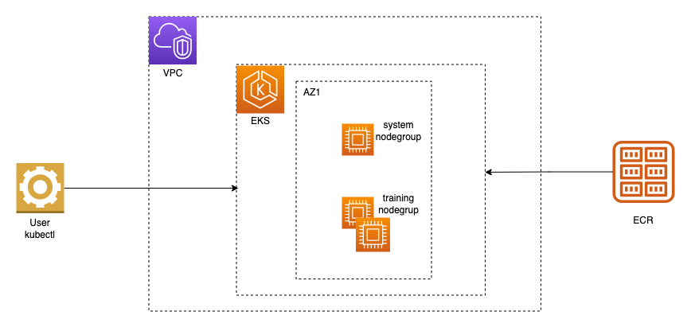

# Amazon EKS distributed training architecture

This project provides several reference architectures to run distributed training on Amazon EKS for different use cases using `p4d.24xlarge` instances (you can replace them by `p5` or `trn1`. These examples use [eksctl](eksctl.io) and a cluster manifest to create your specified Amazon EKS cluster.

## 0. Prerequisites

To deploy the architectures you must install the dependencies below. You are advised to go through the fist two steps of the [Getting started with Amazon EKS](https://docs.aws.amazon.com/eks/latest/userguide/getting-started.html) guide from the AWS Documentation.

1. [AWS CLI](https://docs.aws.amazon.com/cli/latest/userguide/getting-started-install.html) is the AWS command line interface.
2. [eksctl](https://eksctl.io) command line tool to manage EKS clusters.
3. [kubectl](https://kubernetes.io/docs/tasks/tools/#kubectl) command line for Kubernetes.

## 1. Architecture

The following digram shows a common architecture that can be used for distributed model training on EKS.



The EKS cluster has two nodegroups. A `system` nodegroup is used to run pods like kube-dns, kubeflow training operator, etc. which provide internal cluster-scope services and can run on CPU. A worker nodegroup built with an accelerated instance type is used to run the distributed training workload. 

## 2. Cluster configuration

The cluster configuration is specified via a yaml manifest file. If a cluster version is not specified in the manifest, then the default EKS API version will be used. For our examples we set the version to 1.27. This setting may be adjusted before creating clusters as needed.
The following example cluster configurations for distributed training are provided:

* [**`eks-g4dn-vpc.yaml`**](./eks-g4dn-vpc.yaml): Cluster using an existing VPC with a nodegroup of 2 * `g4dn.8xlarge` instances. This instance type supports Elastic Fabric Adapter (EFA), usually does not require a capacity reservation, and is a good starting point when developing distributed training architectures. To use this manifest, edit the vpc id and subnets, and specify the desired private subnet for the nodes.
* [**`eks-g4dn.yaml`**](./eks-g4dn.yaml): Cluster with a nodegroup of 2 * `g4dn.8xlarge` instances, created in a new VPC. This example shows that when a VPC is not specified, one is created for the cluster. The manifest can work without any modifications, however if you wish to change the cluster name, API version, region, availability zones, etc. you can modify the file before using it to create the cluster.
* [**`eks-p4de-odcr-vpc.yaml`**](./eks-p4de-odcr-vpc.yaml): Cluster using an existing VPC with a nodegroup of 2 * `p4de.24xlarge` instances from an existing on-demand capacity reservation (ODCR). This is the most common configuration for distributed training workloads.Edit the file to specify vpc id, subnets, and capacityReservationID. Please note that the subnet of the nodeGroup should match the one of the capacity reservation.
* [**`eks-p4de-odcr.yaml`**](./eks-p4de-odcr.yaml): Cluster with 2 * `p4de.24xlarge` instances from an existing ODCR. A new VPC will be created for this cluster. This configuration is useful for distributed training when no VPC is already available. Note that you would have to match the AZ of your ODCR in the nodegroup section of the manifest. Nodegroups in this and previous examples are fully-managed and can be accessed via the EKS console. If you are using an instance type that is not yet supported in managed nodegroups by EKS, you can define a nodegroup in a self-manged nodegroup section as shown at the end of this example.
* [**`eks-p5-odcr.yaml`**](./eks-p5-odcr.yaml): Cluster with 1 * `p5.48xlarge` instances from an existing ODCR and an existing VPC. Note that you would have to match the AZ of your ODCR in the nodegroup section of the manifest. Nodegroups in this and previous examples are fully-managed and can be accessed via the EKS console. If you are using an instance type that is not yet supported in managed nodegroups by EKS, you can define a nodegroup in a self-manged nodegroup by using the `eks-p5-capacity-block.yaml` template.
* [**`eks-p5-capacity-block.yaml`**](./eks-p5-capacity-block.yaml): This deploys a cluster without a node group, allowing you to create an unmanaged node group for Capacity Blocks for ML. See the section [Capacity Block](#4-capacity-blocks) for further detail.

## 3. Cluster creation

### 3.1 Edit the cluster configuration

To configure your desired cluster, edit the cluster manifest file that most closely matches your desired configuration or copy the file and customize it, following the [cluster manifest schema](https://eksctl.io/usage/schema/). Any of the values in the manifests can be changed and more node groups can be added to the same cluster. The minimal set of values to specify for each file are described above.


You will need to replace the following placeholders to deploy your clusters:

- `PLACEHOLDER_AWS_REGION`: region in which to deploy the cluster, replace by `us-east-1` for example.
- `PLACEHOLDER_AZ_1`: We use 2 AZs for the cluster, replace by `us-east-1a` for example.
- `PLACEHOLDER_AZ_2`: This AZ is where your compute capacity is located, replace by `us-east-1c` for example if that's where your capacity is located.
- `PLACEHOLDER_VPC_ID`: ID of the VPC in which you deploy the cluster, it should take the form `vpc-12356790abcd`.
- `PLACEHOLDER_SUBNET_PUBLIC_1` and `PLACEHOLDER_SUBNET_PUBLIC_2`: change to the id of a public subnet  (`subnet-12356790abcd`).
- `PLACEHOLDER_SUBNET_PUBLIC_2`: change to the id of a public subnet to host the compute nodes (`subnet-12356790abcd`).
- `PLACEHOLDER_SUBNET_PRIVATE_1`: change to the id of a public subnet to host the compute nodes (`subnet-12356790abcd`).
- `PLACEHOLDER_SUBNET_PRIVATE_2`: change to the id of a public subnet to host the compute nodes (`subnet-12356790abcd`). This subnet holds your compute capacity, ensure it is in the right AZ.
- `PLACEHOLDER_CAPACITY_RESERVATION_ID`: if using a capacity reservation put the ID here (`cr-12356790abcd`).


### 3.2 Create a cluster

1. Let's assume that your desired cluster configuration is stored in file `cluster.yaml`. Then to create the cluster, execute the following command:
    ```bash
    eksctl create cluster -f ./cluster.yaml
    ```
    Example output:
    ```console
    YYYY-MM-DD HH:mm:SS [ℹ] eksctl version x.yyy.z
    YYYY-MM-DD HH:mm:SS [ℹ] using region <region_name>
    ...
    YYYY-MM-DD HH:mm:SS [✔] EKS cluster "<cluster_name>" in "<region_name>" region is ready
    ```
    Cluster creation may take between 15 and 30 minutes. Upon successful creation your local `~/.kube/config` file gets updated with connection information to your cluster.
2. Execute the following command line in order to verify that the cluster is accessible:
    ```bash
    kubectl get nodes
    ```

You should see a list of three nodes. One would be a system node instance of type c5.2xlarge, and the others will belong to the nodegroup of instances with your desired instance type for distributed training.

### 3.3 Cleanup

To remove your cluster, execute the following command:

```
kubectl delete cluster -f ./cluster.yaml
```

Example output:
```
YYYY-MM-DD HH:mm:SS [ℹ] deleting EKS cluster "<cluster_name>"
...
YYYY-MM-DD HH:mm:SS [ℹ] waiting for CloudFormation stack "<stack_name>"
```

## 4. Capacity Blocks

Capacity Blocks for ML have a [restriction](https://docs.aws.amazon.com/eks/latest/userguide/capacity-blocks.html) that they can't be in a *managed node group*, in order to create an unmanaged node group we'll first deploy a eks cluster and then deploy a CloudFormation stack using the values created with the cluster:

1. Deploy the EKS cluster using the template `eks-p5-capacity-block.yaml`:

```bash
eksctl create cluster -f ./eks-p5-capacity-block.yaml
```

2. After this cluster deployment finishes we'll deploy the following stack:

[<kbd> <br> 1-Click Deploy 🚀 <br> </kbd>](https://console.aws.amazon.com/cloudformation/home?#/stacks/quickcreate?templateURL=https://awsome-distributed-training.s3.amazonaws.com/templates/amazon-eks-nodegroup.yaml&stackName=p5-nodegroup)


* `ClusterName` this needs to be the same as the cluster you created above, default to `eks-p5-odcr-vpc`
* `ClusterControlPlaneSecurityGroup` grab this by visiting the [EKS Console]() > **Cluster** > **Networking** > **Additional Security Group**
* `NodeImageIdSSMParam` defaults to the [EKS GPU AMI 1.29](https://docs.aws.amazon.com/eks/latest/userguide/eks-optimized-ami.html) but you can override this with the `NodeImageId` parameter.
* This sets up a [security group for EFA](https://docs.aws.amazon.com/AWSEC2/latest/UserGuide/efa-start.html#efa-start-security).


3. After the nodegroup is created we need to update the config map

3.1 Check to see if you already have an `aws-auth` `ConfigMap`.

```bash
kubectl describe configmap -n kube-system aws-auth
```

3.2 If you are shown an `aws-auth` `ConfigMap`, then update it as needed.

3.2.1 Open the `ConfigMap` for editing.

```bash
kubectl edit -n kube-system configmap/aws-auth
```

3.2.2 Add a new `mapRoles` entry as needed. Set the `rolearn` value to the **NodeInstanceRole** value that you recorded in the previous procedure.

```bash
[...]
data:
  mapRoles: |
    - rolearn: <ARN of instance role (not instance profile)>
      username: system:node:{{EC2PrivateDNSName}}
      groups:
        - system:bootstrappers
        - system:nodes
[...]
```

3.2.3 Save the file and exit your text editor.

3.3 If you received an error stating `"Error from server (NotFound): configmaps "aws-auth" not found`, then apply the stock `ConfigMap`.

3.3.1 Download the configuration map.

```bash 
curl -O https://s3.us-west-2.amazonaws.com/amazon-eks/cloudformation/2020-10-29/aws-auth-cm.yaml
```

3.3.2 In the `aws-auth-cm.yaml` file, set the `rolearn` value to the **NodeInstanceRole** value that you recorded in the previous procedure. You can do this with a text editor, or by replacing `my-node-instance-role` and running the following command:

```bash
sed -i.bak -e 's|<ARN of instance role (not instance profile)>|my-node-instance-role|' aws-auth-cm.yaml
```

3.3.3 Apply the configuration. This command may take a few minutes to finish.

```bash
kubectl apply -f aws-auth-cm.yaml
```


4. After the cluster is created we can list the nodes:

```bash
kubectl get nodes
```

5. Apply [K8 Nvidia CNI Plugin](https://github.com/NVIDIA/k8s-device-plugin):

```bash
kubectl create -f https://raw.githubusercontent.com/NVIDIA/k8s-device-plugin/v0.17.0/deployments/static/nvidia-device-plugin.yml
```

6. If using EFA, make sure to install the [EFA CNI Plugin](https://docs.aws.amazon.com/eks/latest/userguide/node-efa.html).

```bash
kubectl apply -f https://raw.githubusercontent.com/aws-samples/aws-efa-eks/main/manifest/efa-k8s-device-plugin.yml
```


## 5. References

For further information regarding EKS cluster infrastructure see the [aws-do-eks](https://github.com/aws-samples/aws-do-eks) project. More cluster configurations are available [here](https://github.com/aws-samples/aws-do-eks/tree/main/wd/conf/eksctl/yaml). 

Related resources for further reading can be found at the links below:
* [AWS CLI](https://aws.amazon.com/cli)
* [Amazon EKS](https://aws.amazon.com/eks)
* [eksctl](https://eksctl.io)
* [kubectl](https://kubernetes.io/docs/reference/kubectl)
* [do-framework](https://bit.ly/do-framework)
* [aws-do-eks](https://bit.ly/do-eks)
