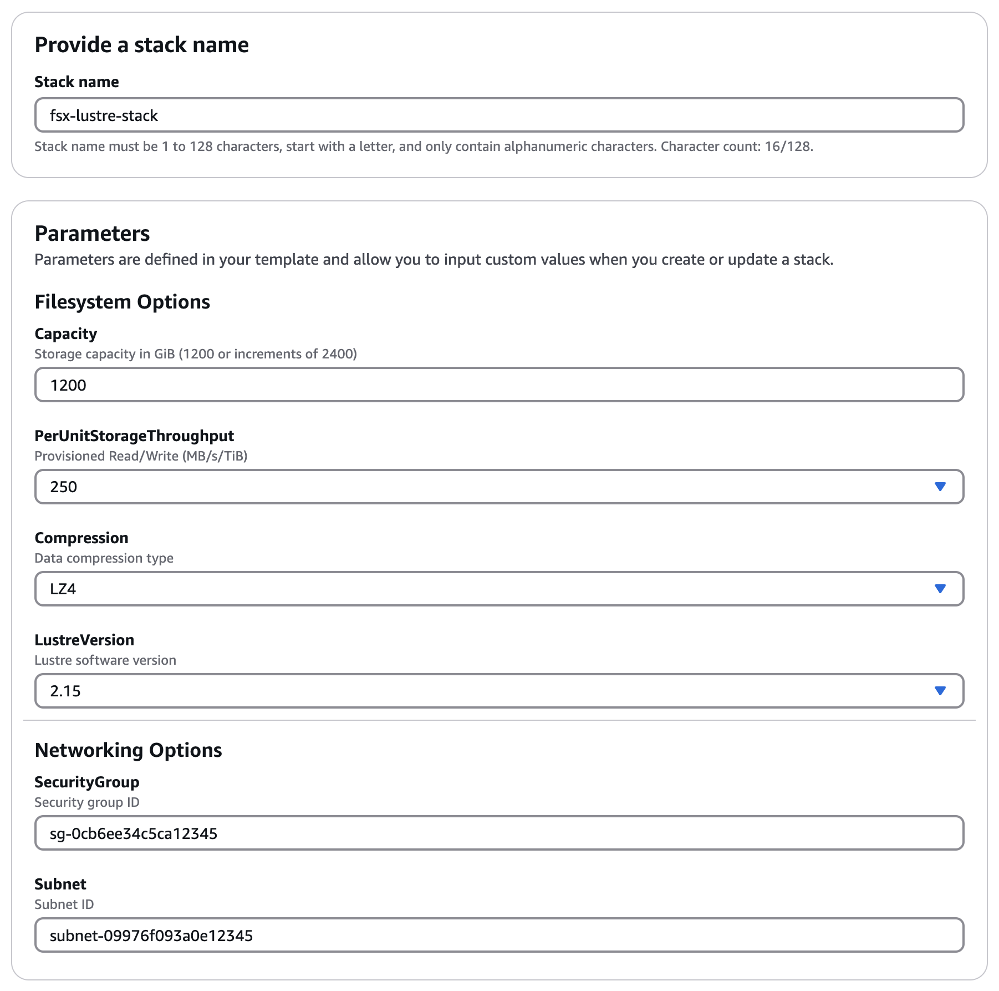

# AWS SageMaker HyperPod Distributed Training Reference Architectures

## 1. Architectures

SageMaker HyperPod clusters provide the ability to create customized clusters, typically with one or more head and login nodes, and multiple compute nodes (typically P4/P5 or Trn1 instances), and optionally a shared FSX for Lustre file system. When configured with Slurm, SageMaker HyperPod provides resiliency tools to automatically identify and replace unhealthy compute nodes. Additionally, HyperPod has access to SageMaker training tools, such as SageMaker Model and Data Parallel packages, and are automatically configured for EFA.

The example that follows describes the process of setting up a SageMaker HyperPod cluster with an attached FSX for Lustre volume.

## 2. Pre-requisites

Before creating a cluster, we need to install the latest [AWS CLI](https://docs.aws.amazon.com/cli/latest/userguide/getting-started-install.html), and setup the appropriate IAM role, VPC, FSx for Lustre volume, and S3 bucket.

### 2.1. Create IAM Role

First, we need to create a role with SageMaker and related resources as trusted entities.

```
aws iam create-role \
    --role-name AmazonSagemakerExecutionRole \
    --assume-role-policy-document file://0.AmazonSageMakerClustersExecutionRoleTrustedEntities.json
```

Next, we create a role policy...

```
aws iam create-policy \
    --policy-name AmazonSagemakerExecutionPolicy \
    --policy-document file://1.AmazonSageMakerClustersExecutionRolePolicy.json
```

...and attach it to the role we just created.

```
POLICY=$(aws iam list-policies --query 'Policies[?PolicyName==`AmazonSagemakerExecutionPolicy`]' | jq '.[0].Arn' |  tr -d '"')
aws iam attach-role-policy \
    --role-name AmazonSagemakerExecutionRole \
    --policy-arn $POLICY
```

### 2.2. Create S3 Bucket

Next, we'll need an S3 bucket. This bucket will be used to store the lifecycle scripts used to setup and configure our cluster.

```
# generate a unique name for the bucket
BUCKET="sagemaker-lifecycle-$(python3 -S -c 'import uuid; print(str(uuid.uuid4().hex)[:10])')"

# create the bucket
aws s3 mb s3://${BUCKET}
```

### 2.3. Create VPC (Optional)

Now we can create a VPC. This is only necessary if you want to attach your cluster to VPC specific resources. For example, to attach a shared FSx for Lustre volume to your cluster.

You can create a VPC using the configuration in [2.SageMakerVPC.yaml](./2.SageMakerVPC.yaml). Which is also available via [<kbd> <br> 1-Click Deploy 🚀 <br> </kbd>](https://us-west-2.console.aws.amazon.com/cloudformation/home?region=us-west-2#/stacks/quickcreate?templateURL=https://awsome-distributed-training.s3.amazonaws.com/templates/Vpc.yaml&stackName=SageMakerVPC)


Feel free to change the stack and VPC names. Make sure to select an availability zone that supports your preferred instance type ([Find an Amazon EC2 instance type](https://docs.aws.amazon.com/AWSEC2/latest/UserGuide/instance-discovery.html)). Leave both S3 and DynamoDB endpoints set to True. You can leave the IAM role blank.

Wait for this CloudFormation script to complete before continuing to the next step (it takes about 5 minutes).

### 2.3. Create FSx for Lustre (Optional)

FSx for Lustre provides a shared high performance file system that's accessible across all nodes in your cluster.

Similar to the VPC we just created, you can create an FSx for Lustre volume using [3.FSxLustre.yaml](./3.FSxLustre.yaml), or by using [<kbd> <br> 1-Click Deploy 🚀 <br> </kbd>](https://us-west-2.console.aws.amazon.com/cloudformation/home?region=us-west-2#/stacks/quickcreate?templateURL=https://awsome-distributed-training.s3.amazonaws.com/templates/FSxLustre.yaml&stackName=FSxLustre)



Change the name, capacity, throughput, and compression configurations as you wish. Select the latest Lustre version (2.15 by default). On NetworkStack, make sure this matches the name (case sensitive) of the VPC CloudFormation stack you used in the previous step. Once again, you can leave the IAM role blank.

Your FSx for Lustre volume will take about 10 minutes to deploy. In the meantime, we can setup our lifecycle scripts.

## 3. Cluster Setup

Now that we have all our infrastructure in place, we can create a cluster.

### 3.1 Lifecycle Scripts

Lifecycle scripts tell SageMaker HyperPod how to setup your cluster. HyperPod clusters can be launched as plain EC2 clusters with nothing installed, or can be created with configurations and users customized to fit a particular machine learning development workflow. We provide a [base configuration](./LifecycleScripts/base-config) to get started, which creates a basic Slurm cluster. Below is a brief description of what each script is doing.

| Script      | Description |
| ----------- | ----------- |
| add_users.sh      | [Optional] creates posix users specified in a file shared_users.txt       |
| lifecycle_script.py | This is the main entrypoint, sets everything else up. |
| mount_fsx.sh | Mounts an FSx for Lustre filesystem. |
| on_create.sh | Entrypoint for clusters. This script calls lifecycle_script.py |
| provisioning_parameters.json | Defines scheduler type Slurm and sets the partitions up also specifies FSx for Lustre Filesystem to attach. We'll modify this in a later step. |
| setup_mariadb_accounting.sh | Sets up Slurm Accounting  with a local mariadb server running on the HeadNode. |
| setup_rds_accounting.sh | Sets up Slurm Accounting  with a RDS endpoint. |
| shared_users_sample.txt | Sample of how to specify users for the add_users.sh script. |
| start_slurm.sh | Starts the Slurm scheduler daemon. |

Also note that there are two scripts in `utils` to install [Docker](https://www.docker.com/), [Enroot](https://github.com/NVIDIA/enroot), and [Pyxis](https://github.com/NVIDIA/pyxis). These scripts can be enabled by uncommenting these lines in `lifecycle_script.py`:

```
        # Note: Uncomment the below lines to install docker and enroot
        # ExecuteBashScript("./utils/install_docker.sh").run()
        # ExecuteBashScript("./utils/install_enroot_pyxis.sh").run(node_type)
```

You can follow this same pattern for further customizations. For example, if you'd like to install Miniconda as part of your lifecycles scripts, you can add the script under `utils` and call it using `ExecuteBashScript` in `lifecycle_script.py`.

For now, let's just use the base configuration provided. Upload the scripts to the bucket you created earlier. This needs to be the same S3 bucket and prefix where we uploaded the other lifecycle scripts earlier.

```
aws s3 cp --recursive LifeCycleScripts/base-config s3://${BUCKET}/LifeCycleScripts/base-config
```

If you created an FSx for Lustre volume in the previous section, we'll need to update one file in the lifecycle scripts to attach it to our cluster.

First, get your `DNSName` and `MountName` for your file system. This can be found either in the AWS console, or by using the CLI command

```
aws fsx describe-file-systems
```

Add both to your `provisioning_parameters.json` file. For example,

```
{
  "version": "1.0.0",
  "workload_manager": "slurm",
  "controller_group": "controller-machine",
  "login_group": "my-login-group",
  "worker_groups": [
    {
      "instance_group_name": "compute-nodes",
      "partition_name": "dev"
    }
  ],
"fsx_dns_name": "fs-12345678a90b01cde.fsx.us-west-2.amazonaws.com",
"fsx_mountname": "1abcdefg"
}
```

Make sure the `instance_group_name` matches the instance group name `InstanceGroupName` in your cluster config which we create next.

Copy the updated `provisioning_parameters.json` to S3:

```
aws s3 cp LifeCycleScripts/base-config/provisioning_parameters.json s3://${BUCKET}/LifeCycleScripts/base-config/
```

Lifecycle scripts can be reused across multiple cluster. This can be handy particularly if you want to move the work saved on your FSx for Lustre volume to a new cluster.

### 3.2 Cluster Configuration

Next we can configure our actual cluster.

In this case, we'll create a cluster with one C5 controller node, and Trn1.32xlarge compute nodes. We'll use the IAM role we created earlier. Note that `InstanceGroupName` for the controller node needs to match `controller_group` from your `provisioning_parameters.json`, while `InstanceGroupName` for your compute nodes needs to match `instance_group_name` under `worker_groups` also in `provisioning_parameters.json`.

```
ROLE=$(aws iam list-roles --query 'Roles[?RoleName==`AmazonSagemakerExecutionRole`]' | jq '.[0].Arn' |  tr -d '"')
cat > cluster-config.json << EOL
[
  {
    "InstanceGroupName": "controller-machine",
    "InstanceType": "ml.c5.xlarge",
    "InstanceCount": 1,
    "LifeCycleConfig": {
      "SourceS3Uri": "s3://${BUCKET}/LifeCycleScripts/base-config/",
      "OnCreate": "on_create.sh"
    },
    "ExecutionRole": "${ROLE}",
    "ThreadsPerCore": 1
  },
  {
    "InstanceGroupName": "compute-nodes",
    "InstanceType": "ml.trn1.32xlarge",
    "InstanceCount": 4,
    "LifeCycleConfig": {
      "SourceS3Uri": "s3://${BUCKET}/LifeCycleScripts/base-config/",
      "OnCreate": "on_create.sh"
    },
    "ExecutionRole": "${ROLE}",
    "ThreadsPerCore": 1
  }
]
EOL
```

And finally, if you created a VPC and FSx for Lustre volume, we need to create a configuration to make sure your cluster is created in the correct VPC. 

```
cat > vpc-config.json << EOL
{ 
  "SecurityGroupIds": ["$SECURITY_GROUP"],
  "Subnets":["$SUBNET_ID"] 
}
EOL
```

Your `SUBNET_ID` can be found using 

```
aws fsx describe-file-systems

{
    "FileSystems": [
        {
            ...
            "StorageType": "SSD",
            "VpcId": "vpc-0123456789012345a",
            "SubnetIds": [
                "subnet-01a2bc3456d78efgh"
            ],


```

Your `SECURITY_GROUP` was configured by the VPC CloudFormation stack, and begins with `SageMakerVPC-SecurityGroup`. Using the VPC ID from the `aws fsx describe-file-systems` output, you can find your `SECURITY_GROUP` using the CLI command

```
aws ec2 describe-security-groups \
    --filters 'Name=group-name,Values="SageMakerVPC-SecurityGroup*"' \
              'Name=vpc-id,Values=vpc-0123456789012345a'
```

### 3.3 Launch Cluster

Now that everything is in place, we can launch our cluster with the command from the `5.sagemaker-hyperpod` directory.

```
aws sagemaker create-cluster \
    --cluster-name ml-cluster \
    --instance-groups file://cluster-config.json \
    --region us-west-2 \
    --vpc-config file://vpc-config.json
```

You can see the current state of the cluster with

```
aws sagemaker describe-cluster --cluster-name ml-cluster --region us-west-2 
```

Or list all your cluster with

```
aws sagemaker list-clusters
```

You can see information on all your cluster nodes with 

```
aws sagemaker list-cluster-nodes --cluster-name ml-cluster --region us-west-2 
```

### 3.4 SSH Into Your Cluster

To log into your cluster, you need the cluster id from the cluster arn, instance ID of your controller node, and instance group name of your controller group. You can your cluster ID with

```
aws sagemaker describe-cluster --cluster-name ml-cluster --region us-west-2

{
    "ClusterArn": "arn:aws:sagemaker:us-west-2:123456789012:cluster/2hd31rmi9mde",
    "ClusterName": "ml-cluster",
```

In this case, the cluster ID is `2hd31rmi9mde`

Get your controller machine instance ID with

```
aws sagemaker list-cluster-nodes --cluster-name ml-cluster --region us-west-2 

{
    "NextToken": "",
    "ClusterNodeSummaries": [
        {
            "InstanceGroupName": "controller-machine",
            "InstanceId": "i-09e7576cbc230c181",
            "InstanceType": "ml.c5.xlarge",
            "LaunchTime": "2023-11-26T15:28:20.665000-08:00",
            "InstanceStatus": {
                "Status": "Running",
                "Message": ""
            }
        },
```

And login with 

```
CLUSTER_ID=2hd31rmi9mde
CONTROLLER_GROUP=controller-machine
INSTANCE_ID=i-09e7576cbc230c181
TARGET_ID=sagemaker-cluster:${CLUSTER_ID}_${CONTROLLER_GROUP}-${INSTANCE_ID}
aws ssm start-session --target $TARGET_ID
```

To make this process easier, we've included an `easy-ssh.sh` script that takes your cluster name and logs you in.

```
./easy-ssh.sh ml-cluster
```

If you used the base-config lifecycle scripts, you should be able to log in as ubuntu and run Slurm commands.

```
sudo su ubuntu
sinfo

PARTITION AVAIL  TIMELIMIT  NODES  STATE NODELIST
dev*         up   infinite      4   idle ip-10-1-4-190,ip-10-1-5-138,ip-10-1-18-53,ip-10-1-20-15
```

You'll also find your FSx for Lustre volume mounted at `/fsx`.

### 3.5 Deleting your Cluster 

When you're done with your cluster, you can delete it down with

```
aws sagemaker delete-cluster --cluster-name ml-cluster --region us-west-2 
```

Your FSx for Lustre volume will retain anything saved to it, and can be reattached to a future cluster.
