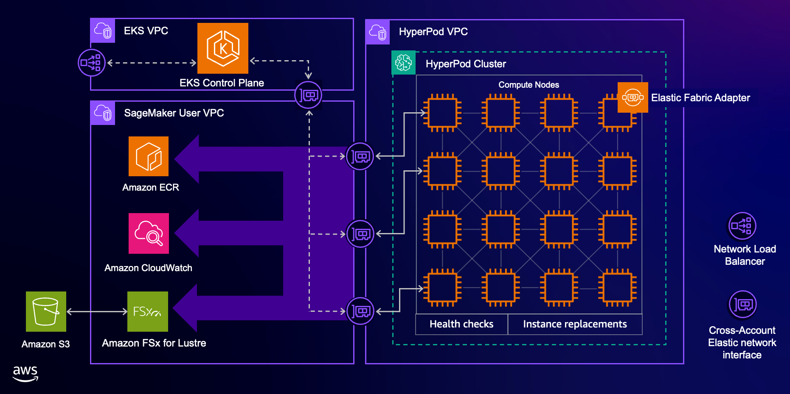

# Amazon EKS support in Amazon SageMaker HyperPod

> 🚨 We recommend following the official [Amazon SageMaker HyperPod EKS Workshop](https://catalog.us-east-1.prod.workshops.aws/workshops/2433d39e-ccfe-4c00-9d3d-9917b729258e/en-US) to deploy clusters, which contains detailed instructions and latest best-practices.

## 1. Architecture

Amazon SageMaker HyperPod is a managed service that makes it easier for you to train foundation models without interruptions or delays. It provides resilient and persistent clusters for large scale deep learning training of foundation models on long-running compute clusters. With HyperPod integration with Amazon EKS, customers can associate a HyperPod cluster with an EKS cluster and manage ML workloads using the HyperPod cluster nodes as Kubernetes worker nodes, all through the Kubernetes control plane on the EKS cluster.



The example that follows describes the process of setting up a SageMaker HyperPod cluster with EKS.

## 2. Prerequisites

### 2.1. Install AWS CLI

Before creating a cluster, we need to install the latest [AWS CLI](https://docs.aws.amazon.com/cli/latest/userguide/getting-started-install.html), you'll need version 2.17.47 as a minimum to run the SageMaker HyperPod commands:

### 2.2. Install Kubectl

We will need to setup kubectl to interact with the EKS cluster Kubernetes API server. The following commands correspond with Linux installations. See the [Kubernetes documentation](https://kubernetes.io/docs/tasks/tools/) for steps on how to install kubectl on other environments.

```bash
export KUBECTL_VERSION=1.29.3
export RELEASE_DATE=2024-04-19
curl -O https://s3.us-west-2.amazonaws.com/amazon-eks/${KUBECTL_VERSION}/${RELEASE_DATE}/bin/linux/amd64/kubectl
chmod +x ./kubectl
mkdir -p $HOME/bin && cp ./kubectl $HOME/bin/kubectl && export PATH=$HOME/bin:$PATH
echo 'export PATH=$HOME/bin:$PATH' >> ~/.bashrc
```

### 2.3 Install Eksctl

You will use eksctl to create an IAM OIDC provider for your EKS cluster and use it to install additional addons. The following commands correspond with Unix installations. See the eksctl documentation for alternative instilation options.

```bash
# for ARM systems, set ARCH to: `arm64`, `armv6` or `armv7`
ARCH=amd64
PLATFORM=$(uname -s)_$ARCH

curl -sLO "https://github.com/eksctl-io/eksctl/releases/latest/download/eksctl_$PLATFORM.tar.gz"

# (Optional) Verify checksum
curl -sL "https://github.com/eksctl-io/eksctl/releases/latest/download/eksctl_checksums.txt" | grep $PLATFORM | sha256sum --check

tar -xzf eksctl_$PLATFORM.tar.gz -C /tmp && rm eksctl_$PLATFORM.tar.gz

sudo mv /tmp/eksctl /usr/local/bin
```

## 3. [Deploy HyperPod Infrastructure using CloudFormation](./cfn-templates/README.md)

## 4. Connect to EKS cluster 

Once you've deployed the HyperPod Infrastructure, we'll reference the EKS cluster as the orchestrator of the HyperPod compute nodes.

By default, the Amazon EKS service will automatically create an [AccessEntry](https://docs.aws.amazon.com/AWSCloudFormation/latest/UserGuide/aws-resource-eks-accessentry.html) with [AmazonEKSClusterAdminPolicy](https://docs.aws.amazon.com/eks/latest/userguide/access-policies.html#access-policy-permissions)  permissions for the IAM principal that you use to deploy the CloudFormation stack, which includes an EKS cluster resource. You can create additional access entries later through the EKS management console or the AWS CLI. For more information, see the documentation on [managing access entries](https://docs.aws.amazon.com/eks/latest/userguide/access-entries.html).

<details>
<summary>AWS CLI Examples</summary>
The create-access-entry  command creates an access entry that gives an IAM principal access your EKS cluster:

```bash 
aws eks create-access-entry \
 --cluster-name $EKS_CLUSTER_NAME \
 --principal-arn arn:aws:iam::xxxxxxxxxxxx:role/ExampleRole \
 --type STANDARD \
 --region $AWS_REGION
```

The associate-access-policy  command associates an access policy and its scope to an access entry:

```bash 
aws eks associate-access-policy \
 --cluster-name $EKS_CLUSTER_NAME \
 --principal-arn arn:aws:iam::xxxxxxxxxxxx:role/ExampleRole \
 --policy-arn arn:aws:eks::aws:cluster-access-policy/AmazonEKSClusterAdminPolicy \
 --access-scope type=cluster \
 --region $AWS_REGION
```
</details>

<sp></sp>

Run the [aws eks update-kubeconfig](https://awscli.amazonaws.com/v2/documentation/api/latest/reference/eks/update-kubeconfig.html) command to upade your local kubeconfig file (located at `~/.kube/config`) with the credentials and configuration needed to connect to your EKS cluster using the `kubectl` command.  

```bash
aws eks update-kubeconfig --name $EKS_CLUSTER_NAME
```

You can verify that you are connected to the EKS cluster by running this commands: 
```bash 
kubectl config current-context 
```
```
arn:aws:eks:us-west-2:xxxxxxxxxxxx:cluster/hyperpod-eks-cluster
```
```bash
kubectl get svc
```
```
NAME             TYPE        CLUSTER-IP   EXTERNAL-IP PORT(S)   AGE
svc/kubernetes   ClusterIP   10.100.0.1   <none>      443/TCP   1m
```

## 5. SSH into instances in the HyperPod Cluster

To SSH into the instances, you need the cluster id from the cluster arn, instance ID of your node, and instance group name of your controller group. You can your HyperPod cluster ID with

```
aws sagemaker describe-cluster --cluster-name ml-cluster --region us-west-2

{
    "ClusterArn": "arn:aws:sagemaker:us-west-2:123456789012:cluster/2hd31rmi9mde",
    "ClusterName": "ml-cluster",
```

In this case, the cluster ID is `2hd31rmi9mde`

Get your  machine instance ID with

```
aws sagemaker list-cluster-nodes --cluster-name ml-cluster --region us-west-2

{
    "NextToken": "",
    "ClusterNodeSummaries": [
        {
            "InstanceGroupName": "controller-machine",
            "InstanceId": "i-09e7576cbc230c181",
            "InstanceType": "ml.c5.xlarge",
            "LaunchTime": "2023-11-26T15:28:20.665000-08:00",
            "InstanceStatus": {
                "Status": "Running",
                "Message": ""
            }
        },
```

And login with

```
CLUSTER_ID=2hd31rmi9mde
CONTROLLER_GROUP=controller-machine
INSTANCE_ID=i-09e7576cbc230c181
TARGET_ID=sagemaker-cluster:${CLUSTER_ID}_${CONTROLLER_GROUP}-${INSTANCE_ID}
aws ssm start-session --target $TARGET_ID
```

## 6. Running workloads on the cluster 

To run workloads on the cluster you can use kubctl(configured in prerequisities) to interact with the EKS control plane and submit jobs. 

Amazon SageMaker HyperPod also provides a [CLI](https://github.com/aws/sagemaker-hyperpod-cli) which can be used to manage jobs on the cluster without having to worry about the kubernetes constraints. To setup the CLI follow the below steps. 

* Install SageMaker HyperPod CLI refering the documentation [here](https://github.com/aws/sagemaker-hyperpod-cli?tab=readme-ov-file#installation)
* To use the CLI to access cluster and submit jobs refer to the documentation [here](https://github.com/aws/sagemaker-hyperpod-cli?tab=readme-ov-file#usage)

## 7. Patching your HyperPod cluster

Run `update-cluster-software` to update existing HyperPod clusters with software and security patches provided by the SageMaker HyperPod service. For more details, see [Update the SageMaker HyperPod platform software of a cluster](https://docs.aws.amazon.com/sagemaker/latest/dg/sagemaker-hyperpod-operate.html#sagemaker-hyperpod-operate-cli-command-update-cluster-software) in the *Amazon SageMaker Developer Guide*.

```
aws sagemaker update-cluster-software --cluster-name ml-cluster --region $AWS_REGION
```

Note that this API replaces the instance root volume and cleans up data in it. You should back up your work before running it.

## 8. [(Optional) Manual Steps for SageMaker HyperPod](./README-manual-steps.md)
