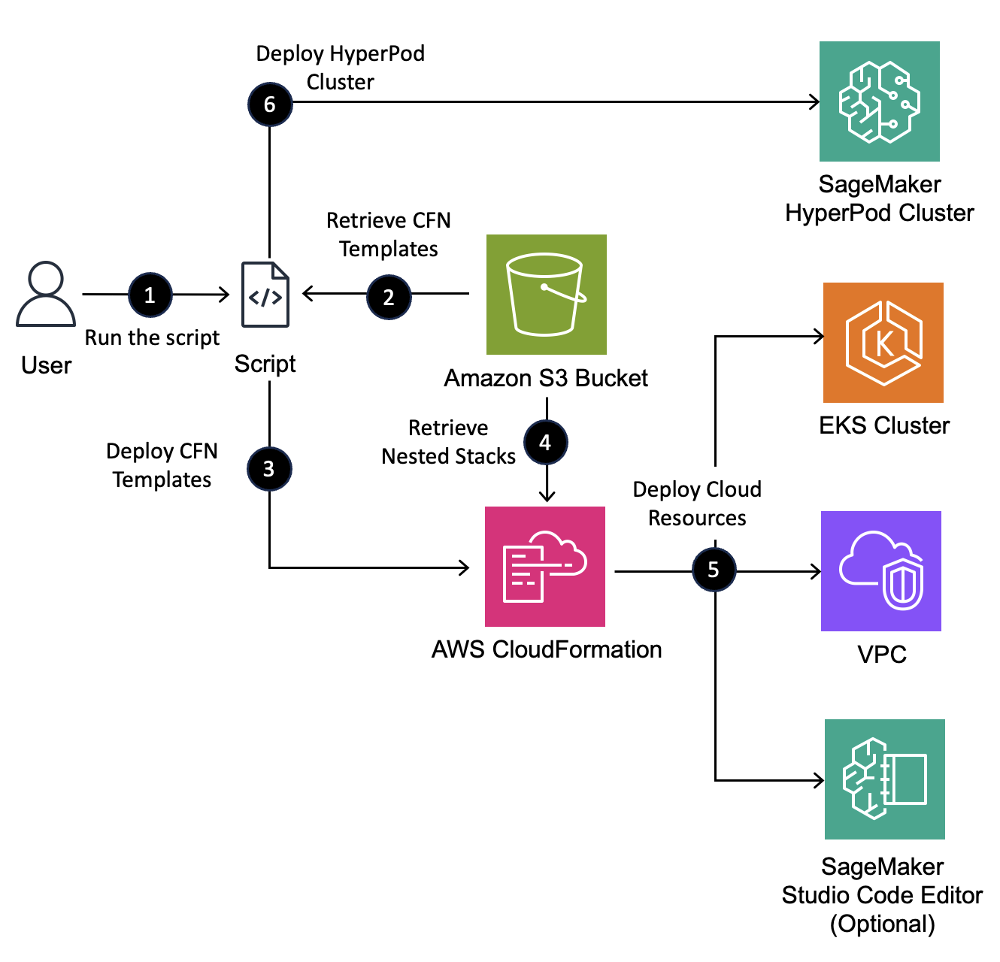

# Amazon SageMaker Hyperpod Cluster Automation Script

This project provides a script to automate the creation and setup of a Amazon SageMaker Hyperpod cluster with EKS integration.

The automation script streamlines the process of setting up a distributed training environment using AWS SageMaker Hyperpod.
It handles the installation and configuration of necessary tools, clones the required repository, sets up environment variables, and configures lifecycle scripts for the SageMaker Hyperpod architecture.

If you plan to use this script to **deploy the same infrastructure multiple times in the same account and region**, be sure to adjust the CloudFormation stack names and resource name prefixes you use when prompted by the script in order to avoid resource naming conflicts.

## What the Helper Script Does

In this section, we provide you with a [helper script](https://github.com/aws-samples/awsome-distributed-training/blob/main/1.architectures/7.sagemaker-hyperpod-eks/automate-smhp-eks/hyperpod-eks-cluster-creation.sh) that will walk you through the following:

1. Installing the right packages in your environment (e.g. aws cli, helm, kubectl, eksctl) 
    - Optionally creating a [SageMaker Studio Code Editor](https://docs.aws.amazon.com/sagemaker/latest/dg/code-editor.html) environment for you to use. 
2. Configuring and deploying the supporting workshop cloud infrastructure, including: 
    - A VPC to use for network communication between your EKS and HyperPod clusters via elastic network interfaces (ENIs). 
    - A Private Subnet in the availability zone where your accelerated compute capacity resides. 
    - A Security Group configured for FSx for Lustre and Elastic Fabric Adapter (EFA) communication. 
    - An EKS Cluster to use as the control interface for your HyperPod cluster. 
    - An S3 Bucket with with the [on_create.sh](https://github.com/aws-samples/awsome-distributed-training/blob/main/1.architectures/7.sagemaker-hyperpod-eks/LifecycleScripts/base-config/on_create.sh) lifecycle script auto-uploaded. 
    - An IAM Role which allows the HyperPod cluster to run and communicate with other AWS resource on your behalf. 
3. Configuring and deploying your HyperPod cluster with the option to add multiple instance groups.
4. Configuring your EKS cluster, including:
    - Setting up your cluster context (it also lets you choose the right context, if the incorrect one is chosen). 
    - The option to add [EKS access entries](https://docs.aws.amazon.com/eks/latest/userguide/access-entries.html) for other IAM users or roles. 
    - Installing HyperPod dependencies on your EKS cluster via [Helm Charts](https://github.com/aws/sagemaker-hyperpod-cli/tree/main/helm_chart). 
5. At re\:Invent 2024, we launched [SageMaker HyperPod training plans](https://aws.amazon.com/blogs/machine-learning/speed-up-your-cluster-procurement-time-with-amazon-sagemaker-hyperpod-training-plans/). This script also includes automation to use your training plans! 

## How the Helper Script Works

The following diagram depicts the high-level workflow of how the helper script deploys the workshop infrastructure on your behalf:



1. When you run the helper script, you will be prompted to answer a series of questions in order to dynamically configure the cloud resources to fit your needs. 
2. The helper script references an AWS managed S3 bucket to pull down CloudFormation stack templates. 
3. Optionally, the helper script will use the [`sagemaker-studio-stack.yaml`](https://github.com/aws-samples/awsome-distributed-training/blob/main/1.architectures/7.sagemaker-hyperpod-eks/cfn-templates/sagemaker-studio-stack.yaml) file to deploy a [SageMaker Studio Code Editor](https://docs.aws.amazon.com/sagemaker/latest/dg/code-editor.html) environment for you. 
4. The helper script will then use the [`main-stack.yaml`](https://github.com/aws-samples/awsome-distributed-training/blob/main/1.architectures/7.sagemaker-hyperpod-eks/cfn-templates/nested-stacks/main-stack.yaml) file to deploy the remaining components of the workshop infrastructure. This includes a series of nested Cloudformation stacks that will be pulled from the AWS managed S3 bucket. 
5. AWS CloudFormation will deploy the configured workshop infrastructure, including VPC, Private Subnet, Security Group, S3 Bucket, IAM Role, and EKS Cluster resources. See [Deploy HyperPod Infrastructure using CloudFormation](./cfn-templates/README.md) for details. 
6. Finally the helper script walks you through a series of prompts to configure and deploy a HyperPod cluster using the AWS CLI. 

## Running the Helper Script

Prerequisites

- AWS CLI (version 2.17.47 or higher)
- Git
- Bash shell environment
- AWS account with appropriate permissions

To run the helper script, clone the [awsome-distributed-training](https://github.com/aws-samples/awsome-distributed-training) repository, or directly download the script (as shown below) and run it on your local (Linux/macOS) terminal. It is recommended to run this script from your own directory, rather than running `cd` into the cloned repository directory. Make sure you've configured the AWS CLI with the IAM principal (user or role) you wish to use before running the script.

```bash
# Clone the repository
mkdir hyperpod-eks && cd hyperpod-eks

curl -O https://raw.githubusercontent.com/aws-samples/awsome-distributed-training/refs/heads/main/1.architectures/7.sagemaker-hyperpod-eks/automate-smhp-eks/hyperpod-eks-cluster-creation.sh

# Make the script executable 
chmod +x hyperpod-eks-cluster-creation.sh

# Run the script
./hyperpod-eks-cluster-creation.sh
```
Executing the script will result in various prompts showing up in your terminal similar to the demonstration below:


These prompts will ask you various questions about how you want to configure your cloud resources. There are intuitive defaults in place to help expedite resource creation. These defaults are indicated using square brackets `[ ]`. 

For example: 
```
Enter worker group name [worker-group-1]: 
Enter the instance type for your worker group [ml.g5.12xlarge]:
Enter number of instances [1]:
```

In this case, when you are prompted to configure the details one of your HyperPod cluster worker groups, the default name is set to `worker-group-1` with 1 count of an `ml.g5.12xlarge` instance. 

To accept a default value press `ENTER/return`. Otherwise, type in the alternative value you wish to use. 

For binary choice questions, the default value is indicated by a capital letter. For example `(Y/n)` indicates that the default is set to `yes`, while `(y/N)` indicates that the default is set to `no`. 

Voila! Once you get through the script, you should see a directory that looks like
```bash
hyperpod/
|-- hyperpod-eks-cluster-creation.sh   # This script!
|-- awsome-distributed-training/   # The script clones the repo with all the Lifecycle Scripts!
|-- cluster-config.json            # Cluster configuration generated by this script. Run `vi cluster-config.json` to make changes
|-- env_vars                       # Your environment variables used to create the SMHP cluster
`-- ...
```

## How AWS CloudFormation is Used 
AWS CloudFormation is used under the hood in two stages of the script to deploy the optional SageMaker Studio Code Editor environment as well as the required supporting cloud infrastructure. 

For each stage, the script waits for the respective CloudFormation stacks to complete their deployment, which may take approximately 15 minutes. 

The script will continue once CloudFormation deployment is complete. 

Feel free to navigate to the [AWS CloudFormation console](https://console.aws.amazon.com/cloudformation/home) to independently monitor progress. 

If you plan to use this script to **deploy the same infrastructure multiple times in the same account and region**, be sure to adjust the CloudFormation stack names and resource name prefixes you use when prompted by the script in order to avoid resource naming conflicts.

## Manual HyperPod Cluster Creation (Optional)
The final step of the script gives you the option to confirm whether or not you want the HyperPod cluster to be created for you automatically. 

The default option is `yes` unless you submit `no`. 

This means that you may hit ENTER to let the script create your HyperPod cluster for you. 

If you would rather create the HyperPod cluster yourself, type `no` and manually execute the following command: 

```bash
aws sagemaker create-cluster \
    --cli-input-json file://cluster-config.json \
    --region $AWS_REGION
```

The HyperPod cluster configuration is stored in the `cluster-config.json` file. 

 If you'd like to make changes to the `cluster-config.json`, you can open it up in a text editor like `vim` and make the changes. 
 ```bash
 # Edit the cluster configuration file
 vim cluster-config.json
 ```

## Monitor HyperPod cluster creation status

You can check the status of your cluster using either the SageMaker console, or the command below. Feel free to add a `watch -n 1` before this to refresh the output every second.

```bash
aws sagemaker list-clusters --output table
```

**Cluster creation typically takes 12-20 minutes.**

You'll see output similar to the following:

```
-------------------------------------------------------------------------------------------------------------------------------------------------
|                                                                 ListClusters                                                                  |
+-----------------------------------------------------------------------------------------------------------------------------------------------+
||                                                              ClusterSummaries                                                               ||
|+----------------------------------------------------------------+----------------------+----------------+------------------------------------+|
||                           ClusterArn                           |     ClusterName      | ClusterStatus  |           CreationTime             ||
|+----------------------------------------------------------------+----------------------+----------------+------------------------------------+|
||  arn:aws:sagemaker:us-west-2:159553542841:cluster/uwme6r18mhic |  ml-cluster          |  Creating     |  2024-12-04T16:59:09.433000+00:00   ||
|+----------------------------------------------------------------+----------------------+----------------+------------------------------------+|
```
