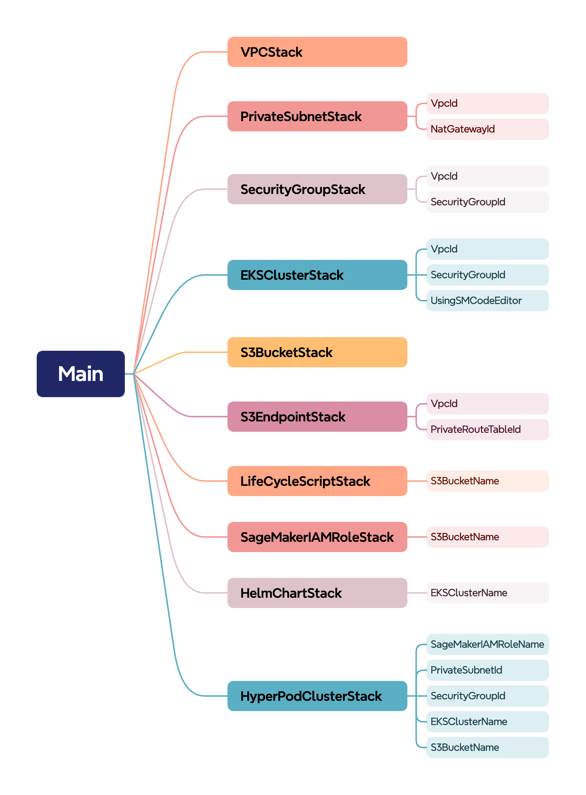

# Deploy HyperPod Infrastructure using CloudFormation
🚨 We recommend following the official [Amazon SageMaker HyperPod EKS Workshop](https://catalog.us-east-1.prod.workshops.aws/workshops/2433d39e-ccfe-4c00-9d3d-9917b729258e/en-US) to deploy clusters, which contains detailed instructions and latest best-practices.

As depicted below, the workshop infrastructure can be deployed using a series of nested CloudFormation stacks, each of which is responsible for deploying different aspects of a full HyperPod cluster environment.




As you can see in the [mai-stack.yaml](./nested-stacks/main-stack.yaml) file, the [`AWS::CloudFormation::Stack`](https://docs.aws.amazon.com/AWSCloudFormation/latest/UserGuide/aws-resource-cloudformation-stack.html)resources have a `TemplateURL` property that specifies the [S3 URL](https://docs.aws.amazon.com/AmazonS3/latest/userguide/VirtualHosting.html#virtual-hosted-style-access) pointing to the target CloudFormation template. 

The `TemplateURL` property is configured to reference a regional mapping of S3 buckets, which by default points to an AWS owned S3 bucket which is used to host the CloudFormation templates for the [Amazon SageMaker HyperPod EKS Workshop](https://catalog.us-east-1.prod.workshops.aws/workshops/2433d39e-ccfe-4c00-9d3d-9917b729258e/en-US). Again, we recommend following the instruction in the workshop, but we've made the templates available here for your to modify and reuse as necessary to meet your specific needs. 

## How to Host the Nested CloudFormation Stacks In Your Own S3 Bucket:  

### [Prerequisite: Build the Helm Chart Injector](./helm-chart-injector/README.md)

---

### Upload the nested CloudFormation stacks to your S3 bucket
```bash 
BUCKET_NAME=<your-bucket-name-here> 

aws s3 cp /nested-stacks/ s3://$BUCKET_NAME --recursive
```
---

### Configure the Main Stack to use the correct parameters

When you deploy the [main-stack.yaml](./nested-stacks/main-stack.yaml) template, be sure to updates the following parameters: 
- `TemplateURL` - Update this to specify the URL of the S3 bucket where you've uploaded the CloudFormation stacks in your own AWS account. 
- `CustomResourceS3Bucket` - Update this to specify the URL of the S3 bucket where you've uploaded the [Helm Chart Injector](./helm-chart-injector/README.md) dependency files. 
    - `LayerS3Key` - Update this to specify the S3 key for the `layer.zip` file you uploaded to your S3 bucket. 
    - `FunctionS3Key` - Update this to specify the S3 key for the `function.zip` file you uploaded to your S3 bucket. 

See the official [Amazon SageMaker HyperPod EKS Workshop](https://catalog.us-east-1.prod.workshops.aws/workshops/2433d39e-ccfe-4c00-9d3d-9917b729258e/en-US) for a more detailed explanation of the other parameters used in the nested CloudFormation stacks. 

