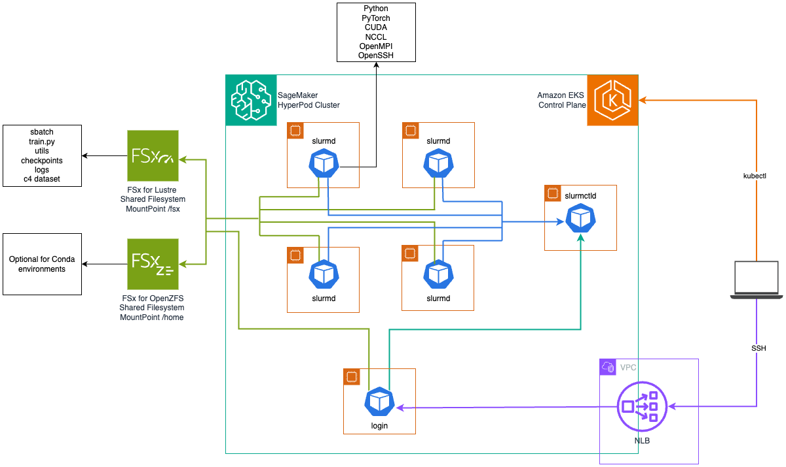

# Running Slurm on HyperPod EKS with Slinky

### What is the Slinky Project? 

The [Slinky Project](https://github.com/SlinkyProject/slurm-operator/tree/main) is an open-source solution maintained by SchedMD (the main developers of Slurm) that deploys Slurm on Kubernetes. When paired with HyperPod EKS, the Slinky Project unlocks the ability for enterprises who have standardized infrastructure management on Kubernetes to deliver a Slurm-based experience to their ML scientists. It also enables training, experimentation, and inference to happen on the same cluster of accelerated nodes with the build-in resiliency provided by HyperPod. 

---

### Slinky on HypePod EKS Architecture


The diagram above depicts the resulting proof-of-concept deployment outlined in this guide. An Amazon EKS cluster acts as an orchestration layer, while a HyperPod cluster delivers a resilient instance group of GPU accelerated compute nodes. The Slinky Slurm operator is installed to extend Kubernetes with custom resources and actions, and a containerized Slurm cluster is deployed using Kubernetes pods via Helm chart. This Slurm cluster includes the following components:
| Component | Description |
|-----------|-------------|
| Controller (slurmctld) | The central management daemon that monitors resources, accepts jobs, and assigns work to compute nodes. |
| Accounting (slurmdbd) | Handles job accounting and user/project management through a MariaDB database backend. |
| Compute (slurmd) | The worker nodes that execute jobs, organized into NodeSets which can be grouped into different partitions. |
| Login | Provides SSH access points for users to interact with the Slurm cluster and submit jobs. |
| REST API (slurmrestd) | Offers HTTP-based API access to Slurm functionality for programmatic interaction with the cluster. |
| Authentication (sackd) | Manages credential authentication for secure access to Slurm services. |
| MariaDB | The database backend used by the accounting service to store job, user, and project information. |
| Slurm Exporter | Collects and exports Slurm metrics for monitoring purposes. |

The login LoadBalancer type service is annotated to dynamically create an AWS Network Load Balancer using the [AWS Load Balancer Controller](https://github.com/kubernetes-sigs/aws-load-balancer-controller), allowing ML scientists to SSH into their login pods without interfacing with the Kubernetes API server via kubectl. 

The login and compute node pods also have FSx for Lustre and FSx for OpenZFS shared filesystems mounted. Having containerized compute node pods allows many dependencies that would traditionally be installed manually using Conda or a Python virtual environment to be baked into the container image, but shared filesystems are still beneficial for storing training artifacts, data, logs, and checkpoints. If Conda environments are still required, FSx for OpenZFS has proven optimal to avoid IOPS saturation with many small files. 

---

### Release Notes 

The following was tested in two infrastructure scenarios for hosting the compute NodeSet pods: 
1. On 4 `ml.g5.8xlarge` instances (1 A10G Tensor Core GPU each) 
2. On 2 `ml.p5.48xlarge` instances (8 H100 Tensor Core GPUs each) with EFAv2

For simplicity, 2 `ml.m5.2xlarge` instances were also allocated for separately hosting other components like the Controller and Login pods. You can adjust the number and type of instances associated with your HyperPod cluster, as well as the component affinity rules in the respective [g5-values.yaml](./g5/g5-values.yaml) or [p5-values.yaml](./p5/p5-values.yaml) files to modify how they are spread across your nodes. 

Testing used [Slurm Operator v0.3.0](https://github.com/orgs/slinkyproject/packages/container/package/charts/slurm-operator) and [Slurm Cluster v0.3.0](https://github.com/orgs/slinkyproject/packages/container/package/charts/slurm) Helm charts pulled as OCI artifacts from the Slinky container registry. Slinky v0.3.0 includes the NoteSet volume mount and Login Pod features.

Worker pods were built with Python 3.12.8 + PyTorch 2.6.0 + CUDA 12.6 + NCCL 2.23.4 + EFA Installer 1.38.0 (bundled with OFI NCCL plugin) pre-installed in the container image. See the [Docker Build for the Slurmd Deep Learning Container](./Docker-Build-README.md) for details. 
 
* * *

### Set Up the HyperPod Cluster: 

Deploy the [HyperPod EKS CloudFormation Stack](https://catalog.workshops.aws/sagemaker-hyperpod-eks/en-US/00-setup/00-workshop-infra-cfn) or the [HyperPod EKS Terraform Modules](https://catalog.workshops.aws/sagemaker-hyperpod-eks/en-US/00-setup/01-workshop-infra-tf) using the provided configurations below. 

#### <u>Clone the AWSome Distributed Training Repo</u> 
```
git clone https://github.com/aws-samples/awsome-distributed-training.git
cp -r awsome-distributed-training/1.architectures/7.sagemaker-hyperpod-eks/slinky-slurm .
cd slinky-slurm 
```

#### <u>Deploy Using CloudFormation</u> 

Use one of the provided `*-params.json` files to set the CloudFormation stack parameters. 

For using 4 `ml.g5.8xlarge` instances:
```
export PARAMS="g5/g5-params.json"
```
For using 2 `ml.p5.48xlarge` instances: 
```
export PARAMS="p5/p5-params.json"
```
Curl the `main-stack.yaml` template and issue an `aws cloudformation create-stack` command to deploy the specified HyperPod cluster infrastructure: 
```
export AWS_REGION=<your-region-here> # e.g. us-west-2

curl -O https://raw.githubusercontent.com/aws-samples/awsome-distributed-training/refs/heads/main/1.architectures/7.sagemaker-hyperpod-eks/cfn-templates/nested-stacks/main-stack.yaml 

aws cloudformation create-stack \
--stack-name  hp-eks-slinky-stack \
--template-body  file://main-stack.yaml \
--region $AWS_REGION \
 --capabilities CAPABILITY_IAM CAPABILITY_NAMED_IAM \
--parameters file://$PARAMS
```
Run the `create_config.sh` script to set your environment variables using the output of the deployed CloudFormation stack: 
```
export AWS_ACCOUNT_ID=$(aws sts get-caller-identity --query Account --output text)

export STACK_ID=hp-eks-slinky-stack

curl -O https://raw.githubusercontent.com/aws-samples/awsome-distributed-training/refs/heads/main/1.architectures/7.sagemaker-hyperpod-eks/create_config.sh 

chmod +x create_config.sh

./create_config.sh

source env_vars
```
---

#### <u>Deploy Using Terraform</u>

Copy the Terraform modules: 
```
cd ..
cp -r awsome-distributed-training/1.architectures/7.sagemaker-hyperpod-eks/terraform-modules .
cd terraform-modules/hyperpod-eks-tf
```
Use one of the provided `*-custom.tfvars` files to set the Terraform Module parameters. 

For using 4 `ml.g5.8xlarge` instances:
```
cp ../../slinky-slurm/g5/g5-custom.tfvars .
export PARAMS="g5-custom.tfvars"
```
For using 2 `ml.p5.48xlarge` instances: 
```
cp ../../slinky-slurm/p5/p5-custom.tfvars .
export PARAMS="p5-custom.tfvars"
```
Initialize the Terraform modules: 
```
terraform init
```
Generate an execution plan to validate the configuration of the Terraform modules: 
```
terraform plan -var-file=$PARAMS
```
Apply the Terraform modules to deploy the specified HyperPod cluster infrastructure: 
```
terraform apply  -var-file=$PARAMS
```
Run the `terraform_outputs.sh` script, which populates the `env_vars.sh` script with your environment variables: 
```
cd ..
chmod +x terraform_outputs.sh
./terraform_outputs.sh
cat env_vars.sh 
source env_vars.sh
cd ..
```
---
Verify that the required environment variables are set: 
```
echo $AWS_ACCOUNT_ID $AWS_REGION $EKS_CLUSTER_NAME $VPC_ID $PRIVATE_SUBNET_ID $SECURITY_GROUP_ID
```
(Optional) Add an EKS access entry (if needed):
```
export ROLE_ARN=arn:aws:iam::$AWS_ACCOUNT_ID:role/<your-role-name-here>

export PLCY_ARN=arn:aws:eks::aws:cluster-access-policy/AmazonEKSClusterAdminPolicy

aws eks create-access-entry \
 --cluster-name $EKS_CLUSTER_NAME \
 --principal-arn $ROLE_ARN \
 --type STANDARD \
 --region $AWS_REGION
 
aws eks associate-access-policy \
 --cluster-name $EKS_CLUSTER_NAME \
 --principal-arn $ROLE_ARN \
 --policy-arn $PLCY_ARN \
 --access-scope type=cluster \
 --region $AWS_REGION
```

Update your kubectl context: 

```
aws eks update-kubeconfig --name $EKS_CLUSTER_NAME

kubectl get nodes
```

* * *

### Create an FSx for Lustre Storage Class: 

Create an [IAM OpenID Connect (OIDC)](https://docs.aws.amazon.com/eks/latest/userguide/enable-iam-roles-for-service-accounts.html) identity provider for your cluster: 
```
eksctl utils associate-iam-oidc-provider --cluster $EKS_CLUSTER_NAME --approve
```
Create a service account with an IAM role mapped to it for use with the FSx for Lustre CSI driver: 
```
eksctl create iamserviceaccount \
  --name fsx-csi-controller-sa \
  --namespace kube-system \
  --cluster $EKS_CLUSTER_NAME \
  --attach-policy-arn arn:aws:iam::aws:policy/AmazonFSxFullAccess \
  --approve \
  --role-name FSXLCSI-${EKS_CLUSTER_NAME}-${AWS_REGION} \
  --region $AWS_REGION
```
Verify proper annotation of the service account with the IAM role ARN: 
```
kubectl get sa fsx-csi-controller-sa -n kube-system -oyaml
```
Install the [FSx for Lustre CSI Driver](https://github.com/kubernetes-sigs/aws-fsx-csi-driver) using Helm: 
```
helm repo add aws-fsx-csi-driver \
 https://kubernetes-sigs.github.io/aws-fsx-csi-driver
 
helm repo update

helm upgrade --install aws-fsx-csi-driver \
  --namespace kube-system \
  --set controller.serviceAccount.create=false \
  aws-fsx-csi-driver/aws-fsx-csi-driver
```
Verify instillation of the FSx for Lustre CSI driver: 
```
kubectl get pods -n kube-system \
 -l app.kubernetes.io/name=aws-fsx-csi-driver
```
Create an FSx for Lustre storage class: 
```
envsubst < lustre-storageclass.yaml | kubectl apply -f -
```
Note: This example uses [envsubst](https://github.com/a8m/envsubst) to inject the `PRIVATE_SUBNET_ID` and `SECURITY_GROUP_ID` environment variables into the storage class Kubernetes manifest. If you don't have envsubst in your development environment, install it by following the [instructions here.](https://github.com/a8m/envsubst?tab=readme-ov-file#installation)

Verify the `fsx-sc` storage class was created: 
```
kubectl get sc fsx-sc -oyaml
```

* * *

### (Optional) Create an FSx for OpenZFS Storage Class: 

Create a service account with an IAM role mapped to it for use with the FSx for OpenZFS CSI driver: 
```
eksctl create iamserviceaccount \
    --name fsx-openzfs-csi-controller-sa \
    --namespace kube-system \
    --cluster $EKS_CLUSTER_NAME \
    --attach-policy-arn arn:aws:iam::aws:policy/AmazonFSxFullAccess \
    --approve \
    --role-name FSXOCSI-${EKS_CLUSTER_NAME}-${AWS_REGION} \
    --region $AWS_REGION
```
Verify proper annotation of the service account with the IAM role ARN: 
```
kubectl get sa fsx-openzfs-csi-controller-sa -n kube-system -oyaml
```
Install the [FSx for OpenZFS CSI driver](https://github.com/kubernetes-sigs/aws-fsx-openzfs-csi-driver) using Helm: 
```
helm repo add aws-fsx-openzfs-csi-driver \
    https://kubernetes-sigs.github.io/aws-fsx-openzfs-csi-driver
 
helm repo update

helm upgrade --install aws-fsx-openzfs-csi-driver \
    --namespace kube-system \
    --set controller.serviceAccount.create=false \
    aws-fsx-openzfs-csi-driver/aws-fsx-openzfs-csi-driver
```
Verify instillation of the FSx for OpenZFS CSI driver: 
```
kubectl get pods -n kube-system \
 -l app.kubernetes.io/part-of=aws-fsx-openzfs-csi-driver
```
Create an FSx for OpenZFS Storage Class: 
```
envsubst < openzfs-storageclass.yaml | kubectl apply -f -
```
Note: This example uses [envsubst](https://github.com/a8m/envsubst) to inject the `PRIVATE_SUBNET_ID` and `SECURITY_GROUP_ID` environment variables into the storage class Kubernetes manifest. If you don't have envsubst in your development environment, install it by following the [instructions here.](https://github.com/a8m/envsubst?tab=readme-ov-file#installation)

Verify the `openzfs-sc` storage class was created:
```
kubectl get sc openzfs-sc -oyaml
```

* * *

### Install the AWS Load Balancer Controller:

Following the instructions below, which are a consolidation of the full [Install with Helm](https://docs.aws.amazon.com/eks/latest/userguide/lbc-helm.html) instructions found in the Amazon EKS documentation: 

Create the IAM policy to give the AWS Load Balancer Controller permission to make calls to AWS APIs on your behalf: 
```
curl -O https://raw.githubusercontent.com/kubernetes-sigs/aws-load-balancer-controller/refs/heads/release-2.13/docs/install/iam_policy.json

aws iam create-policy \
    --policy-name AWSLoadBalancerControllerIAMPolicy-v2.12.0 \
    --policy-document file://iam_policy.json
```

Create a service account with an IAM role mapped to it for use with the AWS Load Balancer Controller: 
``` 
eksctl create iamserviceaccount \
    --cluster=$EKS_CLUSTER_NAME \
    --namespace=kube-system \
    --name=aws-load-balancer-controller \
    --attach-policy-arn=arn:aws:iam::$AWS_ACCOUNT_ID:policy/AWSLoadBalancerControllerIAMPolicy-v2.12.0 \
    --override-existing-serviceaccounts \
    --region $AWS_REGION \
    --approve
```
Verify proper annotation of the service account with the IAM role ARN: 
```
kubectl get sa aws-load-balancer-controller -n kube-system -oyaml
```
Install the AWS Load Balancer Controller using Helm:
```
helm repo add eks https://aws.github.io/eks-charts
helm repo update

helm install aws-load-balancer-controller eks/aws-load-balancer-controller \
  -n kube-system \
  --set clusterName=$EKS_CLUSTER_NAME \
  --set serviceAccount.create=false \
  --set serviceAccount.name=aws-load-balancer-controller \
  --set region=$AWS_REGION \
  --set vpcId=$VPC_ID
```
Verify instillation of the AWS Load Balancer Controller: 
```
kubectl get pods -n kube-system -l app.kubernetes.io/name=aws-load-balancer-controller
```

* * *

### Instill Slinky Prerequisites:  

Follow the steps below to install [cert-manager](https://github.com/cert-manager/cert-manager) and the [Prometheus operator](https://github.com/prometheus-operator/kube-prometheus?tab=readme-ov-file#kube-prometheus):

```
helm repo add prometheus-community https://prometheus-community.github.io/helm-charts
helm repo add metrics-server https://kubernetes-sigs.github.io/metrics-server/
helm repo add bitnami https://charts.bitnami.com/bitnami
helm repo add jetstack https://charts.jetstack.io

helm repo update

helm install cert-manager jetstack/cert-manager \
	--namespace cert-manager --create-namespace --set crds.enabled=true

helm install prometheus prometheus-community/kube-prometheus-stack \
	--namespace prometheus --create-namespace --set installCRDs=true
```

Verify pre-requisite instillation: 

```
 kubectl get all -n cert-manager
 kubectl get all -n prometheus
```

* * *

### Install the Slurm Operator: 

Install the [Slurm Operator](https://github.com/SlinkyProject/slurm-operator/tree/main/helm/slurm-operator#slurm-operator) release v0.3.0, the latest release available at the time of testing, along with the default `values-operator.yaml` file provided by SchedMD: 

```
curl -L https://raw.githubusercontent.com/SlinkyProject/slurm-operator/refs/tags/v0.3.0/helm/slurm-operator/values.yaml \
  -o values-operator.yaml
  
# Delete any stale crds (if you deployed an older version)
kubectl delete crd clusters.slinky.slurm.net
kubectl delete crd nodesets.slinky.slurm.net
  
helm install slurm-operator oci://ghcr.io/slinkyproject/charts/slurm-operator \
  --values=values-operator.yaml --version=0.3.0 --namespace=slinky --create-namespace
```

Verify Slurm Operator Instillation:

```
kubectl get all -n slinky
```

* * *

### Install the Slurm Cluster:

To deploy the slurm cluster, we first need to make some modifications to the default [values.yaml](https://github.com/SlinkyProject/slurm-operator/blob/release-0.3/helm/slurm/values.yaml)` file. 

For your convenience, we've provided [g5-values.yaml](./g5/g5-values.yaml) and [p5-values.yaml](./p5/p5-values.yaml) files with most of the configuration changes mentioned below already implemented, so you'll only need to make additional changes as needed to further customize your deployment. 

The following was tested in two infrastructure scenarios for hosting the compute NodeSet pods:
1. On 4 `ml.g5.8xlarge` instances (1 A10G Tensor Core GPU each) using the [g5-values.yaml](./g5/g5-values.yaml) file
2. On 2 `ml.p5.48xlarge` instances (8 H100 Tensor Core GPUs each) with EFAv2 using the [p5-values.yaml](./p5/p5-values.yaml) file

For simplicity, 2 `ml.m5.2xlarge` instances were also allocated for separately hosting other components like the Controller and Login pods. You can adjust the number and type of instances associated with your HyperPod cluster, as well as the component affinity rules in the respective [g5-values.yaml](./g5/g5-values.yaml) or [p5-values.yaml](./p5/p5-values.yaml) files to modify how they are spread across your nodes. 

The two things you must minimally modify are:
- The container image that the slurm compute nodes use ([instructions here](#build-and-set-the-compute-node-container-image))
- The root ssh key used for accessing the login node ([instructions here](#login-access)) 
---

#### Review Component Affinity:

Verify the existence of the instance type label for non-compute component affinity: 

```
export GEN_INSTANCE_TYPE=ml.m5.2xlarge

kubectl get nodes -l node.kubernetes.io/instance-type=$GEN_INSTANCE_TYPE
```
For each non-compute component, we apply both a Node Affinity and a Pod Anti-affinity in [g5-values.yaml](./g5/g5-values.yaml) and [p5-values.yaml](./p5/p5-values.yaml) to ensure they are hosted only on the 2 `m5.2xlarge` instances while also being evenly spread between the hosts. 

```
# Inter-pod anti-affinity and node affinity for non-compute components
commonAffinity: &commonAffinity
  nodeAffinity:
    requiredDuringSchedulingIgnoredDuringExecution:
      nodeSelectorTerms:
        - matchExpressions:
          - key: "node.kubernetes.io/instance-type"
            operator: In
            values:
              - "ml.m5.2xlarge"
  podAntiAffinity:
    preferredDuringSchedulingIgnoredDuringExecution:
    - weight: 100
      podAffinityTerm:
        labelSelector:
          matchExpressions:
          - key: "app.kubernetes.io/name"
            operator: In
            values: ["slurmdbd", "slurmctld", "slurm-exporter", "login", "mariadb", "slurmrestd"]
        topologyKey: "kubernetes.io/hostname"
```
You can modify this common affinity setting, or apply unique affinity settings for individual components for further customization. 

---

#### Review Compute Node Selector:

Verify the existence of the instance type label for compute node selector:

```
# for g5 instances 
ACCEL_INSTANCE_TYPE=ml.g5.8xlarge

# for p5 instances
ACCEL_INSTANCE_TYPE=ml.p5.48xlarge
 
 kubectl get nodes -l node.kubernetes.io/instance-type=$ACCEL_INSTANCE_TYPE
```

The instance type label is used as a node selector to ensure the compute nodes only run on either the `ml.g5.8xlarge` or `ml.p5.48xlarge` GPU accelerated instances:  

```
# for g5 instances
compute:
...
    nodeSets:
        - name: hp-node
          ...
          replicas: 4
          ...
          nodeSelector:
            kubernetes.io/os: linux
            node.kubernetes.io/instance-type: ml.g5.8xlarge
...

# for p5 instances
compute:
...
    nodeSets:
        - name: hp-node
          ...
          replicas: 4
          ...
          nodeSelector:
            kubernetes.io/os: linux
            node.kubernetes.io/instance-type: ml.p5.48xlarge
...
```
---

#### Create an FSx for Lustre Persistent Volume Claim (PVC) in the slurm namespace:

Create the slurm namespace: 

```
kubectl create ns slurm
```

Create a PVC named `fsx-claim` in the slurm namespace: 

```
kubectl apply -f lustre-pvc-slurm.yaml
```

Verify FSx for Lustre PVC creation:

```
kubectl get pvc -n slurm

# check for a bound state 
kubectl get pvc fsx-claim  -n slurm -ojson \
 | jq -r .status.phase

# get the the volume ID
kubectl get pv $(kubectl get pvc fsx-claim  -n slurm -ojson \
 | jq -r .spec.volumeName) -ojson \
 | jq -r .spec.csi.volumeHandle
```
---

#### (Optional) Create an FSx for OpenZFS PVC in the slurm namespace:

Create a PVC named `openzfs-claim` in the slurm namespace: 
```
kubectl apply -f openzfs-pvc-slurm.yaml
```
Verify FSx for OpenZFS PVC creation: 
```
kubectl get pvc -n slurm

# check for a bound state 
kubectl get pvc openzfs-claim  -n slurm -ojson \
 | jq -r .status.phase

# get the volume ID
kubectl get pv $(kubectl get pvc openzfs-claim -n slurm -ojson \
 | jq -r .spec.volumeName) -ojson \
 | jq -r .spec.csi.volumeHandle
```
---
#### Review Volume Mounts:
FSx for Lustre and OpenZFS PVCs are added to the list of `extraVolumeMounts` and `extraVolumes` for both the login service and compute nodes in [g5-values.yaml](./g5/g5-values.yaml) and [p5-values.yaml](./p5/p5-values.yaml): 

```
login:
  ...
  extraVolumeMounts:
    - name: fsx-lustre
      mountPath: /fsx
    - name: fsx-openzfs
      mountPath: /home
  ...
  extraVolumes: 
    - name: fsx-lustre
      persistentVolumeClaim: 
      claimName: fsx-claim
    - name: fsx-openzfs
      persistentVolumeClaim: 
      claimName: openzfs-claim

compute:
  nodesets:
    - name: hp-node
    ...
      extraVolumeMounts:
        - name: fsx-lustre
          mountPath: /fsx
        - name: fsx-openzfs
          mountPath: /home
        - name: shmem
          mountPath: /dev/shm
      ...
      extraVolumes:
        - name: fsx-lustre
          persistentVolumeClaim: 
            claimName: fsx-claim
        - name: fsx-openzfs
          persistentVolumeClaim: 
            claimName: openzfs-claim
        - name: shmem
          hostPath: 
                path: /dev/shm
```

Note that for the compute nodes we've also added `/dev/shm` to provide access to the EC2 host's shared memory segment. This shared memory is used to for inter-process communication. 

---

#### Review Compute Node Configuration:

 You'll find the compute nodes pre-configured with the following resources: 

In [g5-values.yaml](./g5/g5-values.yaml#L544):
```
compute: 
    nodesets: 
        - name: hp-node
        ...
        resources:
            limit: 
                nvidia.com/gpu: "1"
            requests:
                nvidia.com/gpu: "1"
        ...

```
In [p5-values.yaml](./p5/p5-values.yaml#L539):
```
compute: 
    nodesets: 
        - name: hp-node
        ...
        resources:
          limits: 
              nvidia.com/gpu: 4
              vpc.amazonaws.com/efa: 16
          requests:
              nvidia.com/gpu: 4
              vpc.amazonaws.com/efa: 16
        ...
```
Note that for p5 capacity, we are allocating half the available GPUs (4 of 8) and EFA network interfaces (16 of 32) to each pod so that two pods can run on one `ml.p5.48xlarge` instances. This can be adjusted to accomodate other pod topologies. 

---

#### Build and Set the Compute Node Container Image:

Use the provided [dlc-slurmd.Dockerfile](./dlc-slurmd.Dockerfile) to build a [Slurmd Deep Learning Container](./Docker-Build-README.md) (Slurmd DLC), following [the instructions here](./Docker-Build-README.md).

then modify the compute node container image to use your Slurmd DLC build in either [g5-values.yaml](./g5/g5-values.yaml) or [p5-values.yaml](./p5/p5-values.yaml): 

```
compute: 
    nodesets:
        - name: compute-node
        ...      
          # Set the image to use.
          image:
            #
            # -- (string)
            # Set the image repository to use.
            repository: "<your-account-id-here>.dkr.ecr.<your-region-here>.amazonaws.com/dlc-slurmd"
            #
            # -- (string)
            # Set the image tag to use.
            tag: "25.05.0-ubuntu24.04"
        ...
```
The Slurm DLC has Python 3.12.8 + PyTorch 2.6.0 + CUDA 12.6 + NCCL 2.23.4 + EFA Installer 1.38.0 (bundled with OFI NCCL plugin) pre-installed in the container image, but you can modify the [dlc-slurmd.Dockerfile](./dlc-slurmd.Dockerfile) for further customization.

---

#### Login Access: 

Access to the login service can be configured through several authentication and networking mechanisms. The login service can be exposed either as a `LoadBalancer` (default) or `NodePort` type service, with the external port configurable via `servicePort` (default 22) or `serviceNodePort` (default 32222) respectively. Authentication can be integrated with LDAP through SSSD configuration, where users and groups can be managed via the `sssdConf` settings that define LDAP URIs, search bases, and domain configurations. SSH access can be customized through both `sshdConfig` and `rootSshAuthorizedKeys` parameters, allowing for specific SSH daemon configurations and authorized key management. Additionally, the name service switch configuration (`nsswitchConf`) can be customized to control how various databases like passwd, group, and hosts are resolved, with support for multiple sources including files, SSS, and database lookups.

For simplicity of demonstration, we'll use SSH key authentication for root access.

Generate an SSH key for root authorization: 

```
export EMAIL_ADDR=<your-email-here>

ssh-keygen -t ed25519 -f ~/.ssh/id_ed25519_slurm -C "${EMAIL_ADDR}"

cat ~/.ssh/id_ed25519_slurm.pub

# ssh-ed25519 <public-key-content> janedoe@example.com
```

Specify the root SSH authorized key in either [g5-values.yaml](./g5/g5-values.yaml) or [p5-values.yaml](./p5/p5-values.yaml):

```
login: 
    ...
    rootSshAuthorizedKeys:
        - "ssh-ed25519 <public-key-content> janedoe@example.com"
    ...
```
---

#### Deploy the Slurm Cluster: 

Install the [Slurm Cluster](https://github.com/SlinkyProject/slurm-operator/tree/main/helm/slurm#slurm) release v0.3.0, the latest release available at the time of testing, along with one of the custom [g5-values.yaml](./g5/g5-values.yaml) or [p5-values.yaml](./p5/p5-values.yaml) files privided: 

**Option 1**: Deploy the Slurm cluster on `ml.g5.8xlarge` instances:
```
# Dry run 
helm install --dry-run slurm oci://ghcr.io/slinkyproject/charts/slurm \
  --values=g5/g5-values.yaml --version=0.3.0 --namespace=slurm

helm install slurm oci://ghcr.io/slinkyproject/charts/slurm \
  --values=g5/g5-values.yaml --version=0.3.0 --namespace=slurm
```
**Option 2**: Deploy the Slurm cluster on `ml.p5.48xlarge` instances:
```
# Dry run 
helm install --dry-run slurm oci://ghcr.io/slinkyproject/charts/slurm \
  --values=p5/p5-values.yaml --version=0.3.0 --namespace=slurm

helm install slurm oci://ghcr.io/slinkyproject/charts/slurm \
  --values=p5/p5-values.yaml --version=0.3.0 --namespace=slurm
```

Watch the deployment status of the Slurm cluster:

```
kubectl -n slurm get pods -l app.kubernetes.io/instance=slurm --watch
```

Verify the deployment status of all components:

```
kubectl get all -n slurm
```

---

#### Configure a Login Network Load Balancer using the AWS Load Balancer Controller:

Identify two public subnets in your VPC to reference. An Elastic Network Interface (ENI) will be provisioned in each of these subnets to act as entry points for traffic into your `slurm-login` service. 

If you used the [default VPC configuration](https://catalog.workshops.aws/sagemaker-hyperpod-eks/en-US/00-setup/02-additional-info#default-vpc-networking-architecture) provided in the [HyperPod EKS CloudFormation Stack](https://catalog.workshops.aws/sagemaker-hyperpod-eks/en-US/00-setup/00-workshop-infra-cfn) or the [HyperPod EKS Terraform Modules](https://catalog.workshops.aws/sagemaker-hyperpod-eks/en-US/00-setup/01-workshop-infra-tf), two public subnets were provisioned for you, and you can use the following commands to set environment variables to reference them: 
```
export PUBLIC_SUBNET_ID_1=$(aws ec2 describe-subnets --filters "Name=vpc-id,Values=${VPC_ID}" "Name=map-public-ip-on-launch,Values=true" --query "Subnets[0].SubnetId" --output text)

export PUBLIC_SUBNET_ID_2=$(aws ec2 describe-subnets --filters "Name=vpc-id,Values=${VPC_ID}" "Name=map-public-ip-on-launch,Values=true" --query "Subnets[1].SubnetId" --output text)

echo $PUBLIC_SUBNET_ID_1 $PUBLIC_SUBNET_ID_2
```
Add annotations to the `slurm-login` service to make it internet facing using the public subnets: 

```
kubectl annotate service slurm-login -n slurm \
  service.beta.kubernetes.io/aws-load-balancer-type="nlb" \
  service.beta.kubernetes.io/aws-load-balancer-scheme="internet-facing" \
  service.beta.kubernetes.io/aws-load-balancer-nlb-target-type="ip" \
  service.beta.kubernetes.io/aws-load-balancer-subnets="$PUBLIC_SUBNET_ID_1,$PUBLIC_SUBNET_ID_2" \
  service.beta.kubernetes.io/aws-load-balancer-healthcheck-port="22" \
  --overwrite
  
kubectl describe service slurm-login -n slurm
```

The AWS Load Balancer Controller actively watches for and implements annotation changes.  It Automatically adds inbound rules to the node security group to allow traffic from the NLB security group on the target port (22 in this case). 

---

### Basic Tests:

SSH into the login node as root from the NLB endpoint: 

```
SLURM_LOGIN_HOSTNAME="$(kubectl get services -n slurm -l app.kubernetes.io/instance=slurm,app.kubernetes.io/name=login -o jsonpath="{.items[0].status.loadBalancer.ingress[0].hostname}")"

ssh -i ~/.ssh/id_ed25519_slurm -p 22 root@$SLURM_LOGIN_HOSTNAME
```
---

Check the available nodes: 

```
sinfo 

PARTITION AVAIL  TIMELIMIT  NODES  STATE NODELIST
hp-node      up   infinite      4   idle hp-node-[0-3]
all*         up   infinite      4   idle hp-node-[0-3]
```
Note that in both scenarios (using 4 `ml.g5.8xlarge` instances or 2 `ml.p5.48xlarge` instances) we should see the same number of slurm compute nodes. When running on 4 `ml.g5.8xlarge` instances, each slurm compute node is mapped to 1 available A10G GPU, whereas when running on 2 `ml.p5.48xlarge` instances, each slurm compute node is mapped to 4 available H100 GPUs and 16 EFA network interfaces. 

---

Verify  FSx for Lustre and OpenZFS filesystem mounts on the login pod: 

```
df -h 

# Filesystem                                             Size  Used Avail Use% Mounted on
# overlay                                                500G   30G  471G   6% /
# tmpfs                                                   64M     0   64M   0% /dev
# tmpfs                                                   63G     0   63G   0% /sys/fs/cgroup
# 10.1.12.93@tcp:/7c5dpb4v                               1.2T  7.8M  1.2T   1% /fsx
# fs-03221b7c7d3767607.fsx.us-west-2.amazonaws.com:/fsx   64G     0   64G   0% /home
# tmpfs                                                  115G  4.0K  115G   1% /etc/slurm
# /dev/nvme0n1p1                                         100G   23G   78G  23% /run
# /dev/nvme1n1                                           500G   30G  471G   6% /etc/hostname
# shm                                                     64M     0   64M   0% /dev/shm
# tmpfs                                                  115G  4.0K  115G   1% /etc/sssd/sssd.conf
# tmpfs                                                  115G   12K  115G   1% /etc/ssh/ssh_host_rsa_key
# tmpfs                                                   63G     0   63G   0% /proc/acpi
# tmpfs                                                   63G     0   63G   0% /sys/firmware

exit
```
--- 

Verify  FSx for Lustre and OpenZFS filesystem mounts on the compute node pods: 

```
kubectl -n slurm exec -it pod/slurm-compute-hp-node-0 -- bash --login

df -h

# Filesystem                                             Size  Used Avail Use% Mounted on
# overlay                                                500G   31G  470G   7% /
# tmpfs                                                   64M     0   64M   0% /dev
# tmpfs                                                   63G     0   63G   0% /sys/fs/cgroup
# 10.1.12.93@tcp:/7c5dpb4v                               1.2T  7.5M  1.2T   1% /fsx
# fs-03221b7c7d3767607.fsx.us-west-2.amazonaws.com:/fsx   64G     0   64G   0% /home
# tmpfs                                                  115G  4.0K  115G   1% /etc/slurm
# /dev/nvme0n1p1                                         100G   23G   78G  23% /run
# /dev/nvme1n1                                           500G   31G  470G   7% /etc/hostname
# shm                                                     64M     0   64M   0% /dev/shm
# tmpfs                                                  115G     0  115G   0% /var/log/slurm
```
---

Check the installed CUDA compiler version on compute node pods:

```
nvcc --version

# nvcc: NVIDIA (R) Cuda compiler driver
# Copyright (c) 2005-2024 NVIDIA Corporation
# Built on Tue_Oct_29_23:50:19_PDT_2024
# Cuda compilation tools, release 12.6, V12.6.85
# Build cuda_12.6.r12.6/compiler.35059454_0
```
--- 

Check the NCCL version on compute node pods:

```
ldconfig -v | grep "libnccl.so" | tail -n1 | sed -r 's/^.*\.so\.//'

# 2.23.4
```
--- 

Confirm NCCL headers are installed worker node pods:

```
find /usr/local/lib/ -name "nccl.h" 2>/dev/null

# /usr/local/lib/python3.12/site-packages/torch/include/torch/csrc/cuda/nccl.h
```
---

Check EFA availability:
```
ls /sys/class/infiniband/
fi_info -p efa 
```
Check that the EFA libraries are properly mounted 
```
ls /opt/amazon/efa/lib
ls /opt/amazon/ofi-nccl/lib/x86_64-linux-gnu
```
Verify EFA device allocation:
```
ls -l /dev/infiniband/
```
Verify intra-node GPU topology:
```
nvidia-smi topo -m
```
For `ml.p5.48xlarge` instances, the GPU topology should show all GPUs are connected via NVLink (NV18 indicates 18 NVLink connections). 
The GPUs are split across two NUMA nodes (0-3 on NUMA 0, 4-7 on NUMA 1).

---

### FSDP Test 

SSH into the login pod as root, clone the repo, and create a checkpoints directory: 

```
SLURM_LOGIN_HOSTNAME="$(kubectl get services -n slurm -l app.kubernetes.io/instance=slurm,app.kubernetes.io/name=login -o jsonpath="{.items[0].status.loadBalancer.ingress[0].hostname}")"

ssh -i ~/.ssh/id_ed25519_slurm -p 22 root@$SLURM_LOGIN_HOSTNAME

# install git 
apt update
apt install -y git 
git --version 

# install vim (optional)
apt install -y vim
vim --version

cd /fsx
git clone https://github.com/aws-samples/awsome-distributed-training/
cd awsome-distributed-training/3.test_cases/pytorch/FSDP/slurm

mkdir -p checkpoints
```
---
Copy the modified sbatch file:
```
export SLINKY_PATH=/fsx/awsome-distributed-training/1.architectures/7.sagemaker-hyperpod-eks/slinky-slurm

# for g5 instances 
cp ${SLINKY_PATH}/g5/g5-llama2_7b-training.sbatch ./llama2_7b-training.sbatch

# for p5 instances
cp ${SLINKY_PATH}/p5/p5-llama2_7b-training.sbatch ./llama2_7b-training.sbatch
```
---
Add your Hugging Face token to stream the [allenai/c4](https://huggingface.co/datasets/allenai/c4) dataset without throttling:
```
NEW_TOKEN="your_new_token_here"
sed -i "s/export HF_TOKEN=.*$/export HF_TOKEN=$NEW_TOKEN/" llama2_7b-training.sbatch
```

---
Kick-off the training job: 
```
sbatch llama2_7b-training.sbatch
```
---

Watch the output logs from the login pod:

```
export JOB_ID=$(squeue -h -u root -o "%i" | head -1)

tail -f logs/llama2_7b-FSDP_${JOB_ID}.out
```
---

Watch the error logs from `slurm-compute-hp-node-0`:

```
# from a new terminal window 
kubectl -n slurm exec -it pod/slurm-compute-hp-node-0 -- bash --login

cd /fsx/awsome-distributed-training/3.test_cases/pytorch/FSDP/slurm
export JOB_ID=$(squeue -h -u root -o "%i" | head -1)

watch "grep 'Batch.*Loss' logs/llama2_7b-FSDP_${JOB_ID}.err"

# or

tail -f logs/llama2_7b-FSDP_${JOB_ID}.err | grep --line-buffered 'Batch.*Loss'
```

Watch squeue from `slurm-compute-hp-node-1`:

```
# from a new terminal window 
kubectl -n slurm exec -it pod/slurm-compute-hp-node-1 -- bash --login

# 1 second updates
watch -n 1 squeue
```

Watch checkpoints from `slurm-compute-hp-node-2`:

```
# from a new terminal window
kubectl -n slurm exec -it pod/slurm-compute-hp-node-2 -- bash --login

cd /fsx/awsome-distributed-training/3.test_cases/pytorch/FSDP/slurm

# highlight changes, show timestamps, 5 second updates
watch -n 5 -d "ls -lh checkpoints"
```

* * *

### Clean Up:

(Optional) From the login pod, clear out the checkpoints and logs directories as needed to make room for additional training runs:
```
cd /fsx/awsome-distributed-training/3.test_cases/pytorch/FSDP/slurm

rm -rf checkpoints/*

rm -rf logs/*

exit
```
Uninstall the Slurm cluster and the Slurm operator:
```
helm uninstall slurm -n slurm 
helm uninstall slurm-operator -n slinky
```
Uninstall the Prometheus operator and cert-manager:
```
helm uninstall prometheus -n prometheus
helm uninstall cert-manager -n cert-manager
```
Delete the FSx persistent volume claims: 
```
kubectl delete pvc fsx-claim -n slurm
kubectl delete pvc openzfs-claim -n slurm
```
Delete the FSx storage classes: 
```
kubectl delete sc fsx-sc
kubectl delete sc openzfs-sc
```
Uninstall the FSx CSI drivers and delete the IAM roles mapped to their service accounts:
```
helm uninstall aws-fsx-csi-driver -n kube-system
helm uninstall aws-fsx-openzfs-csi-driver -n kube-system

eksctl delete iamserviceaccount \
  --name fsx-csi-controller-sa \
  --namespace kube-system \
  --cluster $EKS_CLUSTER_NAME
  
eksctl delete iamserviceaccount \
  --name fsx-openzfs-csi-controller-sa \
  --namespace kube-system \
  --cluster $EKS_CLUSTER_NAME
```
Uninstall the AWS Load Balancer Controller and delete the IAM role mapped to its service account:
```
helm uninstall aws-load-balancer-controller -n kube-system

eksctl delete iamserviceaccount \
  --name aws-load-balancer-controller \
  --namespace kube-system \
  --cluster $EKS_CLUSTER_NAME

aws iam delete-policy --policy-arn arn:aws:iam::$AWS_ACCOUNT_ID:policy/AWSLoadBalancerControllerIAMPolicy-v2.12.0
```

Delete the HyperPod EKS CloudFormation stacks: 
```
aws cloudformation delete-stack --stack-name $STACK_ID --region $AWS_REGION
```
Delete the HyperPod EKS Terraform modules: 
```
cd terraform-modules/hyperpod-eks-tf
terraform plan -destroy -var-file=custom.tfvars
terraform destroy -var-file=$PARAMS
```