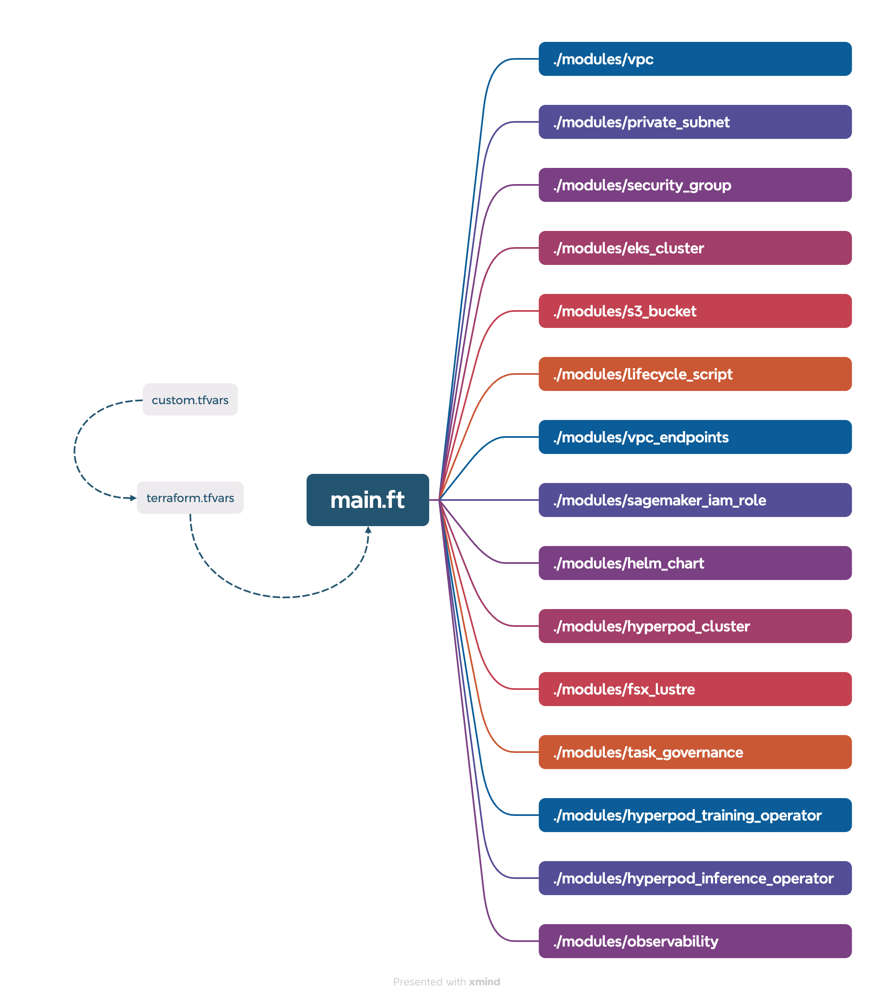

# Deploy HyperPod Infrastructure using Terraform

## Modules

The diagram below depicts the Terraform modules that have been bundled into a single project to enable you to deploy a full HyperPod cluster environment all at once. 



## Configuration
Start by reviewing the default configurations in the `terraform.tfvars` file and make modifications as needed to suit your needs. 

```bash 
vim hyperpod-eks-tf/terraform.tfvars 
```
For example, you may want to add or modify the HyperPod instance groups to be created:
```
instance_groups = {
  group1 = {
    instance_type               = "ml.g5.8xlarge"
    instance_count             = 8
    ebs_volume_size           = 100
    threads_per_core          = 2
    enable_stress_check       = true
    enable_connectivity_check = true
    lifecycle_script          = "on_create.sh"
  }
}
```
If you wish to reuse any cloud resources rather than creating new ones, set the associated `create_*` variable to `false` and provide the id for the corresponding resource as the value of the `existing_*` variable. 

For example, if you want to reuse an existing VPC, set `create_vpc ` to `false`, then set `existing_vpc_id` to your VPC ID, like `vpc-1234567890abcdef0`. 

## Deployment 
Run `terraform init` to initialize the Terraform working directory, install necessary provider plugins, download modules, set up state storage, and configure the backend for managing infrastructure state: 

```bash 
terraform -chdir=hyperpod-eks-tf init
```
Run `terraform plan` to generate and display an execution plan that outlines the changes Terraform will make to your infrastructure, allowing you to review and validate the proposed updates before applying them.

```bash 
terraform -chdir=hyperpod-eks-tf plan
```
Run `terraform apply` to execute the proposed changes outlined in the Terraform plan, creating, updating, or deleting infrastructure resources according to your configuration, and updating the state to reflect the new infrastructure setup.

```bash 
terraform -chdir=hyperpod-eks-tf apply 
```
When prompted to confirm, type `yes` and press enter.

You can also run `terraform apply` with the `-auto-approve` flag to avoid being prompted for confirmation, but use with caution to avoid unintended changes to your infrastructure. 

## Environment Variables
Run the `terraform_outputs.sh` script, which populates the `env_vars.sh` script with your environment variables for future reference: 
```bash 
chmod +x terraform_outputs.sh
./terraform_outputs.sh
cat env_vars.sh 
```
Source the `env_vars.sh` script to set your environment variables: 
```bash 
source env_vars.sh
```
Verify that your environment variables are set: 
```bash
echo $EKS_CLUSTER_NAME
echo $PRIVATE_SUBNET_ID
echo $SECURITY_GROUP_ID
```

## Clean Up

Before cleaning up, validate the changes by running a speculative destroy plan: 

```bash
terraform -chdir=hyperpod-eks-tf plan -destroy
```

Once you've validated the changes, you can proceed to destroy the resources: 
```bash 
terraform -chdir=hyperpod-eks-tf destroy
```
