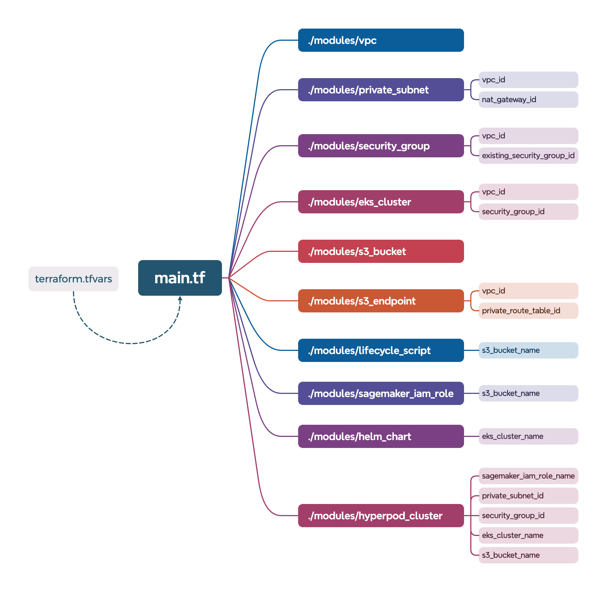

# Deploy HyperPod Infrastructure using Terraform

The diagram below depicts the Terraform modules that have been bundled into a single project to enable you to deploy a full HyperPod cluster environment all at once. 



---

## Get the Modules
Clone the AWSome Distributed Training repository and navigate to the terraform-modules directory:
```bash
git clone https://github.com/aws-samples/awsome-distributed-training.git
cd awsome-distributed-training/1.architectures/7.sagemaker-hyperpod-eks/terraform-modules/hyperpod-eks-tf
```

---

## Deployment 
First, clone the [HyperPod Helm charts GitHub repository](https://github.com/aws/sagemaker-hyperpod-cli/tree/main/helm_chart) to locally stage the dependencies Helm chart.  
```bash
git clone https://github.com/aws/sagemaker-hyperpod-cli.git /tmp/helm-repo
```
Run `terraform init` to initialize the Terraform working directory, install necessary provider plugins, download modules, set up state storage, and configure the backend for managing infrastructure state: 

```bash 
terraform init
```
Run `terraform plan` to generate and display an execution plan that outlines the changes Terraform will make to your infrastructure, allowing you to review and validate the proposed updates before applying them.

```bash 
terraform plan
```
If you created a `custom.tfvars` file, plan using the `-var-file` flag: 
```bash 
terraform plan -var-file=custom.tfvars
```
Or for RIG deployments:
```bash
terraform plan -var-file=rig_custom.tfvars
```
Run `terraform apply` to execute the proposed changes outlined in the Terraform plan, creating, updating, or deleting infrastructure resources according to your configuration, and updating the state to reflect the new infrastructure setup.

```bash 
terraform apply 
```
If you created a `custom.tfvars` file, apply using the `-var-file` flag: 
```bash
terraform apply  -var-file=custom.tfvars
```
Or for RIG deployments: 
```bash
terraform apply -var-file=rig_custom.tfvars
```
When prompted to confirm, type `yes` and press enter.

You can also run `terraform apply` with the `-auto-approve` flag to avoid being prompted for confirmation, but use with caution to avoid unintended changes to your infrastructure. 

---

## Environment Variables
Run the `terraform_outputs.sh` script, which populates the `env_vars.sh` script with your environment variables for future reference: 
```bash 
cd ..
chmod +x terraform_outputs.sh
./terraform_outputs.sh
cat env_vars.sh 
```
Source the `env_vars.sh` script to set your environment variables: 
```bash 
source env_vars.sh
```
Verify that your environment variables are set: 
```bash
echo $EKS_CLUSTER_NAME
echo $PRIVATE_SUBNET_ID
echo $SECURITY_GROUP_ID
```

---

## Clean Up

Before cleaning up, validate the changes by running a speculative destroy plan: 

```bash
cd hyperpod-eks-tf
terraform plan -destroy
```

Before destroying resources, list state to exclude any resources you wish to retain from deletion:
```bash
terraform state list
terraform state rm < resource_to_preserve >
```

If you created a `custom.tfvars` file, plan using the `-var-file` flag: 
```bash
terraform plan -destroy -var-file=custom.tfvars
```
Or for RIG deployments:
```bash
terraform plan -destroy -var-file=rig_custom.tfvars
```
Once you've validated the changes, you can proceed to destroy the resources: 
```bash 
terraform destroy
```
If you created a `custom.tfvars` file, destroy using the `-var-file` flag: 
```bash
terraform destroy -var-file=custom.tfvars
```
Or for RIG deployments: 
```bash
terraform destroy -var-file=rig_custom.tfvars
```

---

## Customize Deployment Configuration
Start by reviewing the default configurations in the `terraform.tfvars` file and make modifications to customize your deployment as needed.

If you wish to reuse any cloud resources rather than creating new ones, set the associated `create_*_module` variable to `false` and provide the id for the corresponding resource as the value of the `existing_*` variable. 

For example, if you want to reuse an existing VPC, set `create_vpc_module ` to `false`, then set `existing_vpc_id` to your VPC ID, like `vpc-1234567890abcdef0`. 

---

### Using a `custom.tfvars` File 
To modify your deployment details without having to open and edit the `terraform.tfvars` file directly, create a `custom.tfvars` file with your parameter overrides. 

For example, the following `custom.tfvars` file would enable the creation of all new resources including a new EKS Cluster and a HyperPod instance group of 5 `ml.p5en.48xlarge` instances in `us-west-2` using a [training plan](https://docs.aws.amazon.com/sagemaker/latest/dg/reserve-capacity-with-training-plans.html):

```bash
cat > custom.tfvars << EOL 
kubernetes_version = "1.32"
eks_cluster_name = "my-eks-cluster"
hyperpod_cluster_name = "my-hp-cluster"
resource_name_prefix = "hp-eks-test"
aws_region = "us-west-2"
instance_groups = [
    {
        name = "accelerated-instance-group-1"
        instance_type = "ml.p5en.48xlarge",
        instance_count = 5,
        availability_zone_id  = "usw2-az2",
        ebs_volume_size_in_gb = 100,
        threads_per_core = 2,
        enable_stress_check = true,
        enable_connectivity_check = true,
        lifecycle_script = "on_create.sh"
        training_plan_arn = arn:aws:sagemaker:us-west-2:123456789012:training-plan/training-plan-example
    }
]
EOL
```
---

### Configuring Kubernetes Labels and Taints

You can add custom Kubernetes labels and taints to your HyperPod instance groups to control pod scheduling and node organization. This is useful for:
- Organizing nodes by workload type, team, or environment
- Dedicating GPU nodes to specific workloads
- Implementing multi-tenant cluster configurations
- Controlling pod placement with node selectors and tolerations

**Adding Labels:**

Labels are key-value pairs for node identification and selection:

```hcl
instance_groups = [
  {
    name                      = "gpu-training-group"
    instance_type             = "ml.g5.12xlarge"
    instance_count            = 4
    availability_zone_id      = "usw2-az2"
    ebs_volume_size_in_gb     = 500
    threads_per_core          = 1
    enable_stress_check       = false
    enable_connectivity_check = false
    lifecycle_script          = "on_create.sh"
    
    # Custom labels
    labels = {
      "workload-type" = "training"
      "gpu-type"      = "a10g"
      "team"          = "ml-research"
    }
  }
]
```

**Adding Taints:**

Taints prevent pods without matching tolerations from scheduling on nodes:

```hcl
instance_groups = [
  {
    name                      = "gpu-inference-group"
    instance_type             = "ml.g5.12xlarge"
    instance_count            = 2
    availability_zone_id      = "usw2-az2"
    ebs_volume_size_in_gb     = 200
    threads_per_core          = 1
    enable_stress_check       = false
    enable_connectivity_check = false
    lifecycle_script          = "on_create.sh"
    
    # Custom taints (max 50 per instance group)
    taints = [
      {
        key    = "nvidia.com/gpu"
        value  = "true"
        effect = "NoSchedule"  # NoSchedule, PreferNoSchedule, or NoExecute
      },
      {
        key    = "dedicated"
        value  = "inference"
        effect = "NoSchedule"
      }
    ]
  }
]
```

**Taint Effects:**
- `NoSchedule`: Pods without matching tolerations won't be scheduled
- `PreferNoSchedule`: Kubernetes tries to avoid scheduling non-matching pods
- `NoExecute`: Existing pods without matching tolerations will be evicted

---

### Using an Existing EKS Cluster with HyperPod

The following `custom.tfvars` file uses an existing EKS Cluster (referenced by name) along with an existing Security Group, VPC, and NAT Gateway (referenced by ID):
```bash
cat > custom.tfvars << EOL 
create_eks_module = false
existing_eks_cluster_name = "my-eks-cluster"
existing_security_group_id = "sg-1234567890abcdef0"
create_vpc_module = false
existing_vpc_id = "vpc-1234567890abcdef0"
existing_nat_gateway_id = "nat-1234567890abcdef0"
hyperpod_cluster_name = "my-hp-cluster"
resource_name_prefix = "hp-eks-test"
aws_region = "us-west-2"
instance_groups = [
    {
        name = "accelerated-instance-group-1"
        instance_type = "ml.p5en.48xlarge",
        instance_count = 5,
        availability_zone_id  = "usw2-az2",
        ebs_volume_size_in_gb = 100,
        threads_per_core = 2,
        enable_stress_check = true,
        enable_connectivity_check = true,
        lifecycle_script = "on_create.sh"
        training_plan_arn = arn:aws:sagemaker:us-west-2:123456789012:training-plan/training-plan-example
    }
]
EOL
```
---

### Closed Network Deployment

For air-gapped or closed network environments without internet access:

#### Prerequisites: Copy Images to ECR and Prepare Helm Chart

**BEFORE running Terraform**, copy container images to your private ECR and update the Helm chart:

```bash
# Navigate to the terraform modules directory
cd awsome-distributed-training/1.architectures/7.sagemaker-hyperpod-eks/terraform-modules/hyperpod-eks-tf

# 1. Set your AWS account and region
export AWS_ACCOUNT_ID=$(aws sts get-caller-identity --query Account --output text)
export AWS_REGION=$(aws configure get region)  # Or set explicitly: export AWS_REGION="us-west-2"

echo "Account ID: $AWS_ACCOUNT_ID"
echo "Region: $AWS_REGION"

# 2. Copy container images to your private ECR
# This copies all required images from public registries (NVIDIA, Kubeflow, etc.) to your ECR
cd tools
./copy-images-to-ecr.sh $AWS_REGION $AWS_ACCOUNT_ID
cd ..

# 3. Clone sagemaker-hyperpod-cli (if not already done)
git clone https://github.com/aws/sagemaker-hyperpod-cli.git

# 4. Update Helm chart to reference your private ECR images
# IMPORTANT: Run from hyperpod-eks-tf directory so script finds tools/ecr-images.conf
python3 tools/update-values-with-ecr.py $AWS_REGION $AWS_ACCOUNT_ID

# 5. Commit changes locally
cd sagemaker-hyperpod-cli
git add -A && git commit -m "Update to private ECR images"

# 6. Get commit hash for terraform.tfvars
git rev-parse HEAD
# Copy this hash - you'll use it in helm_repo_revision variable

# 7. Copy entire git repo to /tmp/helm-repo for Terraform
# IMPORTANT: Copy the entire repo (with .git) so Terraform can checkout the commit
cd ..
rm -rf /tmp/helm-repo  # Remove if exists
cp -r sagemaker-hyperpod-cli /tmp/helm-repo
```

**What these steps do:**
- **Step 2**: Copies images from public registries to your private ECR (creates ECR repos automatically)
- **Step 4**: Updates Helm chart `values.yaml` to use your ECR instead of public registries
- **Step 7**: Stages the updated Helm chart where Terraform expects it

**Important**: All commands should be run from the `hyperpod-eks-tf` directory so the scripts can find the configuration files.

#### Deployment Configuration

The `closed-network.tfvars` file provides a complete example for deploying in a closed network environment.

**Option 1: Create New Closed Network VPC**

Use the provided example as-is to create a brand new closed network:
```bash
terraform plan -var-file=closed-network.tfvars
terraform apply -var-file=closed-network.tfvars
```

**Option 2: Use Existing Resources**

To use existing VPC, subnets, or other resources, modify `closed-network.tfvars`:

```hcl
# Use existing VPC instead of creating new one
create_vpc_module = false
existing_vpc_id   = "vpc-xxxxx"

# Use existing private subnets
create_private_subnet_module = false
existing_private_subnet_ids  = ["subnet-xxxxx", "subnet-yyyyy", "subnet-zzzzz"]

# Use existing security group
create_security_group_module = false
existing_security_group_id   = "sg-xxxxx"

# Use existing EKS cluster
create_eks_module         = false
existing_eks_cluster_name = "my-existing-cluster"

# Use existing S3 bucket
create_s3_bucket_module = false
existing_s3_bucket_name = "my-existing-bucket"

# Reuse existing VPC endpoints (if VPC already has them)
create_vpc_endpoints_module      = false
existing_private_route_table_ids = ["rtb-xxxxx"]
```

**IMPORTANT: When Reusing VPC Endpoints with a New Security Group**

If you're creating a new security group (`create_security_group_module = true`) but reusing existing VPC endpoints (`create_vpc_endpoints_module = false`), the deployment will fail because pods can't access the VPC endpoints. Follow this workflow:

**Step 1: Initial deployment (will fail)**
```bash
terraform apply -var-file=your-config.tfvars
```

The deployment will fail with this error after ~5 minutes:
```
Error: local-exec provisioner error
  with module.hyperpod_cluster[0].null_resource.wait_for_hyperpod_nodes[0],
  on modules/hyperpod_cluster/main.tf line 133, in resource "null_resource" "wait_for_hyperpod_nodes":
  
Error running command: exit status 1. Output:
Waiting for EKS Pod Identity Agent to be ready...
error: timed out waiting for the condition on pods/eks-pod-identity-agent-xxxxx
```

This is expected! The security group was created but pods can't reach VPC endpoints yet.

**Step 2: Add new security group to VPC endpoints**
```bash
# Get your new security group ID from the partial deployment
NEW_SG_ID=$(terraform output -raw security_group_id)
VPC_ID=$(terraform output -raw vpc_id)  
REGION=$(terraform output -raw aws_region)  

# Get all interface VPC endpoint IDs
ENDPOINT_IDS=$(aws ec2 describe-vpc-endpoints \
  --filters "Name=vpc-id,Values=$VPC_ID" "Name=vpc-endpoint-type,Values=Interface" \
  --query 'VpcEndpoints[].VpcEndpointId' \
  --output text --region $REGION)

# Add new security group to each VPC endpoint (convert tabs to newlines for proper iteration)
echo "$ENDPOINT_IDS" | tr '\t' '\n' | while read VPCE_ID; do
  if [ -n "$VPCE_ID" ]; then
    echo "Adding security group to $VPCE_ID..."
    aws ec2 modify-vpc-endpoint \
      --vpc-endpoint-id $VPCE_ID \
      --add-security-group-ids $NEW_SG_ID \
      --region $REGION
  fi
done

echo "All VPC endpoints updated!"
```

**Step 3: Delete failing pods and complete deployment**
```bash
# Delete pods that failed to pull images
kubectl delete pods -n kube-system -l app.kubernetes.io/name=eks-pod-identity-agent

# Complete the deployment
terraform apply -var-file=your-config.tfvars
```

**Alternative: Reuse existing security group** to avoid this issue entirely:
```hcl
create_security_group_module = false
existing_security_group_id   = "sg-xxxxx"  # Same SG used by VPC endpoints
```

**Note on Cleanup:** When destroying resources, the security group deletion may take 5-10 minutes because AWS automatically detaches it from all VPC endpoints. This is normal. If the destroy times out or gets stuck, you may need to manually remove the security group from VPC endpoints before retrying:
```bash
# Set your values
NEW_SG_ID="sg-029efc6343bdb7d05"  
VPC_ID="vpc-09ab7b104c4c92266"    
REGION="us-west-2"    

# Get all interface VPC endpoint IDs
ENDPOINT_IDS=$(aws ec2 describe-vpc-endpoints \
  --filters "Name=vpc-id,Values=$VPC_ID" "Name=vpc-endpoint-type,Values=Interface" \
  --query 'VpcEndpoints[].VpcEndpointId' \
  --output text --region $REGION)

# Remove security group from each endpoint
echo "$ENDPOINT_IDS" | tr '\t' '\n' | while read VPCE_ID; do
  if [ -n "$VPCE_ID" ]; then
    echo "Removing security group from $VPCE_ID..."
    aws ec2 modify-vpc-endpoint \
      --vpc-endpoint-id $VPCE_ID \
      --remove-security-group-ids $NEW_SG_ID \
      --region $REGION
  fi
done
```

**Key Configuration Details:**

**VPC Endpoints (Required for Closed Networks):**
- **S3** (Gateway) - Free - Container images and data access
- **EC2** (Interface) - CRITICAL - AWS CNI plugin needs this to assign IPs to pods
- **ECR API/DKR** (Interface) - Pull container images from ECR
- **STS** (Interface) - IAM role assumption (IRSA)
- **EKS Auth** (Interface) - CRITICAL - EKS Pod Identity authentication
- **CloudWatch Logs/Monitoring** (Interface) - Observability
- **SSM/SSM Messages/EC2 Messages** (Interface) - Systems Manager access

**EKS API Access:**
```hcl
eks_endpoint_private_access = true   # Required for nodes to join
eks_endpoint_public_access  = true   # Disable after deployment for full isolation
```

#### Deployment Steps

Once prerequisites are complete and your Helm chart is prepared:

```bash
# Navigate to terraform directory
cd awsome-distributed-training/1.architectures/7.sagemaker-hyperpod-eks/terraform-modules/hyperpod-eks-tf

# Initialize Terraform
terraform init

# Plan deployment (review changes)
terraform plan -var-file=closed-network.tfvars

# Apply deployment
terraform apply -var-file=closed-network.tfvars
```

#### Verification

After deployment, verify connectivity to AWS services:
```bash
python3 tools/verify-aws-connectivity.py
```

---
### Enabling Optional Addons 
Set the following parameters to `true` in your `custom.tfvars` file to enable optional addons for your HyperPod cluster (e.g. `create_task_governance_module = true`):
| Parameter | Usage |
|-----------|-------|
| `create_task_governance_module`    | Installs the [HyperPod task governance addon](https://docs.aws.amazon.com/sagemaker/latest/dg/sagemaker-hyperpod-eks-operate-console-ui-governance.html) for  job queuing, prioritization, and scheduling on multi-team compute clusters |
| `create_hyperpod_training_operator_module`   | Installs the [HyperPod training operator addon](https://docs.aws.amazon.com/sagemaker/latest/dg/sagemaker-eks-operator.html) for intelligent fault recovery, hang job detection, and process-level management capabilities (required for [Checkpointless](https://docs.aws.amazon.com/sagemaker/latest/dg/sagemaker-eks-checkpointless.html) and [Elastic](https://docs.aws.amazon.com/sagemaker/latest/dg/sagemaker-eks-elastic-training.html) training)|
| `create_hyperpod_inference_operator_module`  | Installs the [HyperPod inference operator addon](https://docs.aws.amazon.com/sagemaker/latest/dg/sagemaker-hyperpod-model-deployment-setup.html) for deployment and management of machine learning inference endpoints |
| `create_observability_module` | Installs the [HyperPod Observability addon](https://docs.aws.amazon.com/sagemaker/latest/dg/hyperpod-observability-addon-setup.html) to publish key metrics to Amazon Managed Service for Prometheus and displays them in Amazon Managed Grafana dashboards | 

---
### Advanced Observability Metrics Configuration
In addition to enabling the [HyperPod Observability addon](https://docs.aws.amazon.com/sagemaker/latest/dg/hyperpod-observability-addon-setup.html) by setting `create_observability_module = true`, you can also configure the following metrics that you wish to collect on your cluster: 
| Parameter | Default | Options | Usage |
|-----------|---------|---------|-------|
| `training_metric_level` | `BASIC` | `BASIC, ADVANCED` | Task duration, type, fault data (Advanced: Event-based task performance), [Learn More Here](https://docs.aws.amazon.com/sagemaker/latest/dg/hyperpod-observability-cluster-metrics.html#hyperpod-observability-training-metrics)
| `task_governance_metric_level` | `DISABLED` | `DISABLED, ADVANCED` | Team-level resource allocation, [Learn More Here](https://docs.aws.amazon.com/sagemaker/latest/dg/hyperpod-observability-cluster-metrics.html#hyperpod-observability-task-governance-metrics)
| `scaling_metric_level` | `DISABLED` | `DISABLED, ADVANCED` | KEDA auto-scaling metrics, [Learn More Here](https://docs.aws.amazon.com/sagemaker/latest/dg/hyperpod-observability-cluster-metrics.html#hyperpod-observability-scaling-metrics)
| `cluster_metric_level` | `BASIC` | `BASIC, ADVANCED` | Cluster health, instance count (Advanced: Detailed Kube-state cluster metrics), [Learn More Here](https://docs.aws.amazon.com/sagemaker/latest/dg/hyperpod-observability-cluster-metrics.html#hyperpod-observability-cluster-health-metrics)
| `node_metric_level` | `BASIC` | `BASIC, ADVANCED` | CPU, disk, OS-level usage (Advanced: Full node exporter suite), [Learn More Here](https://docs.aws.amazon.com/sagemaker/latest/dg/hyperpod-observability-cluster-metrics.html#hyperpod-observability-instance-metrics)
| `network_metric_level` | `DISABLED` | `DISABLED, ADVANCED` | Elastic Fabric Adapter metrics, [Learn More Here](https://docs.aws.amazon.com/sagemaker/latest/dg/hyperpod-observability-cluster-metrics.html#hyperpod-observability-network-metrics)
| `accelerated_compute_metric_level` | `BASIC` | `BASIC, ADVANCED` | GPU utilization, temperature (Advanced: All NVIDIA GPU DCGM, Neuron metrics), [Learn More Here](https://docs.aws.amazon.com/sagemaker/latest/dg/hyperpod-observability-cluster-metrics.html#hyperpod-observability-accelerated-compute-metrics)
| `logging_enabled` | `false` | `true, false` | When enabled, this will automatically create the required log groups in Amazon CloudWatch and start recording all container and pod logs as log streams
---
### FSx for Lustre Module

By default, the FSx for Lustre module installs the Amazon FSx for Lustre Container Storage Interface (CSI) Driver, but does not dynamically provision a new filesystem. For existing filesystems, you can follow [these steps in the AI on SageMaker HyperPod Workshop](https://awslabs.github.io/ai-on-sagemaker-hyperpod/docs/getting-started/orchestrated-by-eks/Set%20up%20your%20shared%20file%20system#option-3-bring-your-own-fsx-static-provisioning) for static provisioning. If you wish to create a new filesystem using Terraform, add the parameter `create_new_fsx_filesystem = true` to your `custom.tfvars` file, and review the `fsx_storage_capacity` (default 1200 GiB) and `fsx_throughput` (default 250 MBps/TiB) parameters to ensure they are set according to your requirements. When `create_new_fsx_filesystem = true` the FSx for Lustre module will statically create a new filesystem along with a StorageClass, PersistentVolume, and PersistentVolumeClaim (PVC). By default the PVC will be mapped to the default namespace. If you wish to use another namespace, use the `fsx_pvc_namespace` parameter to specify it. By default, specifying a non-default namespace will trigger the creation of that namespace. If you are using an existing EKS cluster where the target namespace already exists, set `create_fsx_pvc_namespace = false` to skip creation. 

---

### Amazon GuardDuty EKS Runtime Monitoring
If your target account has [Amazon GuardDuty EKS Runtime Monitoring](https://docs.aws.amazon.com/guardduty/latest/ug/runtime-monitoring.html) enabled, an interface VPC endpoint is automatically created to allow the security agent to deliver events to GuardDuty while event data remains within the AWS network. Because this VPC endpoint is not managed by Terraform, the associated Elastic Network Interfaces (ENIs) and Security Group that are automatically deployed by GuardDuty can block destruction when you are ready to clean up. To mitigate this, we've included an optional GuardDuty cleanup script [guardduty-cleanup.sh](./hyperpod-eks-tf/scripts/guardduty-cleanup.sh) that is invoked only at destruction time using a Terraform `null_resource`. This script finds the GuardDuty VPC endpoint associated with your HyperPod VPC and deletes it, waits for the associated ENIs to be cleaned up, then deletes the associated Security Group. To enable this script at plan and apply time, simply add the parameter `enable_guardduty_cleanup = true` to your `custom.tfvars` file. This script won't run when you issue a `terraform apply` command, but will run when you issue a `terraform destroy` command. 

---

### Creating a Restricted Instance Group (RIG) for Nova Model Customization

As a prerequisite, you will need to identify or create input and output S3 buckets to reference in your deployment (represented as `my-tf-rig-test-input-bucket` and `my-tf-rig-test-output-bucket` in the following examples). 

To create new S3 buckets, you can execute commands like the following example using the AWS CLI: 
```bash
aws s3 mb s3://my-tf-rig-test-input-bucket --region us-east-1 # adjust region as needed

aws s3 mb s3://my-tf-rig-test-output-bucket --region us-east-1 # adjust region as needed
```
S3 bucket names must be globally unique. 

You will also need to have [yq](https://pypi.org/project/yq/) installed so that a bash script that modifies CoreDNS and VPC CNI deployments can execute properly. 

For Nova model customization using Restricted Instance Groups (RIG), you can use the example configuration in [`rig_custom.tfvars`](./hyperpod-eks-tf/rig_custom.tfvars). This file demonstrates how to configure restricted instance groups with the necessary S3 buckets and instance specifications.

If you wish to create a new `rig_custom.tfvars` file, you execute a command like the following example with your specific configuration: 

```bash 
cat > rig_custom.tfvars << EOL 
kubernetes_version = "1.32"
eks_cluster_name = "tf-eks-cluster-rig"
hyperpod_cluster_name = "tf-hp-cluster-rig"
resource_name_prefix = "tf-eks-test-rig"
aws_region = "us-east-1"
rig_input_s3_bucket = "my-tf-rig-test-input-bucket"
rig_output_s3_bucket = "my-tf-rig-test-output-bucket"
restricted_instance_groups = [
    {
        name = "rig-1" 
        instance_type = "ml.p5.48xlarge",
        instance_count = 2, 
        availability_zone_id  = "use1-az6"
        ebs_volume_size_in_gb = 850,
        threads_per_core = 2, 
        enable_stress_check = false,
        enable_connectivity_check = false,
        fsxl_per_unit_storage_throughput = 250,
        fsxl_size_in_gi_b = 4800
        training_plan_arn = arn:aws:sagemaker:us-west-2:123456789012:training-plan/training-plan-example
    }
]
EOL
```
RIG mode (`local.rig_mode = true` set in [main.tf](./hyperpod-eks-tf/main.tf)) is automatic when `restricted_instance_groups` are defined, enabling Nova model customization with the following changes: 
- **VPC Endpoints**: Lambda and SQS interface endpoints are added for reinforcement fine-tuning (RFT) with integrations for your custom reward service hosted outside of the RIG. These endpoints are enabled in RIG mode by default so that you can easily transition from continuous pre-training (CPT) or supervised fine-tuning (SFT) to RFT without making infrastructure changes, but they can be disabled by setting `rig_rft_lambda_access` and `rig_rft_sqs_access` to false. 
- **IAM Execution Role Permissions**: The execution role associated with the HyperPod nodes is expanded to include read permission to your input S3 bucket and write permissions to your output S3 bucket. Access to SQS and Lambda resources with ARN patterns `arn:aws:lambda:*:*:function:*SageMaker*` and `arn:aws:sqs:*:*:*SageMaker*` are also conditionally added if `rig_rft_lambda_access` and `rig_rft_sqs_access` are true (default). 
- **Helm Charts**: A specific Helm revision is checked out and used for RIG support. After Helm chart instillation, a bash script is used to modify CoreDNS and VPC NCI deployments (be sure to have [yq](https://pypi.org/project/yq/) installed for this). 
- **HyperPod Cluster**: Continuous provisioning mode and Karpenter autoscaling are disabled automatically for RIG compatibility. Deploying a HyperPod cluster with a combination of standard instance groups and RIGs is also not currently supported, so `instance_groups` definitions are ignored when `restricted_instance_groups` are defined.
- **FSx for Lustre**: For RIGs a service managed FSx for Lustre filesystem is created based on the specifications you provide in `fsxl_per_unit_storage_throughput` and `fsxl_size_in_gi_b`. 
    - Valid values for `fsxl_per_unit_storage_throughput` are 125, 250, 500, or 1000 MBps/TiB. 
    - Valid values for `fsxl_size_in_gi_b` start at 1200 GiB and go up in increments of 2400 GiB. 
- **S3 Lifecycle Scripts**: Because RIGs do not leverage lifecycle scripts, the `s3_bucket` and `lifecycle_script` modules are also disabled in RIG mode. 

Please note that the following addons are NOT currently supported on HyperPod with RIGs: 
- HyperPod Task Governance 
- HyperPod Observability
- HyperPod Training Operator
- HyperPod Inference Operator

Do not attempt to install these addons later using the console. 

Once you have your `rig_custom.tfvars` file is created, you can proceed to deployment. 

---


