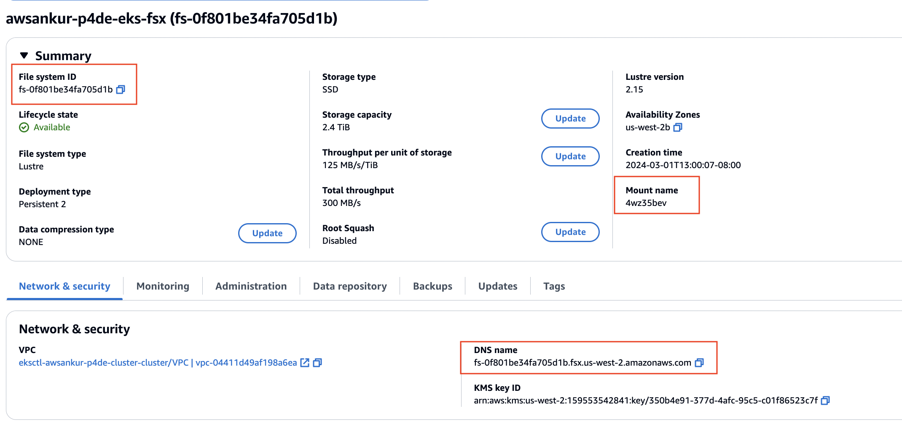

# Run the NeMo Framework on Amazon EKS

[NVIDIA NeMo™](https://www.nvidia.com/en-us/ai-data-science/products/nemo/) is an end-to-end, cloud-native enterprise framework for developers to build, customize, and deploy generative AI models with billions of parameters. The NeMo framework provides an accelerated workflow for training with 3D parallelism techniques. It offers a choice of several customization techniques and is optimized for at-scale inference of models for language and image applications, with multi-GPU and multi-node configurations. NeMo makes generative AI model development easy, cost-effective, and fast for enterprises.

In this work we will present a step by step guide to run distributed training workloads on an [Amazon EKS](https://aws.amazon.com/eks/) cluster.

## 0. Prerequisites

We require that to run this workload, you have a 2 node P4de or P5 cluster available with EFA enabled and a [Amazon FSx for Lustre](https://aws.amazon.com/fsx/lustre/) mounted on that cluster. You can follow the steps at [4.amazon-eks](https://github.com/aws-samples/awsome-distributed-training/tree/1.architectures/4.amazon-eks) to create a EFA enabled EKS cluster with P4de nodes. To this end, we provide the cluster creation config in `p4de-cluster-config.yaml`.


This config will create 2 managed node groups, one for the system node `c5.2xlarge` and one `p4de.24xlarge`. Managed node groups will use EKS optimized AMIs.

If you wish to provide a custom AMI, you can create an `unmanaged` node group and specify a custom AMI. To find the AMI id you can follow these [steps](https://docs.aws.amazon.com/eks/latest/userguide/retrieve-ami-id.html). Also, to find more details about the EKS optimized AMI, please see [here](https://docs.aws.amazon.com/AWSEC2/latest/UserGuide/efa.html#efa-instance-types).

The [Nvidia device plugin for Kubernetes](https://github.com/NVIDIA/k8s-device-plugin) should already be deployed but if not you can do so as follows:

```bash
kubectl apply -f https://raw.githubusercontent.com/NVIDIA/k8s-device-plugin/v0.14.3/nvidia-device-plugin.yml
```

## 1. Deploy the AWS EFA Kubernetes Device Plugin

Once the cluster is created you can install the [AWS EFA Kubernetes Device Plugin](https://github.com/aws/eks-charts/tree/master/stable/aws-efa-k8s-device-plugin) as follows:

```bash
helm repo add eks https://aws.github.io/eks-charts
helm install efa eks/aws-efa-k8s-device-plugin -n kube-system
```

Once this is done, you should see the following pods:
```bash
root@cb9511473ccc:/eks/deployment/efa-device-plugin# kubectl get pods -A
NAMESPACE     NAME                                        READY   STATUS    RESTARTS   AGE
kube-system   aws-efa-k8s-device-plugin-daemonset-78x4q   1/1     Running   0          38m
kube-system   aws-efa-k8s-device-plugin-daemonset-tgfbk   1/1     Running   0          38m
kube-system   aws-node-2fqmn                              2/2     Running   0          10h
kube-system   aws-node-kbjfd                              2/2     Running   0          10h
kube-system   aws-node-pgknw                              2/2     Running   0          10h
kube-system   coredns-9556476b9-888q4                     1/1     Running   0          10h
kube-system   coredns-9556476b9-x2cqq                     1/1     Running   0          10h
kube-system   kube-proxy-67j5j                            1/1     Running   0          10h
kube-system   kube-proxy-hmxpp                            1/1     Running   0          10h
kube-system   kube-proxy-v6c62                            1/1     Running   0          10h
kube-system   nvidia-device-plugin-daemonset-6fz2s        1/1     Running   0          10h
kube-system   nvidia-device-plugin-daemonset-h58n7        1/1     Running   0          10h
kube-system   nvidia-device-plugin-daemonset-vrz2q        1/1     Running   0          10h
```
You can use the [EKS node viewer](https://github.com/awslabs/eks-node-viewer) tool to view nodes and their status in your cluster. Once it is installed, you can simply type `eks-node-viewer` in the console or `nv` in the `aws-do-eks` container to get the following view:

```bash
3 nodes (650m/199290m) 0.3% cpu ░░░░░░░░░░░░░░░░░░░░░░░░░░░░░░░░░░░░░░░░ $82.272/hour | $60058.195/month
21 pods (0 pending 21 running 21 bound)

ip-192-168-120-214.us-west-2.compute.internal cpu ██░░░░░░░░░░░░░░░░░░░░░░░░░░░░░░░░░   4% (8 pods) c5.2xlarge/$0.3400     On-Demand - Ready
ip-192-168-165-37.us-west-2.compute.internal  cpu ░░░░░░░░░░░░░░░░░░░░░░░░░░░░░░░░░░░   0% (7 pods) p4de.24xlarge/$40.9657 On-Demand - Ready
ip-192-168-164-33.us-west-2.compute.internal  cpu ░░░░░░░░░░░░░░░░░░░░░░░░░░░░░░░░░░░   0% (6 pods) p4de.24xlarge/$40.9657 On-Demand - Ready
•
←/→ page • q: quit
```

Here the node viewer shows the IP addresses of my 2 p4de.24xlarge compute nodes. We can take one of the IP addresses to describe the node as:

```bash
kubectl describe node ip-192-168-165-37.us-west-2.compute.internal
```
The above command describes a lot of detail of the node. To make sure EFA is installed correctly make sure you see the following:

```bash
Allocatable:
  cpu:                    95690m
  ephemeral-storage:      868645791124
  hugepages-1Gi:          0
  hugepages-2Mi:          21122Mi
  memory:                 1146004920Ki
  nvidia.com/gpu:         8
  pods:                   250
  vpc.amazonaws.com/efa:  4
```
For p4 nodes you will see ` vpc.amazonaws.com/efa:  4` and for p5.48xlarge nodes you should see ` vpc.amazonaws.com/efa:  32`.

> [!TIP]
> NOTE: If EFA is enabled in the node group, edit the security group that the nodes are attached to and add a rule to allow all outgoing traffic originating from the same security group. This is required for EFA to work.

## 2. Mount Amazon FSx for Lustre file system on EKS

To have a FSx for Lustre filesystem mounted on your EKS cluster, we will follow the following steps:

1. Create an IAM role and a security group for the EKS nodes to access the filesystem
2. Create the filesystem
3. Install [FSx CSI drivers](https://docs.aws.amazon.com/eks/latest/userguide/fsx-csi.html)
4. Mount the filesystem

### 2.1 Create IAM role

Follow the scripts below to create an IAM role and attach the FSx Policy

```bash
export FSX_POLICY_NAME=fsx-csi

# Get FSX_POLICY_DOC from https://github.com/aws-samples/aws-do-eks/blob/main/Container-Root/eks/deployment/csi/fsx/fsx-policy.json
export FSX_POLICY_DOC=file://fsx-policy.json

# From EC2 Auto Scaling Group
export EKS_INSTANCE_PROFILE_NAME=(eks-xxx... )

POLICY_ARN=$(aws iam create-policy --policy-name ${FSX_POLICY_NAME} --policy-document $FSX_POLICY_DOC --query "Policy.Arn" --output text)

INSTANCE_PROFILE=$(aws iam list-instance-profiles --query InstanceProfiles[?InstanceProfileName=="'${EKS_INSTANCE_PROFILE_NAME}'"].{InstanceProfileName:InstanceProfileName} --output text)

ROLE_NAME=$(aws iam get-instance-profile --instance-profile-name ${INSTANCE_PROFILE} --query InstanceProfile.Roles[0].RoleName --output text)

# Attach FSx Policy to role ${ROLE_NAME} ..."
aws iam attach-role-policy --policy-arn ${POLICY_ARN} --role-name ${ROLE_NAME}
```

### 2.2 Create Security Group

Next we can use the script below to create a security group that allows EKS nodes to access the filesystem:

```bash
# From EC2 console
export MY_REGION=us-west-2
# FSX_SUBNET_ID should be same ID the compute nodes are present in. You can get this from the EKS console 
export FSX_SUBNET_ID=subnet-xxx
# From EC2 Auto Scaling Group
export FSX_SECURITY_GROUP_NAME=eks-fsx-sg

# Get VPC_ID from EKS console
export VPC_ID=vpc-xxx

# Create security group
export SECURITY_GROUP_ID=$(aws ec2 create-security-group --vpc-id ${VPC_ID} --region ${MY_REGION} --group-name ${FSX_SECURITY_GROUP_NAME} --description "FSx for Lustre Security Group" --query "GroupId" --output text)

export SUBNET_CIDR=$(aws ec2 describe-subnets --region ${MY_REGION} --query Subnets[?SubnetId=="'${FSX_SUBNET_ID}'"].{CIDR:CidrBlock} --output text)

# Ingress rule
aws ec2 authorize-security-group-ingress --region ${MY_REGION} --group-id ${SECURITY_GROUP_ID} --protocol tcp --port 988 --cidr ${SUBNET_CIDR}
```

### 2.3 Create FileSystem

Next, we create a 1.2TB Persistent_2 Amazon FSx for Lustre filesystem from the console in the same availability zone as my compute instances (FSX_SUBNET_ID), VPC of EKS (VPC_ID) and security group created above (SECURITY_GROUP_ID). Once the filesystem is created, grab the filesystem ID, DNS name and Mount name from the console.

<center> </br>
</center>

### 2.4 Mount the filesystem on EKS cluster

Next to mount the file system, we provide scripts in the `fsx` folder fsx-storage-class.yaml, fsx-pv.yaml and fsx-pvc.yaml:

```bash
# Storage Class
kubectl apply -f fsx-storage-class.yaml
kubectl get sc

# Persistent Volume
kubectl apply -f fsx-pv.yaml

# Persistent Volume Claim
kubectl apply -f fsx-pvc.yaml
```

Once this is done, you can check to make sure that the volumes are in Bound state.

```bash
root@cb9511473ccc:/eks# kubectl get pv
NAME     CAPACITY   ACCESS MODES   RECLAIM POLICY   STATUS   CLAIM             STORAGECLASS   REASON   AGE
fsx-pv   1200Gi     RWX            Retain           Bound    default/fsx-pvc   fsx-sc                  37d
root@cb9511473ccc:/eks# k get pvc
NAME      STATUS   VOLUME   CAPACITY   ACCESS MODES   STORAGECLASS   AGE
fsx-pvc   Bound    fsx-pv   1200Gi     RWX            fsx-sc         37d
```

## 3. Build AWS Optimized Dockerfile for NeMo

The NeMo framework is available publicly in the image `nvcr.io/nvidia/nemo:24.01.framework`. We provide an AWS optimized `0.Dockerfile` for use with P4 and P5 instances. Follow the steps below to build and push the image to [Amazon ECR](https://aws.amazon.com/ecr/)

```bash
## AWS
export AWS_REGION=us-west-2
export ACCOUNT=$(aws sts get-caller-identity --query Account --output text)

## Docker Image
export REGISTRY=${ACCOUNT}.dkr.ecr.${AWS_REGION}.amazonaws.com/
export IMAGE=nemo-aws
export TAG=":24.01.framework"

## Build image
docker build -t ${REGISTRY}${IMAGE}${TAG} -f 0.Dockerfile .

echo "Logging in to $REGISTRY ..."
aws ecr get-login-password | docker login --username AWS --password-stdin $REGISTRY

# Create registry if it does not exist
REGISTRY_COUNT=$(aws ecr describe-repositories | grep ${IMAGE} | wc -l)
if [ "$REGISTRY_COUNT" == "0" ]; then
        echo ""
        echo "Creating repository ${IMAGE} ..."
        aws ecr create-repository --repository-name ${IMAGE}
fi

# Push image
docker image push ${REGISTRY}${IMAGE}${TAG}
```

## 4. Copy Launcher scripts

The NeMo framework requires users to fill out config files with job and model information. You can copy the launcher scripts from the container as below:

```bash
export LAUNCHER_SCRIPTS_PATH=<Path-to-save-launcher-scripts>

# Run container
docker run -it ${REPOSITORY}${IMAGE}${TAG} bash

# Copy files
docker cp -a <container-id>: /opt/NeMo-Megatron-Launcher/${LAUNCHER_SCRIPTS_PATH} 
```

>[!TIP]
>Note, in a Slurm cluster implementation the launcher scripts, data and results folder could reside in the filesystem that both the head node (node from where jobs are submitted) and compute nodes. But in this EKS implementation, the head node does not have access to EKS filesystem. To get around this, we can put the launcher scripts in the head node and the results and data folder in the filesystem which the compute nodes have access to. 


## 5. Install Requirements

Run the following to install the necessary dependencies to run NeMo.

```bash
git clone https://github.com/aws-samples/awsome-distributed-training.git
cd ./awsome-distributed-training/3.test_cases/2.nemo-launcher/EKS/
pip install -r requirements.txt
```

## 6. Deploy kubeflow mpi-operator

For preprcessing training data in parallel, we will leverage the [KubeFlow MPI Operator](https://github.com/kubeflow/mpi-operator). You can install it as follows:

```bash
kubectl apply -f https://raw.githubusercontent.com/kubeflow/mpi-operator/v0.4.0/deploy/v2beta1/mpi-operator.yaml

# From https://github.com/aws-samples/aws-do-eks/blob/main/Container-Root/eks/deployment/kubeflow/mpi-operator/clusterrole-mpi-operator.yaml
# Add lease permissions fot mpi-operator cluster role
kubectl apply -f ./clusterrole-mpi-operator.yaml
```

## 7. Deploy kubeflow training-operator

To enable distributed training, we will leverage the [KubeFlow Training Operator](https://github.com/kubeflow/training-operator). You can install it as follows:

```bash
# Deploy Kubeflow training operator

kubectl apply -k "github.com/kubeflow/training-operator/manifests/overlays/standalone?ref=v1.7.0"

# From https://github.com/aws-samples/aws-do-eks/blob/main/Container-Root/eks/deployment/kubeflow/training-operator/deploy.sh

# Configure RBAC resources

kubectl apply -f ./clusterrole-hpa-access.yaml

kubectl apply -f ./clusterrolebinding-training-operator-hpa-access.yaml
```

## 8. Run NeMo on EKS

Now we can modify launcher scripts and run NeMo jobs on EKS. First, we will download the [Pile dataset](https://huggingface.co/datasets/monology/pile-uncopyrighted) and then run distributed training for the GPT3 5B model.

First, export these environment variables:

```bash
LAUNCHER_SCRIPTS_PATH="<Path-to-launcher-scripts>"
FSX_MOUNT_NAME="fsx_shared"
PATH_TO_FSX="/${FSX_MOUNT_NAME}"
FSX_PVC="fsx-pvc" #In case you changed the FSx PVC name in fsx-pvc.yaml
FSX_PV="fsx-pv" #In case you changed the FSx PV name in fsx-pv.yaml
NODE_ARRAY_SIZE=2 # Change it if you have more nodes. This will scale preprocessing in parallel
FILE_NUMBERS="0-5" # Number of files to be downloaded out of the 30 files. With 5 files it should be around 350GB of data
```

Run the following next to substitute the environment variables in the yaml file and place it in the right location:

```bash
git clone https://github.com/aws-samples/awsome-distributed-training.git
cd awsome-distributed-training/3.test_cases/2.nemo-launcher/EKS/launcher_scripts/conf

envsubst < ./config.yaml > ${LAUNCHER_SCRIPTS_PATH}/launcher_scripts/conf/config.yaml
envsubst < ./cluster/k8s.yaml > ${LAUNCHER_SCRIPTS_PATH}/launcher_scripts/conf/cluster/k8s.yaml
envsubst < ./download_gpt3_pile.yaml > ${LAUNCHER_SCRIPTS_PATH}/launcher_scripts/conf/data_preparation/gpt3/download_gpt3_pile.yaml
envsubst < ./data-prep.yaml > ${LAUNCHER_SCRIPTS_PATH}/launcher_scripts/nemo_launcher/core/k8s_templates/data_preparation/data-prep.yaml
envsubst < ./training.yaml > ${LAUNCHER_SCRIPTS_PATH}/launcher_scripts/nemo_launcher/core/k8s_templates/training/training.yaml
```

Launch the data preparation job: To launch the data prepapration job which downloads, extracts and preprocess the Pile dataset, set the stage to data_preparation only and comment other stages. 

```bash
python main.py
```

This script creates a Helm chart for the selected stage (in this case, data_preparation) and runs the Helm chart automatically. You can monitor your job status/logs using three commands (“helm list”, “kubectl get pods”, and “kubectl logs --follow”).

To launch the training job, change the stage in the config to training and run `python main.py`.

```bash
Epoch 0: :   0%|          | 2000/603000 [1:03:17<317:00:58, v_num=, reduced_train_loss=2.600, global_step=2e+3, consumed_samples=1.28e+6, train_step_timing in s=1.900, val_loss=2.800]dation DataLoader 0: : 51it [00:20,  2.53it/s]
```

Once the job is finished, you can remove the helm chart with `helm uninstall <job-name>`.

