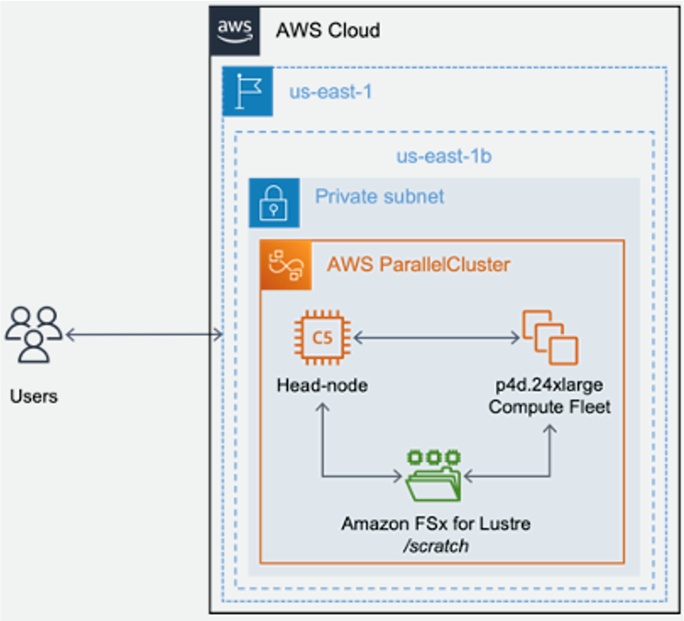

# Distributed Training of Self-Supervised Vision Transformers in PyTorch for multi-channel single-cells images with AWS ParallelCluster

Orchestrating distributed training jobs on a cluster of EC2 instances can be challemging from a Compute, Storage and Networking point of view. [AWS ParallelCluster](https://github.com/aws/aws-parallelcluster) is an open source cluster management tool that provides a user friendly way of creating a HPC cluster that can be used to run distributed training jobs.

Vision Transformers are increasingly popular in the computational drug discovery space, especially in the area of phenotypic characterisation using multi-channel single cell images. In this project, we will show how to pretrain and do downstream analyses for [scDINO](https://github.com/JacobHanimann/scDINO/tree/master) model.

<center> </br>

Fig. 1 - ParallelCluster Architecture for Distributed Training
</center>

Figure 1. shows the architecture for distributed training with AWS ParallelCluster. The project is designed to introduce the concepts of deploying this architecture and running distributed training for training self-supervised vision transformers at a small scale, however the same architecture can be applied for training at large scale by adjusting the number and type of nodes, using other accelerators (NVIDIA A100 GPUs, AWS Trainium, Intel Habana Gaudi).

This project is organized in a number of sequential steps. The scripts that belong to each step are organized in folders with corresponding names. To execute a step, we will change the current directory accordingly and execute scripts in their designated order. The prerequisites section is required, but there are no scripts associated with it. We will complete setting up prerequisites by following instructions. Steps 1 through 6 are required to complete the workshop. Step 7-Cleanup is optional.

## 0. Prerequisites
The only prerequisite we have is that the user is able to launch an EC2 instance and has permission to access to GPU based instances.

## 1. Create ParallelCluster
In this section, we will walk step-by-step how to create the cluster. Once you have launched an EC2 instance (ex: c6a.4xlarge), clone this repo and execute `source 0-setup.sh`. This script would run:
a) `aws configure`,
b) create and attach a new role `EC2Role` which has S3 access policy, 
c) create and activate a new virual environment `apc-ve` which we will use next to create the cluster.

### 1.1 Install ParallelCluster Tools
Once the virtual environment is created, `./1-install-parallel-cluster.sh` will install the necessary tools like `awscli`, `packer`to create custom AMIs, dependencies like `flask` and `node.js` and `aws-parallelcluster`. 

### 1.2 Download Deep Phenotyping Image Data
Execute `./2-download-data.sh` to download the image data, unzip it, create a S3 bucket `pcluster-ml-workshop` and upload to the S3 bucket. You can find more information about the dataset [here](https://www.research-collection.ethz.ch/handle/20.500.11850/343106). This dataset has 90852 images in the Training set and 22712 images in the Test set. The directory structure looks like below. For more information about the eight immune classes and donors, please refer to the [paper](https://www.biorxiv.org/content/10.1101/2023.01.16.524226v1.full.pdf)

Training Directory | Test Directory for Donor1
--- | ---
 | 
`
### 1.3 Create VPC
Next step before creating the cluster, we need to create a VPC with a public and a private subnet in a user specified Availability Zone (AZ). In this work, we used `us-west-2a` as the AZ in which the Compute Nodes and the FSx for Lustre file system will reside. Executing `./3-create-vpc.sh` will read the [Large-Scale-VPC.yaml](https://github.com/awsankur/aws-distributed-training-workshop-pcluster/blob/main/.env/Large-Scale-VPC.yaml) and create a cloud formation stack. In addition to the subnets, this stack will also deploy an Internet Gateway and NAT Gateway in the public subnet and deploy endpoints for Amzon S3 and Amazon DynamoDB. The VPC contains 2 CIDR blocks with 10.0.0.0/16 and 10.1.0.0/16. The first CIDR is used for the public subnet, the second is used for the private. 

You can check the progress of VPC creation in the CloudFormation stack `create-large-scale-vpc-stack`. Once the VPC creation is done in a few minutes, you can check the outputs of the stack which will show subnet and vpc IDs. We will use these next to create a cluster.

<center> </br>
Fig. 2 - Outputs of the VPC creation stack
</center>

### 1.4 Create an Amazon Machine Image (AMI)
Before we can create a cluster, we need to create an AMI that will be used to startup the compute nodes and will have all the necessary dependencies for running a distributed training workload. We can also use a published Deep Learning (DLAMI) but they are often quite big and have a number of other features not needed for distributed training. To build a targeted AMI for distributed training you can execute `4-create-ami.sh`. This will kickoff [Packer](https://www.packer.io/) from [HashiCorp](https://www.hashicorp.com/) that will build an AMI using a configuration json [nvidia-efa-ml-al2-enroot_pyxis.json](https://github.com/awsankur/aws-distributed-training-workshop-pcluster/blob/main/.env/ami/nvidia-efa-ml-al2-enroot_pyxis.json) and [variables.json](https://github.com/awsankur/aws-distributed-training-workshop-pcluster/blob/main/.env/ami/variables.json). This AMI will be specific for Nvidia GPUs and will base on Amazon Linux 2. The software stack installed on the AMI through packer consists of:

1. Nvidia Driver - 510.47.03
2. CUDA - 11.6
3. CUDNN - v8
4. NVIDIA Container Toolkit - system latest
5. Docker - system latest
6. NCCL - v2.12.7-1
7. Pyxis - v0.12.0"
8. Enroot - latest
9. AWS CLI V2 - latest for Nvidia Driver 510.47.03
10. Nvidia Fabric Manager - latest
11. EFA Driver - latest
12. EFA OFI NCCL plugin - latest
13. NCCL Tests - Latest
14. Intel MKL - 2020.0-088 

The [variables.json](https://github.com/awsankur/aws-distributed-training-workshop-pcluster/blob/main/.env/ami/variables.json) config specifies `us-west-2` as the default region and `parallel_cluster_version` as 3.1.4 but could be changed if other newer versions are needed. When the Packer run kicks off, it starts a `g4dn.12xlarge` instance as specified in the `instance_type` variable in `variables.json`, creates the AMI and saves in your account. Once the run is done, the `g4dn.12xlarge` instance is automatically terminated. The AMI creation could take up to ~30mins and once done it will show up in the AMI section of the EC2 console in the `Private Images` section as `pcluster-dist-training-ami-parallelcluster-3.1.4-amzn2`.

This AMI also installs Pyxis and Enroot that enable us to run containers using Slurm. Please refer to the [official documentation](https://github.com/NVIDIA/pyxis#usage=) on Github for examples with Slurm. However, in this work, we will not use containers. We will show how to use Conda environments within your cluster in the next section.

### 1.5 Create key-pair
One final step before we actually create the cluster is to create a key-pair that would be needed to access into the head node of the cluster. Executing `5-create-key.sh` will create a key pair and put the `pcluster-key.pem` in your repo.

### 1.6 Create cluster
To create a cluster, execute `6-create-cluster.sh`. This will first print out the necessary inputs needed in the cluster configuration file such as public and private subnet-ids, ami-id and key name. Next it will substitute these variables in the file [create-cluster-template.yaml](https://github.com/awsankur/aws-distributed-training-workshop-pcluster/blob/main/create-cluster-template.yaml) and create a new cluster config file `create-cluster.yaml`. An important point to keep in mind is that the `--rollback-on-failure "false"` flag in [6-create-cluster.sh](https://github.com/awsankur/aws-distributed-training-workshop-pcluster/blob/main/6-create-cluster.sh) does not allow resources like the head node or compute nodes to terminate if for any reason the cluster fails to create. This is important for debugging purposes. You can view the progress of cluster creation in CloudFormation with a stack name of `pcluster-ml` which is the name specified for the cluster.

A couple of key points to keep in mind when making changes to the cluster creation config file.
1. The Head Node does not need to have a GPU accelerator on it. A small instance such as a `c5.4xlarge` should suffice.
2. The Head Node will lie in the `Public Subnet` and the Compute Nodes will lie in the `Private Subnet`.
3. This config file will actually create a FSx for Lustre volume in the same AZ as the Compute Nodes.
4. To attach an existing FileSystemId, please follow steps in this [blog](https://swsmith.cc/posts/fsx-persistent-2-pcluster.html). For an existing FileSystem you need to create a security group which allows communication between the cluster and the file system. You would need to specify `FileSystemId` in the `FsxLustreSettings` section. 
5. In `FsxLustreSettings` section, you can add `DeletionPolicy: Retain` to retain the FSx for Lustre filesystem even when cluster is deleted.
6. In the `ComputeResources` section, you can actually specify 0 resources.
7. Finally, to use EFA, please set the `Enabled` flag in the `Efa` section in `ComputeResources` as `true`. For a list of instance types that support EFA, please see [here](https://docs.aws.amazon.com/AWSEC2/latest/UserGuide/efa.html#efa-instance-types).
8. Also, please keep in mind that all instance types (Ex: `p3.8xlarge`) do not support Instance store. If you want to use an instance that does not support Instance store please comment out the `EphemeralVolume` section. For a list of instances that support Instance store, please see [here](https://docs.aws.amazon.com/AWSEC2/latest/UserGuide/instance-store-volumes.html)

To list clusters and view their status you can run `pcluster list-clusters`. And after the cluster is creadted you will see an output like below:

<center> </br>
</center>

After the cluster is created, you can see the Head Node and Compute Nodes ready in the EC2 console and FSx for Lustre file system created in the FSx console which looks like below. You can check the AZ, Storage Capacity and Throughput per unit of storage.

<center> </br>
</center>

If the cluster fails to create for any reason, you can view the `CloudFormation` events in the stack with the cluster name. You can also view detailed log files in `/var/log/parallelcluster` in the head node and compute nodes. In addition, you can also view logs in `chef-client.log` and `cloud-init.log` files in the head and compute nodes.

### 1.7 Connect to the cluster
Once the cluster is created, you can ssh into the head node by executing `./7-connect-to-cluster.sh`. In the head node, you can run `sinfo` to see the available compute nodes and it will look like below:
<center> </br>
</center>
This output shows that there are 2 `static` nodes (same as Min Capacity in cluster creation config) `train-g4dn-12xl-st-train-g4dn-12xl-1` and `train-g4dn-12xl-st-train-g4dn-12xl-2` and 4 `dynamic` nodes `train-g4dn-12xl-dy-train-g4dn-12xl-[1-4]`. The `dynamic` nodes are those that can be spun up on demand. From the head node you can ssh into the compute nodes by executing `ssh train-g4dn-12xl-st-train-g4dn-12xl-1` or `ssh train-g4dn-12xl-st-train-g4dn-12xl-2`.

## 2. Run Distributed Training jobs
In this section, we will show how distributed training slurm jobs can be submitted from the head node. But first we need to make sure the cluster has access to the training data and has all the relevant dependencies installed in the conda environment. 

### 2.0 Get Data
From the head node or any of the compute nodes, you can access the FSx file system in `cd /fsx`. To get data in FSx, you can create a `data-repository-association` which will link a S3 bucket to the FSx file system. Or, you can manually `preload` the data from S3 to FSx. An advantage of repository association is that any outputs saved in `/fsx` will automatically showup in S3. You can manually copy data from S3 to FSx like below:

```
cd /fsx
mkdir data
aws s3 cp s3://pcluster-ml-workshop/DeepPhenotype_PBMC_ImageSet_YSeverin/ /fsx/data/ --recursive
```

### 2.1 Conda environment
It is a good practice to keep all the input data and output data in `/fsx` and any codes in `/apps`. Both folders will be accessible by the head node and all compute nodes. Executing the lines below will create a `pytorch-py38` conda environment.

```
cd /apps
git clone https://github.com/awsankur/aws-distributed-training-workshop-pcluster.git
cd /aws-distributed-training-workshop-pcluster/head-node-scripts/
source 1-create_environment.sh
```
### 2.2 Run Training Jobs
Next we are ready to submit distributed training and other compute jobs to our cluster. Following the [scDINO repo](https://github.com/JacobHanimann/scDINO/tree/master), we have adapted the submission without using snakemake. You can fill out all user defined parameters in the config yaml [scDINO_full_pipeline.yaml](https://github.com/awsankur/aws-distributed-training-workshop-pcluster/blob/main/head-node-scripts/scDINO_full_pipeline.yaml). Execute the following:

a. `sbatch 2-calc_mean_std.slurm`: Will kick off [mean_std_dataset.py code](https://github.com/awsankur/aws-distributed-training-workshop-pcluster/blob/main/head-node-scripts/pyscripts/mean_std_dataset.py) to compute mean and standard deviation normalization parameters for all Training images. The code will be executed on 1 compute node, use 16 cpus, store any logs in `std_out_xx.out`and `std_err_xx.err` files and save results in `/fsx/outputdir/scDino_pcluster_full_0/mean_and_std_of_dataset.txt` file.

b. `sbatch 3-main_dino.slurm`: Will kick off the distributed training job using the training code in [main_dino.py](https://github.com/awsankur/aws-distributed-training-workshop-pcluster/blob/main/head-node-scripts/pyscripts/main_dino.py). A few things to keep in mind:
1) `#SBATCH --gres=gpu:4`: Number of GPUs per compute node.
2) `#SBATCH --nodes=2`: Number of compute nodes
3) `WORLD_SIZE`: Total number of GPUs across all nodes
4) `export LOGLEVEL=INFO`: This line is for detailed logging information. This is optional.
5) `export NCCL_DEBUG=INFO` and `export NCCL_DEBUG_SUBSYS=ALL`: Optional NCCL environment variable. A list of NCCL environment variables can be found [here](https://docs.nvidia.com/deeplearning/nccl/user-guide/docs/env.html)
6) I am using `yq` to read parameters from the config yaml [scDINO_full_pipeline.yaml](https://github.com/awsankur/aws-distributed-training-workshop-pcluster/blob/main/head-node-scripts/scDINO_full_pipeline.yaml).

Executing `squeue` will list all running jobs on the static and dynamic compute nodes. Once the job finishes, you can see `checkpoint.pth` files created in the output directory.

c. Similarly run the rest of the downstream analyses to extract CLS features (`sbatch 4-compute_cls_features.slurm`), extract labels (`sbatch 5-extract_labels.slurm`), run knn analyses (`sbatch 6-global_knn.slurm`), and generate plots (`sbatch 7-plots.slurm`)

## 3. Cleanup
Finally, to delete the cluster you can execute `./8-delete-cluster.sh`. This will terminate the compute and head nodes and also the FSx for Lustre volume if `DeletionPolicy: Retain` is not explicitly mentioned in `FsxLustreSettings`. 


