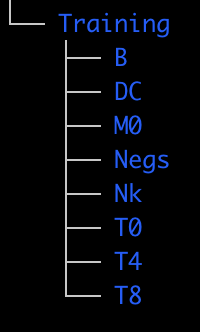

# Distributed Training of Self-Supervised Vision Transformers in PyTorch for multi-channel single-cells images with AWS ParallelCluster

Vision Transformers are increasingly popular in the computational drug discovery space, especially in the area of phenotypic characterisation using multi-channel single cell images. In this project, we will show how to pretrain and do downstream analyses for [scDINO](https://github.com/JacobHanimann/scDINO/tree/master) model.

### Download Deep Phenotyping Image Data
Execute `./2-download-data.sh` to download the image data, unzip it, create a S3 bucket `pcluster-ml-workshop` and upload to the S3 bucket. You can find more information about the dataset [here](https://www.research-collection.ethz.ch/handle/20.500.11850/343106). This dataset has 90852 images in the Training set and 22712 images in the Test set. The directory structure looks like below. For more information about the eight immune classes and donors, please refer to the [paper](https://www.biorxiv.org/content/10.1101/2023.01.16.524226v1.full.pdf)

Training Directory | Test Directory for Donor1
--- | ---
 | 
`
## 2. Run Distributed Training jobs
In this section, we will show how distributed training slurm jobs can be submitted from the head node. But first we need to make sure the cluster has access to the training data and has all the relevant dependencies installed in the conda environment. 

### 2.0 Get Data
From the head node or any of the compute nodes, you can access the FSx file system in `cd /fsx`. To get data in FSx, you can create a `data-repository-association` which will link a S3 bucket to the FSx file system. Or, you can manually `preload` the data from S3 to FSx. An advantage of repository association is that any outputs saved in `/fsx` will automatically showup in S3. You can manually copy data from S3 to FSx like below:

```
cd /fsx
mkdir data
aws s3 cp s3://pcluster-ml-workshop/DeepPhenotype_PBMC_ImageSet_YSeverin/ /fsx/data/ --recursive
```

### 2.1 Conda environment
It is a good practice to keep all the input data and output data in `/fsx` and any codes in `/apps`. Both folders will be accessible by the head node and all compute nodes. Executing the lines below will create a `pytorch-py38` conda environment.

```
cd /apps
git clone https://github.com/awsankur/aws-distributed-training-workshop-pcluster.git
cd /aws-distributed-training-workshop-pcluster/head-node-scripts/
source 1-create_environment.sh
```
### 2.2 Run Training Jobs
Next we are ready to submit distributed training and other compute jobs to our cluster. Following the [scDINO repo](https://github.com/JacobHanimann/scDINO/tree/master), we have adapted the submission without using snakemake. You can fill out all user defined parameters in the config yaml [scDINO_full_pipeline.yaml](https://github.com/awsankur/aws-distributed-training-workshop-pcluster/blob/main/head-node-scripts/scDINO_full_pipeline.yaml). Execute the following:

a. `sbatch 2-calc_mean_std.slurm`: Will kick off [mean_std_dataset.py code](https://github.com/awsankur/aws-distributed-training-workshop-pcluster/blob/main/head-node-scripts/pyscripts/mean_std_dataset.py) to compute mean and standard deviation normalization parameters for all Training images. The code will be executed on 1 compute node, use 16 cpus, store any logs in `std_out_xx.out`and `std_err_xx.err` files and save results in `/fsx/outputdir/scDino_pcluster_full_0/mean_and_std_of_dataset.txt` file.

b. `sbatch 3-main_dino.slurm`: Will kick off the distributed training job using the training code in [main_dino.py](https://github.com/awsankur/aws-distributed-training-workshop-pcluster/blob/main/head-node-scripts/pyscripts/main_dino.py). A few things to keep in mind:
1) `#SBATCH --gres=gpu:4`: Number of GPUs per compute node.
2) `#SBATCH --nodes=2`: Number of compute nodes
3) `WORLD_SIZE`: Total number of GPUs across all nodes
4) `export LOGLEVEL=INFO`: This line is for detailed logging information. This is optional.
5) `export NCCL_DEBUG=INFO` and `export NCCL_DEBUG_SUBSYS=ALL`: Optional NCCL environment variable. A list of NCCL environment variables can be found [here](https://docs.nvidia.com/deeplearning/nccl/user-guide/docs/env.html)
6) I am using `yq` to read parameters from the config yaml [scDINO_full_pipeline.yaml](https://github.com/awsankur/aws-distributed-training-workshop-pcluster/blob/main/head-node-scripts/scDINO_full_pipeline.yaml).

Executing `squeue` will list all running jobs on the static and dynamic compute nodes. Once the job finishes, you can see `checkpoint.pth` files created in the output directory.

c. Similarly run the rest of the downstream analyses to extract CLS features (`sbatch 4-compute_cls_features.slurm`), extract labels (`sbatch 5-extract_labels.slurm`), run knn analyses (`sbatch 6-global_knn.slurm`), and generate plots (`sbatch 7-plots.slurm`)


