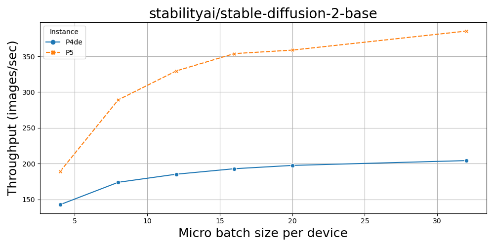

# Stable Diffusion Test Case

DISCLAIMER: The scripts presented in this repo work but I believe there is room for optimization to further accelerate distributed training

We will follow MosaicML's stable diffusion benchmarking scripts provided [here](https://github.com/mosaicml/diffusion-benchmark/tree/main). It uses the `'stabilityai/stable-diffusion-2-base'` model. You can check the number of parameters by executing:

```bash
python3 calculate_number_of_parameters.py
Model has 1289.952427 M parameters and 865.910724 M trainable_params
``` 


Just for simplifaction of testing, we have separate scripts for Single node and Multi node Distributed Training. We will also present a comparison of throughput (images/second) achieved with P4de (A100 80GB) and P5 (H100 80GB) nodes.

## 0. Conda and Docker

Make sure you are able to create conda environments and docker containers. For example, to install Miniconda, please follow the steps below:

```bash
# Get the appropriate Miniconda_version from https://repo.anaconda.com/miniconda/
wget -O miniconda.sh "https://repo.anaconda.com/miniconda/Miniconda3-py310_23.5.2-0-Linux-x86_64.sh" \
    && bash miniconda.sh -b -p ./.conda \
        &&  ./.conda/bin/conda init bash  

# Amazon Linux 2 instance
source /home/ec2-user/.bashrc

# Ubuntu instance
source /home/ubuntu/.bashrc
```

## 1. Single Node Setup

When testing the latest version of MosaicML's Composer, we found that different ways to set up the environment with a PyTorch Nightly conda environment or a Nvidia PyTorch Docker container. For single or multi-node testing, you could use either to run distributed training. Next, we present both approaches.

The `single-node` folder has the shell script [`create-conda.sh`](https://github.com/aws-samples/awsome-distributed-training/blob/stable-diffusion/3.test_cases/6.stable-diffusion/single-node/create-conda.sh) which installs the PyTorch nightly distribution for Cuda 12.1 and the `diffusers, transformers` and weights and biases libraries and also clones the Composer repository. Before installing Composer, we need to avoid some torch and torchvision version checks by commenting out those lines in [`composer/setup.py`](https://github.com/mosaicml/composer/blob/dev/setup.py) so it looks like:


```bash
install_requires = [
    'pyyaml>=6.0,<7',
    'tqdm>=4.62.3,<5',
    'torchmetrics>=0.10.0,<1.1',
    'torch_optimizer>=0.3.0,<0.4',
    #'torchvision>=0.13.1,<0.17',
    #'torch>=1.13.1,<2.1.1',
    'requests>=2.26.0,<3',
    'numpy>=1.21.5,<1.27.0',
    'psutil>=5.8.0,<6',
    'coolname>=1.1.0,<3',
    'tabulate==0.9.0',  # for auto-generating tables
    'py-cpuinfo>=8.0.0,<10',
    'packaging>=21.3.0,<23',
    'importlib-metadata>=5.0.0,<7',
    'mosaicml-cli>=0.5.8,<0.6',
]
```
Once this change is done, you can install composer as `pip3 install -e .`

The `single-node` folder also has the Dockerfile and `build.sh` and `run.sh` commands to build the image and run the container.

```bash
docker build -t mosaicml-stable-diffusion .

```
```bash
docker run --gpus all --ipc=host --ulimit memlock=-1 --ulimit stack=67108864 -it mosaicml-stable-diffusion /bin/bash
```

### 1.1 Single Node Training

Once you are in the conda environment or the container, run the following to kickstart training. In all these tests, we are using synthetic data generated by `diffusion-benchmark/data.py`

```bash
composer benchmark.py --use_ema --use_synth_data --device_train_microbatch_size 4
```
And you should see training starts as:
```bash
Namespace(batch_size=2048, image_size=512, remote=None, local='/tmp/mds-cache/mds-laion-2/', use_synth_data=True, model_name='stabilityai/stable-diffusion-2-base', use_ema=True, wandb_name=None, wandb_project=None, device_train_microbatch_size=4)
wandb: Tracking run with wandb version 0.13.11
wandb: W&B syncing is set to `offline` in this directory.
wandb: Run `wandb online` or set WANDB_MODE=online to enable cloud syncing.
wandb: WARNING URL not available in offline run
******************************
Config:
enabled_algorithms/EMA: true
node_name: unknown because NODENAME environment variable not set
num_gpus_per_node: 8
num_nodes: 1
rank_zero_seed: 3179589898

******************************
train          Epoch   0:   38%|█████████▍               | 18/48 [03:28<05:29, 10.99s/ba, loss/train/total=0.1463]
                                                                                                                                
```

To see GPU utilization, start another shell on the EC2 instance and run either `watch nvidia-smi` or `nvidia-smi -l 2` if you get a segmentation error which happens frequently if you launched the EC2 instance with a DLAMI. You can also run nvidia-smi in docker as:

```bash
docker run --rm -it --gpus all nvidia/cuda:12.2.0-devel-ubuntu20.04 watch nvidia-smi
```

### 1.2 Single Node Training Benchmarks

We ran tests on P4de (A100 80GB) and P5 (H100 80GB) machines and here is a comparison.

<center> </br>
</center>

|Micro BS|num_workers| EMA | P4de Throughput| P5 Throughput | Ratio  |
|:------:|:---------:|:---:| :------------: | :-----------: |:------:|
|    4   |     8     | Yes |      142.69    |     189.28    |  1.32x |
|    8   |     8     | Yes |      173.89    |     289.19    |  1.66x |
|   12   |     8     | Yes |      185.18    |     329.55    |  1.78x |
|   16   |     8     | Yes |      192.85    |     353.81    |  1.83x |
|   20   |     8     | Yes |      197.47    |     358.68    |  1.82x |
|   20   |     8     | No  |      197.90    |     361.15    |  1.83x |
|   32   |     8     | Yes |      204.22    |     385.31    |  1.89x |

#### Scaled Dot Product Attention

HuggingFace Diffusers has a set_attn_processor method that you can use to plug and play different attention processors. A list of attention processors can be found [here](https://github.com/huggingface/diffusers/blob/main/src/diffusers/models/attention_processor.py)

You can try a different Attention Processor like below:

```
from diffusers.models.attention_processor import AttnProcessor

self.unet = UNet2DConditionModel.from_pretrained(''stabilityai/stable-diffusion-2-base'', subfolder='unet')
self.unet.set_attn_processor(AttnProcessor())
```
AttnProcessor2_0 which is a Processor for implementing scaled dot-product attention is enabled by default if you're using PyTorch 2.0.

The older self.unet.set_attn_processor(AttnProcessor()) gives Cuda OOM error with a batch size of 32 while with `AttnProcessor2_0()` is able to run with a batch size of 32 and yield 385 images/sec throughput 

More details on this can be found here: https://pytorch.org/blog/accelerated-diffusers-pt-20/


## 2. Multi Node Tests

### 2.1 Multi-Node Training

For the multi-node training we've created a `Dockerfile`, and Slurm submit script and a `Makefile` to build the docker image and convert it to an enroot image. To get started please follow the guide [AWS ParallelCluster Distributed Training](https://github.com/aws-samples/awsome-distributed-training/tree/main/1.architectures/2.aws-parallelcluster). Before starting this section make sure you have the following setup:

* AWS ParallelCluster >= 3.7.0
* Pyxis
* Enroot
* FSx Lustre Filesystem

1. To get started, clone this repo and cd into the multi-node directory:

```
git clone https://github.com/aws-samples/awsome-distributed-training.git
cd awsome-distributed-training/6.stable-diffusion/multi-node
```

Next build the docker image and convert it to a enroot sqsh file:

```bash
make # this will build the docker image and convert it to enroot
```

Now we can start training

```
sbatch 2.train.sbatch
```

### 2.1 Multi Node Results


## 3. What's Next?
TODO:
1. Investigate why single node performance on A100 80 GB instances is sub-par.
2. Implement distributed training following original implementation of stable diffusion
3. Explore the impact of MosaicML's Exponential Moving Average implementation on training performance.
4. Test the impact of xFormers
