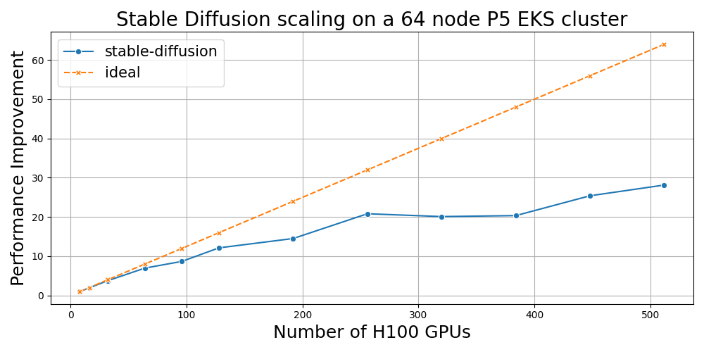
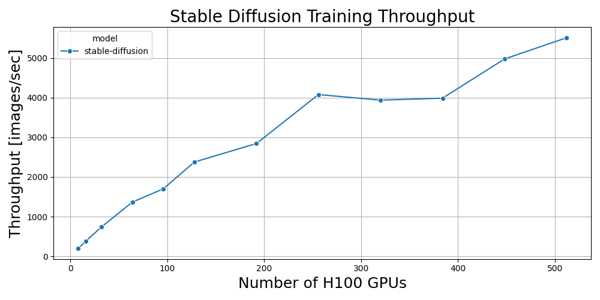

# Stable Diffusion Test Case

We will follow MosaicML's stable diffusion benchmarking scripts provided [here](https://github.com/mosaicml/diffusion-benchmark/tree/main). It uses the `'stabilityai/stable-diffusion-2-base'` model. You can check the number of parameters by executing:

```bash
python3 calculate_number_of_parameters.py
Model has 1289.952427 M parameters and 865.910724 M trainable_params
``` 

To simplify testing, we have separate scripts for Single node and Multi node Distributed Training. We will also present a comparison of throughput (images/second) achieved with P4de (A100 80GB) and P5 (H100 80GB) instances.

You can export the following environment variables:

```
export PYTHON_VERSION=3.10
# We are using Python version 3.10 in this work. For a different Python version select the right Miniconda file from https://repo.anaconda.com/miniconda/
export MINICONDA_INSTALLER=Miniconda3-py310_23.5.2-0-Linux-x86_64
export CUDA_VERSION=12.1
export MOSAICML_VERSION=0.15.0
export PYTORCH_INDEX_URL=https://download.pytorch.org/whl/nightly/cu121
export PYTORCH_IMAGE=nvcr.io/nvidia/pytorch:23.08-py3
export DOCKER_IMAGE_NAME=mosaicml-stable-diffusion
export TAG=$MOSAICML_VERSION
```

## 1 Single Node Training

For the single node training use case, we provide both a Conda environment and a Dockerfile for your convenience and preference. However, you do not need both for setting up training.


## 1.1. Create Conda Environment


To install Miniconda, please follow the steps below:

```bash
# install in the shared directory so compute nodes can source the environment:
cd /apps

# Get the appropriate Miniconda_version from https://repo.anaconda.com/miniconda/
wget -O miniconda.sh "https://repo.anaconda.com/miniconda/${MINICONDA_INSTALLER}.sh" \
    && bash miniconda.sh -b -p ./.conda \
    &&  ./.conda/bin/conda init bash

# Detect the OS based on /etc/os-release
os=$(grep '^ID=' /etc/os-release | awk -F= '{print $2}' | tr -d '"')

if [[ "$os" == "amzn" ]]; then
  source /home/ec2-user/.bashrc
elif [[ "$os" == "ubuntu" ]]; then
  source /home/ubuntu/.bashrc
else
  echo "Unknown OS: $os"
fi

conda create -n pt-nightlies python=${PYTHON_VERSION}

conda activate pt-nightlies

# Install PyTorch Nightly distribution with specified Cuda version
pip3 install --pre torch torchvision torchaudio --index-url ${PYTORCH_INDEX_URL}

# Install Diffusers and Transformers
pip3 install diffusers["torch"] transformers

# Install Weights and Biases
pip3 install wandb

# We will install Composer from source. First clone the Repo
git clone https://github.com/mosaicml/composer.git


```


### 1.2 Single Node Setup with Conda

When testing the latest version of MosaicML's Composer, we found that different ways to set up the environment with a PyTorch Nightly conda environment or a Nvidia PyTorch Docker container. For single or multi-node testing, you could use either to run distributed training. Next, we present both approaches.

The conda environment installs the PyTorch nightly distribution for Cuda 12.1 and the `diffusers, transformers` and weights and biases libraries and also clones the Composer repository. Before installing Composer, we need to avoid some torch and torchvision version checks by commenting out those lines in [`composer/setup.py`](https://github.com/mosaicml/composer/blob/dev/setup.py) so it looks like:


```bash
install_requires = [
    'pyyaml>=6.0,<7',
    'tqdm>=4.62.3,<5',
    'torchmetrics>=0.10.0,<1.1',
    'torch_optimizer>=0.3.0,<0.4',
    'requests>=2.26.0,<3',
    'numpy>=1.21.5,<1.27.0',
    'psutil>=5.8.0,<6',
    'coolname>=1.1.0,<3',
    'tabulate==0.9.0',  # for auto-generating tables
    'py-cpuinfo>=8.0.0,<10',
    'packaging>=21.3.0,<23',
    'importlib-metadata>=5.0.0,<7',
    'mosaicml-cli>=0.5.8,<0.6',
]
```
Once this change is done, you can install composer as `pip3 install -e .`

### 1.3 OPTIONAL - Single Node Setup with Docker

The `single-node` folder also has the Dockerfile with commands to build the image and run the container. If you are opting to setup training with a Conda environment, then this setup is not needed. Run this setup only if you need to run MosaicML Composer from within a Nvidia PyTorch container.

```bash
cd awsome-distributed-training/3.test_cases/6.stable-diffusion/single-node
# build the image
docker build --build-arg MOSAICML_VERSION=${MOSAICML_VERSION} --build-arg PYTORCH_IMAGE=${PYTORCH_IMAGE} --build-arg PYTORCH_INDEX_URL=${PYTORCH_INDEX_URL} -t ${DOCKER_IMAGE_NAME}:${TAG} -f 0.Dockerfile .

# run container
docker run --gpus all --ipc=host --ulimit memlock=-1 --ulimit stack=67108864 -it ${DOCKER_IMAGE_NAME} /bin/bash

```

### 1.4 Single Node Training

Once you are in the conda environment or the container, run the following to kickstart training. In all these tests, we are using synthetic data generated by `diffusion-benchmark/data.py`

```bash
composer benchmark.py --use_ema --use_synth_data --device_train_microbatch_size 4
```

And you should see training starts as:

```bash
Namespace(batch_size=2048, image_size=512, remote=None, local='/tmp/mds-cache/mds-laion-2/', use_synth_data=True, model_name='stabilityai/stable-diffusion-2-base', use_ema=True, wandb_name=None, wandb_project=None, device_train_microbatch_size=4)
wandb: Tracking run with wandb version 0.13.11
wandb: W&B syncing is set to `offline` in this directory.
wandb: Run `wandb online` or set WANDB_MODE=online to enable cloud syncing.
wandb: WARNING URL not available in offline run
******************************
Config:
enabled_algorithms/EMA: true
node_name: unknown because NODENAME environment variable not set
num_gpus_per_node: 8
num_nodes: 1
rank_zero_seed: 3179589898

******************************
train          Epoch   0:   38%|█████████▍               | 18/48 [03:28<05:29, 10.99s/ba, loss/train/total=0.1463]                      
```

To see GPU utilization, start another shell on the EC2 instance and run either `watch nvidia-smi` or `nvidia-smi -l 2` if you get a segmentation error which happens frequently if you launched the EC2 instance with a DLAMI. You can also run nvidia-smi in docker as:

```bash
docker run --rm -it --gpus all nvidia/cuda:12.2.0-devel-ubuntu20.04 watch nvidia-smi
```

### 1.5 Single Node Training Benchmarks

We ran tests on P4de (A100 80GB) and P5 (H100 80GB) machines and here is a comparison.

<center> </br>
</center>

|Micro BS|num_workers| EMA | P4de Throughput| P5 Throughput | Ratio  |
|:------:|:---------:|:---:| :------------: | :-----------: |:------:|
|    4   |     8     | Yes |      142.69    |     189.28    |  1.32x |
|    8   |     8     | Yes |      173.89    |     289.19    |  1.66x |
|   12   |     8     | Yes |      185.18    |     329.55    |  1.78x |
|   16   |     8     | Yes |      192.85    |     353.81    |  1.83x |
|   20   |     8     | Yes |      197.47    |     358.68    |  1.82x |
|   20   |     8     | No  |      197.90    |     361.15    |  1.83x |
|   32   |     8     | Yes |      204.22    |     385.31    |  1.89x |

### 1.6 Scaled Dot Product Attention

HuggingFace Diffusers has a set_attn_processor method that you can use to plug and play different attention processors. A list of attention processors can be found [here](https://github.com/huggingface/diffusers/blob/main/src/diffusers/models/attention_processor.py)

You can try a different Attention Processor like below:

```
from diffusers.models.attention_processor import AttnProcessor

self.unet = UNet2DConditionModel.from_pretrained(''stabilityai/stable-diffusion-2-base'', subfolder='unet')
self.unet.set_attn_processor(AttnProcessor())
```
`AttnProcessor2_0` which is a Processor for implementing scaled dot-product attention is enabled by default if you're using PyTorch 2.0.

The older `self.unet.set_attn_processor(AttnProcessor())` gives [Cuda OOM](https://medium.com/@snk.nitin/how-to-solve-cuda-out-of-memory-error-850bb247cfb2) error with a batch size of 32 while with `AttnProcessor2_0()` is able to run with a batch size of 32 and yield 385 images/sec throughput 

More details on this can be found here: https://pytorch.org/blog/accelerated-diffusers-pt-20/

## 2. Multi Node Tests

### 2.1 Multi-Node Training with Slurm

For the multi-node training we've created a [Dockerfile](https://github.com/aws-samples/awsome-distributed-training/blob/multi-node/3.test_cases/6.stable-diffusion/multi-node/1.Dockerfile), and Slurm submit script to submit the training job. To get started please follow the guide [AWS ParallelCluster Distributed Training](../../1.architectures/2.aws-parallelcluster). Before starting this section make sure you have the following setup:

* AWS ParallelCluster >= 3.7.0
* Pyxis
* Enroot
* FSx Lustre Filesystem

1. To get started, clone this repo and cd into the multi-node directory:

```
git clone https://github.com/aws-samples/awsome-distributed-training.git
cd awsome-distributed-training/6.stable-diffusion/multi-node
```

#### 2.1.1 Next build the docker image:

```
docker build --build-arg MOSAICML_VERSION=${MOSAICML_VERSION} --build-arg PYTORCH_IMAGE=${PYTORCH_IMAGE} -t ${DOCKER_IMAGE_NAME}:${TAG} -f 1.Dockerfile .
```

#### 2.1.2 Convert Docker image to Squash file

Convert the Docker container image to an [Enroot](https://github.com/NVIDIA/enroot) squash file that will be stored in /apps. This step takes a few minutes.

```
enroot import -o /apps/${DOCKER_IMAGE_NAME}.sqsh dockerd://${DOCKER_IMAGE_NAME}:${TAG}
```

#### 2.1.3 Now we can start training

```
sbatch 2.train.sbatch
```
```bash
Namespace(batch_size=2048, image_size=512, remote=None, local='/tmp/mds-cache/mds-laion-2/', use_synth_data=True, model_name='stabilityai/stable-diffusion-2-base', use_ema=True, wandb_name=None, wandb_project=None, device_train_microbatch_size=4)
wandb: Tracking run with wandb version 0.13.11
wandb: W&B syncing is set to `offline` in this directory.
wandb: Run `wandb online` or set WANDB_MODE=online to enable cloud syncing.
wandb: WARNING URL not available in offline run
******************************
Config:
enabled_algorithms/EMA: true
node_name: unknown because NODENAME environment variable not set
num_gpus_per_node: 8
num_nodes: 2
rank_zero_seed: 3179589898

******************************
rain          Epoch   0:  100%|█████████████████████████| 48/48 [09:57<00:00, 12.45s/ba, loss/train/total=0.1521]
                      
```

### 2.2 Multi-Node Training with Amazon EKS

Next we will show how to train stable diffusion with Mosaic ML's [composer](https://github.com/mosaicml/composer/tree/dev) on [Amazon EKS](https://aws.amazon.com/eks/). To start we have created an EKS cluster following the steps [here](https://github.com/aws-samples/awsome-distributed-training/tree/main/1.architectures/4.amazon-eks). You can follow these steps to add a nodegroup of `p5.48xlarge` instances. First export these environment variables. 

```bash
export AWS_REGION=us-west-2
export ACCOUNT=$(aws sts get-caller-identity --query Account --output text)

## Docker Image
export REGISTRY=${ACCOUNT}.dkr.ecr.${AWS_REGION}.amazonaws.com/
export DOCKER_IMAGE_NAME=mosaicml-stable-diffusion
export MOSAICML_VERSION=0.15.0
export TAG=$MOSAICML_VERSION
export PYTORCH_IMAGE=nvcr.io/nvidia/pytorch:23.08-py3

## Job parameters
export MASTER_PORT=80
export NUM_NODES=64
export NUM_GPUS_PER_NODE=8
export WORLD_SIZE=$((NUM_NODES*NUM_GPUS_PER_NODE))

```

#### 2.2.1 Set up `aws-do-eks` container

First we need to run the `aws-do-eks` container which has all the necessary kubectl tools installed. Just run:

```bash
git clone https://github.com/aws-samples/aws-do-eks.git
cd ./aws-do-eks

# Build the aws-do-eks Docker image
./build.sh

# Run container
./run.sh

# Execute in the container
./exec.sh

cd /eks/impl/aws

# Next we will edit the nodegroup.conf config file
```

#### 2.2.2 Add a Managed P5 Nodegroup

To add a managed P5 nodegroup, we will follow the steps listed in the [`aws-do-eks`](https://github.com/aws-samples/aws-do-eks/tree/main/Container-Root/eks/impl/aws) project.

1. First we need to create a P5 launch template and to do that we need to fill out the nodegroup.conf config

```bash
CLUSTER=<Your-EKS-Cluster-Name>
REGION=${AWS_REGION}
LAUNCH_TEMPLATE_NAME=lt-p5-odcr-eks-1-27
LAUNCH_TEMPLATE_ID=
LAUNCH_TEMPLATE_VERSION=1
NODEGROUP_NAME=p5-48xlarge
NODE_ROLE_ARN=<Copy Node IAM Role ARN from `sys` node in EKS console>
SUBNETS=<Private subnet id from the AZ your P5 nodes are in>
MIN_SIZE=0
DESIRED_SIZE=64
MAX_SIZE=64

EFA_VERSION=1.29.1
AMI=<eks-optimized-ami-id>
SSH_KEY_NAME=<ssh-key-name>
CAPACITY_RESERVATION_ID=<capacity reservation id of the P5 nodes>
PLACEMENT_GROUP_NAME=<Create a Placement Group from EC2 console>

```

You can get the EKS optimized id for EKS version 1.27 and Amazon Linux 2 as:
```bash
aws ssm get-parameter --name /aws/service/eks/optimized-ami/1.27/amazon-linux-2-gpu/recommended/image_id --region $AWS_REGION --query 'Parameter.Value' --output text

```

Next you can follow the steps given [here](https://github.com/aws-samples/aws-do-eks/tree/main/Container-Root/eks/impl/aws) to create a P5 nodegroup. 


#### 2.2.3 View your nodes

Once the nodes are created, you can use `nv` to list the available nodes. `nv` is an alias to `eks-node-viewer` . You can see other aliases by typing `alias`. Below is a sample output with a cluster with 2 `c5.4xlarge` nodes. The status of `Ready` means that the node has joined the cluster. If a node is in a `Not Ready` state, you might need to manually terminate the node from EC2 console and EKS will restart it and the node will join the cluster again.

```bash
2 nodes (700m/31780m) 2.2% cpu █░░░░░░░░░░░░░░░░░░░░░░░░░░░░░░░░░░░░░░░ $1.360/hour | $992.800/month
13 pods (0 pending 13 running 13 bound)

ip-192-168-70-41.us-west-2.compute.internal  cpu █░░░░░░░░░░░░░░░░░░░░░░░░░░░░░░░░░░   2% (7 pods) c5.4xlarge/$0.6800 On-Demand - Ready
ip-192-168-120-65.us-west-2.compute.internal cpu █░░░░░░░░░░░░░░░░░░░░░░░░░░░░░░░░░░   2% (6 pods) c5.4xlarge/$0.6800 On-Demand - Ready
•
←/→ page • q: quit

```

You can see additional details about the node as below. 

```bash
kubectl describe node <node-ip-address-from-node-viewer>
```
The following is the `Allocatable` section of a P5 node which shows that there are 8 GPUs available and 32 EFA devices available as well.

```bash

Allocatable:
  cpu:                    191450m
  ephemeral-storage:      27356033509547
  hugepages-1Gi:          0
  hugepages-2Mi:          42242Mi
  memory:                 2052371068Ki
  nvidia.com/gpu:         8
  pods:                   100
  vpc.amazonaws.com/efa:  32
```

#### 2.2.4 Next we need to build the Docker Image and push it to [ECR](https://aws.amazon.com/ecr/):

```bash
docker build --build-arg MOSAICML_VERSION=${MOSAICML_VERSION} --build-arg PYTORCH_IMAGE=${PYTORCH_IMAGE} -t ${REGISTRY}${DOCKER_IMAGE_NAME}${TAG} -f 1.Dockerfile .
```

Before pushing the image you might need to login to ECR as:

```bash
aws ecr get-login-password | docker login --username AWS --password-stdin $REGISTRY
```

And the push the image as:
```bash
# Create registry if it does not exist
REGISTRY_COUNT=$(aws ecr describe-repositories | grep ${DOCKER_IMAGE_NAME} | wc -l)
if [ "$REGISTRY_COUNT" == "0" ]; then
        echo ""
        echo "Creating repository ${DOCKER_IMAGE_NAME} ..."
        aws ecr create-repository --repository-name ${DOCKER_IMAGE_NAME}
fi

echo "Pushing image ${REGISTRY}${DOCKER_IMAGE_NAME}:${TAG}"
docker image push ${REGISTRY}${DOCKER_IMAGE_NAME}:${TAG}

```
#### 2.2.5 Deploy Kubeflow training operator

[Kubeflow Training Operator](https://github.com/kubeflow/training-operator/) is a Kubernetes-native project for fine-tuning and scalable distributed training allows you to use Kubernetes workloads to effectively train your large models via [Kubernetes Custom Resources APIs](https://kubernetes.io/docs/concepts/extend-kubernetes/api-extension/custom-resources/) or using Training Operator Python SDK. You can do that with ease from within the `aws-do-eks` container and execute the following:

```bash
cd /eks/deployment/kubeflow/training-operator
./deploy.sh
```

#### 2.2.6 Now we can start training

We provide a template YAML file for submitting the stable diffusion distributed training job in [3.stable-diffusion-eks.yaml-template](https://github.com/aws-samples/awsome-distributed-training/blob/stable-diffusion-eks/3.test_cases/6.stable-diffusion/multi-node/3.stable-diffusion-eks.yaml-template). You can substitute the environment variables in the template manifest as:

```bash
cat 3.mosaicml-sd-eks.yaml-template | envsubst > mosaicml-sd-eks.yaml

```

To submit the training job, you need to deploy the `etcd` manifest first and then the training manifest.

```bash
kubectl apply -f ./etcd.yaml
kubectl apply -f ./mosaicml-sd-eks.yaml
```

Once the pods are created, you can use the following to monitor the job:

```bash
# To view all the pods
kubectl get pods -A

# To view logs from a pod
kubectl logs -f stable-diffusion-worker-0

```

To kill the training job:

```bash
kubectl delete -f mosaicml-sd-eks.yaml
```

#### 2.2.7 P5 scaling

We were able to do a scaling test till 64 P5 nodes. The following charts show performance improvemnt and raw throughput numbers as we scale to 64 nodes:

 


#### 2.2.8 Delete P5 nodegroup

You can delete the P5 nodegroup either from the EKS console or from the CLI like below:

```bash
aws eks delete-nodegroup --cluster-name <Your-EKS-Cluster-Name> --nodegroup-name p5-48xlarge --output text
```
