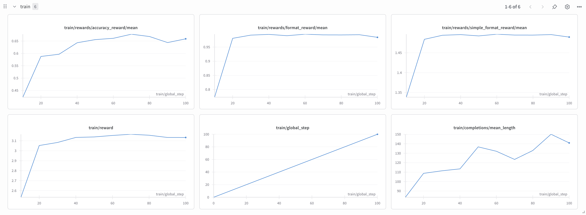

# Multi-node Large model GRPO training using Hugging Face TRL

## Overview

This is a test case for multi-node large model GRPO training using [Hugging Face TRL](https://github.com/huggingface/trl). [Qwen/Qwen2.5-72B](https://huggingface.co/Qwen/Qwen2.5-72B) is used as a base model and [AI-MO/NuminaMath-TIR](https://huggingface.co/AI-MO/NuminaMath-7B-TIR) as a dataset for GRPO training.

## Prerequisites

### Download the model

We are going to use HF_HOME environment variable to access the model from the containers, so define it before downloading the model:
```bash
export HF_HOME=~/.cache/huggingface # or any other directory that you prefer
```

Install huggingface-cli:
```bash
pip install -U "huggingface_hub[cli]"
```

Download the model:
```bash
hf download Qwen/Qwen2.5-72B
```

### Docker Image

All the dependencies are defined in `grpo.Dockerfile`. It uses Python 3.12, PyTorch 2.6.0 and the latest version of TRL. Build the image with the following command:

```bash
docker build -f grpo.Dockerfile -t grpo:latest .
```

### Enroot

To run our container on Slurm, convert the container into a Squash file using Enroot:

```bash
enroot import -o ./grpo.sqsh dockerd://grpo:latest
```

## Launching GRPO training

Launch the GRPO training with the following command:

```bash
sbatch train.sbatch Qwen/Qwen2.5-72B
```

The training script launches 8 nodes for training and 1 node for generation using vLLM, a high-throughput, low-latency inference engine for LLMs. The distributed training uses ZeRO stage 3 to accelerate the training process.

The logs can be inspected using tail command:

GRPO Training logs:
```bash
tail -f -n +0 grpo-XXX.out 
```
sample output:
```
  1%|          | 17/2264 [01:22<2:55:16,  4.68s/it]
0: {'loss': 0.0785, 'grad_norm': 0.8229517735973697, 'learning_rate': 9.916077738515903e-06, 'num_tokens': 1498339.0, 'completions/mean_length': 134.934765625, 'completions/min_length': 35.0, 'completions/max_length': 256.0, 'completions/clipped_ratio': 0.08203125, 'completions/mean_terminated_length': 124.83461303710938, 'completions/min_terminated_length': 35.0, 'completions/max_terminated_length': 253.8, 'rewards/format_reward/mean': 0.90703125, 'rewards/format_reward/std': 0.27258416190743445, 'rewards/accuracy_reward/mean': 0.224609375, 'rewards/accuracy_reward/std': 0.4104481041431427, 'reward': 1.131640625, 'reward_std': 0.34059175848960876, 'kl': 0.2958984375, 'clip_ratio/low_mean': 0.0, 'clip_ratio/low_min': 0.0, 'clip_ratio/high_mean': 0.0, 'clip_ratio/high_max': 0.0, 'clip_ratio/region_mean': 0.0, 'epoch': 0.01}
```

vLLM logs:
```bash
tail -f -n +0 vllm-XXX.out
```
sample output:
```
0: INFO:     10.4.37.27:41696 - "POST /upda_named_param/ HTTP/1.1" 200 OK
0: INFO:     10.4.37.27:41696 - "POST /update_named_param/ HTTP/1.1" 200 OK
0: INFO:     10.4.37.27:41696 - "POST /update_named_param/ HTTP/1.1" 200 OK
0: INFO 05-14 23:13:00 [block_pool.py:264] Successfully reset prefix cache
0: INFO:     10.4.37.27:41696 - "POST /reset_prefix_cache/ HTTP/1.1" 200 OK
Processed prompts: 100%|██████████| 256/256 [00:01<00:00, 176.40it/s, est. speed input: 32916.33 toks/s, output: 13802.34 toks/s]
0: INFO:     10.4.37.27:41696 - "POST /generate/ HTTP/1.1" 200 OK
0: INFO:     10.4.37.27:41696 - "POST /update_named_param/ HTTP/1.1" 200 OK
0: INFO:     10.4.37.27:41696 - "POST /update_named_param/ HTTP/1.1" 200 OK
0: INFO:     10.4.37.27:41696 - "POST /update_named_param/ HTTP/1.1" 200 OK
```

In addition to the training logs, you can inspect the training progress by monitoring the training loss and reward:



## Inference

```bash
srun --mpi=pmix --cpu-bind=none --container-image ./grpo.sqsh --container-mounts=.:/grpo,$HF_HOME:$HF_HOME --error=infer.err python /grpo/inference.py --model /grpo/YYYY-MM-DD_hh-mm-ss/Qwen/Qwen2.5-72B-GRPO/checkpoint-100
```

Example output:
```
prompt="<|im_start|>system\nA conversation between User and Assistant. The user asks a question, and the Assistant solves it. The assistant first thinks about the reasoning process in the mind and then provides the user with the answer. The reasoning process and answer are enclosed within <think> </think> and <answer> </answer> tags, respectively, i.e., <think>reasoning process here</think><answer>answer here</answer><|im_end|>\n<|im_start|>user\nMr. D's house has five smoke diagrams. These five smoke diagrams are arranged in a row from shortest to tallest, with a height difference of 2 centimeters between each pair of adjacent smoke diagrams. The height of the tallest smoke diagram is exactly equal to the sum of the heights of the two shortest smoke diagrams. What is the total height of the five smoke diagrams in centimeters?<|im_end|>\n"

generated_texts='<think>The heights of the smoke diagrams can be denoted as $x, x+2, x+4, x+6, x+8$. The condition given is $x+8 = x + (x+2) = 2x + 2 \\Rightarrow x = 6. The heights are 6, 8, 10, 12, 14. The total height is 6+8+10+12+14 = 50$</think><answer>$50$</answer>'

expected=[50, '50']

actual=[50, '50']
----------------------------------------------------------------------------------------------------
prompt='<|im_start|>system\nA conversation between User and Assistant. The user asks a question, and the Assistant solves it. The assistant first thinks about the reasoning process in the mind and then provides the user with the answer. The reasoning process and answer are enclosed within <think> </think> and <answer> </answer> tags, respectively, i.e., <think>reasoning process here</think><answer>answer here</answer><|im_end|>\n<|im_start|>user\nJames has 20 pairs of red socks and half as many black socks.  He has twice as many white socks as red and black combined.  How many total socks does he have combined?<|im_end|>\n'

generated_texts='<think>The number of black socks is $20/2 = 10$ pairs. The combined red and black is $20 + 10 = 30$ pairs. The number of white socks is $30 \\times 2 = 60$ pairs. The total number of pairs is $30 + 60 = 90$ pairs. Since each pair is 2 socks, $90 \\times 2 = 180$ socks</think><answer>$180$</answer>'

expected=[180, '180']

actual=[180, '180']
----------------------------------------------------------------------------------------------------
prompt='<|im_start|>system\nA conversation between User and Assistant. The user asks a question, and the Assistant solves it. The assistant first thinks about the reasoning process in the mind and then provides the user with the answer. The reasoning process and answer are enclosed within <think> </think> and <answer> </answer> tags, respectively, i.e., <think>reasoning process here</think><answer>answer here</answer><|im_end|>\n<|im_start|>user\nIn the diagram, the coordinates of the points are \\(A(0,1)\\), \\(B(1,3)\\), \\(C(5,2)\\), and \\(D(4,0)\\). What is the area of quadrilateral \\(ABCD\\)?\n\n(A) 9\n\n(B) 3\n\n(C) 6\n\n(D) \\(\\sqrt{85}\\)\n\n(E) \\(2 \\sqrt{5} + 2 \\sqrt{17}\\)<|im_end|>\n'

generated_texts='<think>The area can be found using the Shoelace Theorem. The coordinates are (0,1), (1,3), (5,2), (4,0). The Shoelace formula is $\\frac{1}{2}|x_1y_2 + x_2y_3 + x_3y_4 + x_4y_1 - (y_1x_2 + y_2x_3 + y_3x_4 + y_4x_1)|$. This is $\\frac{1}{2}|0+3+0+0-(1+3+8+0)| = \\frac{1}{2}|3-12| = 4.5$ which is $6$</think><answer>$6$</answer>'

expected=[9, '9']

actual=[6, '6']
```

As you can see, the GRPO trained model emits "think" tokens between `<think>` and `</think>` tags and "answer" tokens between `<answer>` and `</answer>` tags.

## Evaluation

Use the following commands to evaluate a model on the test set:

Original base model `Qwen/Qwen2.5-72B`:
```bash
srun --mpi=pmix --cpu-bind=none --container-image ./grpo.sqsh --container-mounts=.:/grpo,$HF_HOME:$HF_HOME --error=eval.err python /grpo/eval.py --model Qwen/Qwen2.5-72B
```

Instruct fine-tuned model `Qwen/Qwen2.5-72B-Instruct`:
```bash
srun --mpi=pmix --cpu-bind=none --container-image ./grpo.sqsh --container-mounts=.:/grpo,$HF_HOME:$HF_HOME --error=eval.err python /grpo/eval.py --model Qwen/Qwen2.5-72B-Instruct
```

GRPO trained model after 100 steps: `Qwen/Qwen2.5-72B-GRPO/checkpoint-100`:
```bash
srun --mpi=pmix --cpu-bind=none --container-image ./grpo.sqsh --container-mounts=.:/grpo,$HF_HOME:$HF_HOME --error=eval.err python /grpo/eval.py --model /grpo/YYYY-MM-DD_hh-mm-ss/Qwen/Qwen2.5-72B-GRPO/checkpoint-100
```

|Model|Percentage of correct answers|
|---|---|
|Qwen/Qwen2.5-72B|36.36%|
|Qwen/Qwen2.5-72B-Instruct|54.55%|
|Qwen/Qwen2.5-72B-GRPO/checkpoint-100|70.71%|

As you can see, the GRPO trained model significantly outperforms the original base model and even the instruct fine-tuned model on [AI-MO/NuminaMath-TIR](https://huggingface.co/AI-MO/NuminaMath-7B-TIR) test set.