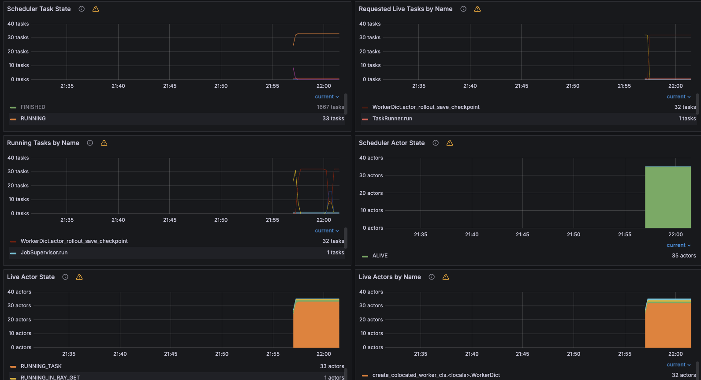

# Ray Observability for HyperPod EKS

Set up Ray metrics monitoring using your existing Amazon Managed Prometheus and Grafana.

## Setup

### 1. Update OTEL Collector to Scrape Ray Metrics

```bash
# Load environment variables
source setup/env_vars

# Apply OTEL config with Ray scrape jobs
envsubst < observability/otel-collector-config-updated.yaml | kubectl apply -f -

# Restart collector to pick up new config
kubectl rollout restart deployment hyperpod-observability-central-collector -n hyperpod-observability
kubectl rollout status deployment hyperpod-observability-central-collector -n hyperpod-observability
```

### 2. Deploy RayCluster with Grafana/Prometheus Config

Your `setup/raycluster.yaml` already includes the necessary Grafana/Prometheus environment variables.

```bash
# Apply RayCluster (if not already running)
source setup/env_vars
envsubst < raycluster-observability.yaml | kubectl apply -f -
```

### 3. Download Grafana Dashboards

1. You can download them directly from your cluster head pod:
```
HEAD_POD=$(kubectl get pods --selector ray.io/node-type=head,ray.io/cluster=rayml-efa -o jsonpath='{.items[0].metadata.name}')

# Copy dashboard files from the pod
kubectl cp $HEAD_POD:/tmp/ray/session_latest/metrics/grafana/dashboards/ ./dashboards/
```

2. Or you can download them directly from [KubeRay GitHub](https://github.com/ray-project/kuberay/tree/master/config/grafana):
```
# Clone the repo
git clone https://github.com/ray-project/kuberay.git --depth 1
cd kuberay/config/grafana
ls *_grafana_dashboard.json
```

### 4. Import Dashboards to Grafana

- `default_grafana_dashboard.json` - Main Ray Dashboard
- `data_grafana_dashboard.json` - Ray Data metrics
- `serve_grafana_dashboard.json` - Ray Serve metrics
- `serve_deployment_grafana_dashboard.json` - Per-deployment metrics

To import:
1. Open your Grafana workspace (check `$GRAFANA_ENDPOINT` in `setup/env_vars`)
2. Click "+" → "Import"
3. Upload each JSON file
4. Select your AMP data source
5. Use the "Cluster" dropdown to filter by `rayml-efa`

## Verify It's Working

```bash
# Check OTEL collector is scraping Ray (should see ray-head-metrics and ray-worker-metrics)
kubectl logs -n hyperpod-observability deployment/hyperpod-observability-central-collector --tail=50 | grep ray

# Check Ray metrics endpoint is responding
HEAD_POD=$(kubectl get pods --selector ray.io/node-type=head,ray.io/cluster=rayml-efa -o jsonpath='{.items[0].metadata.name}')
kubectl exec $HEAD_POD -- curl -s http://localhost:8080 | head -n 20
```

Wait 2-3 minutes for metrics to flow to AMP, then check your Grafana dashboards.

## Troubleshooting

**No metrics in Grafana?**
- Wait 2-3 minutes for data to propagate
- Check time range in Grafana (set to "Last 15 minutes")
- Verify "Cluster" dropdown shows `rayml-efa`
- Check OTEL collector logs for errors

**OTEL collector not scraping Ray?**
- Verify the collector restarted: `kubectl get pods -n hyperpod-observability`
- Check for scrape errors: `kubectl logs -n hyperpod-observability deployment/hyperpod-observability-central-collector --tail=100`

**Ray scrape configs disappeared?**

HyperPod's ObservabilityConfig controller manages the OTEL collector ConfigMap. If you update the ObservabilityConfig (e.g., change scrape intervals), it will regenerate the ConfigMap and remove your Ray scrape configs.

If this happens, simply reapply:
```bash
source setup/env_vars
envsubst < observability/otel-collector-config-updated.yaml | kubectl apply -f -
kubectl rollout restart deployment hyperpod-observability-central-collector -n hyperpod-observability
```

The configs will persist as long as you don't modify the ObservabilityConfig resource.


Results:
## Dashboard Preview


