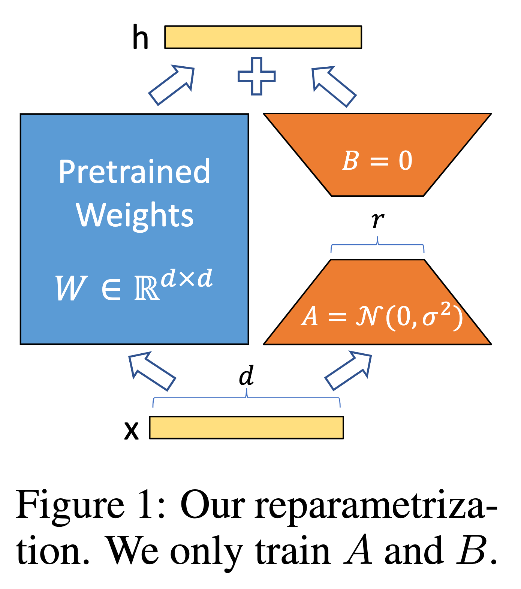

# End-to-End LLama3-70B model development with Torchtune  <!-- omit in toc -->

This tutorial guide you through each following LLM model development steps using Llama3-70B: 

* Continual Pretraining
* Instruction Finetuning
* Alignment
* Evaluation
* Deployment

for details of each step, refer the [overview documentation](../../README.md).

## 1. Prerequisites
Before starting, ensure you have requested access to Meta-Llama-3-70B by visiting [Meta-Llama-3-70B](https://huggingface.co/meta-llama/Meta-Llama-3-70B) on Hugging Face and following the access request instructions. Additionally, make sure all prerequisites described in the [slurm](..) directory are set up.

## 2. Download llama3 model

To begin working with the Llama3-70B model, follow these steps to download the model weights and tokenizer:

### Setting Up Your Environment

Navigate to the [test case path](..) and prepare your environment by sourcing the `.env` file. This step is essential for setting up the paths and credentials needed to access and interact with the Llama3-70B model:

```bash
source .env
```

### Fetching the Model Weights and Tokenizer

Execute the `download_hf_model.sh` script with the model identifier as an argument to download the model weights and tokenizer:

```bash
bash download_hf_model.sh --model meta-llama/Meta-Llama-3-70B
```

Upon successful execution, the script will output messages indicating the progress of the download. Here's what you can expect to see:

```bash
Executing following command:
torchtune download --output-dir /fsx/ubuntu/models/torchtune/meta-llama/Meta-Llama-3-70B meta-llama/Meta-Llama-3-70B --ignore-patterns original/consolidated*

=============
== PyTorch ==
=============

NVIDIA Release 24.04 (build 88113656)
...
Downloading builder script: 100%|█████████████████████████████████████████████████████████████████████████████████████████████████████████████████████████████████████████████████████████████████████████████| 5.67k/5.67k [00:00<00:00, 29.6MB/s]
No CUDA runtime is found, using CUDA_HOME='/usr/local/cuda'
Ignoring files matching the following patterns: original/consolidated*
USE_POLICY.md: 100%|██████████████████████████████████████████████████████████████████████████████████████████████████████████████████████████████████████████████████████████████████████████████████████████| 4.70k/4.70k [00:00<00:00, 16.3MB/s]
generation_config.json: 100%|█████████████████████████████████████████████████████████████████████████████████████████████████████████████████████████████████████████████████████████████████████████████████████| 177/177 [00:00<00:00, 1.96MB/s]
.gitattributes: 100%|█████████████████████████████████████████████████████████████████████████████████████████████████████████████████████████████████████████████████████████████████████████████████████████| 1.52k/1.52k [00:00<00:00, 17.3MB/s]
README.md: 100%|███████████████████████████████████████████████████████████████████████████████████████████████████████████████████████████████████████████████████████████████████████████████████████████████| 36.6k/36.6k [00:00<00:00, 181MB/s]
LICENSE: 100%|████████████████████████████████████████████████████████████████████████████████████████████████████████████████████████████████████████████████████████████████████████████████████████████████| 7.80k/7.80k [00:00<00:00, 77.7MB/s]
...
/fsx/ubuntu/models/torchtune/meta-llama/Meta-Llama-3-70B/model-00007-of-00030.safetensors
/fsx/ubuntu/models/torchtune/meta-llama/Meta-Llama-3-70B/model-00016-of-00030.safetensors
/fsx/ubuntu/models/torchtune/meta-llama/Meta-Llama-3-70B/model-00010-of-00030.safetensors
/fsx/ubuntu/models/torchtune/meta-llama/Meta-Llama-3-70B/model-00001-of-00030.safetensors
/fsx/ubuntu/models/torchtune/meta-llama/Meta-Llama-3-70B/model-00028-of-00030.safetensors
/fsx/ubuntu/models/torchtune/meta-llama/Meta-Llama-3-70B/model-00023-of-00030.safetensors
```

This output confirms that the `torchtune download` command has been executed within the container, successfully downloading the safetensors for `meta-llama/Meta-Llama-3-70B` into the specified `${MODEL_PATH}`.
By following these steps, you ensure that the necessary model components are in place, setting the stage for subsequent tasks such as pretraining, finetuning, evaluation, and deployment.


## 3. Continuous Pretraining

In this step, you will fine-tune the Llama3 model starting from the original checkpoint using the WikiText dataset. This process, known as Full-Parameter Finetuning, updates all the parameters in the original model. The configuration file used for this process is `./tutorials/e2e-llama3-70b-development/full_finetune_distributed.yaml`.

### Memory Consumption Challenges
One of the primary challenges during such training is memory consumption. A typical model trained in mixed precision with AdamW requires 18 bytes per model parameter plus activation memory (6 bytes for parameters in mixed precision training, 8 bytes for AdamW, and 4 bytes for other overheads). For more details on the anatomy, see the [Hugging Face blog post](https://huggingface.co/docs/transformers/model_memory_anatomy) blog post. This means that training a 70B parameter model would require more than 1.12 TB of accelerated memory, which far exceeds the 80 GB capacity of H100 accelerated memory. To address this issue, torchtune integrates PyTorch Fully Sharded Data Parallel (FSDP).

### Basic concepts and relevant configuration

**FSDP** is a distributed training feature designed to efficiently handle large model training by sharding model parameters, gradients, and optimizer states across multiple devices. This approach significantly reduces memory consumption and optimizes resource utilization, making it possible to train models that are too large to fit on a single GPU. In `torchtune` users can launch FSDP training job with command `tune run full_finetune_distributed`.  

**The WikiText language modeling dataset**  is a collection of over 100 million tokens extracted from the set of verified Good and Featured articles on Wikipedia. `torchtune` has a module preconfigured for this dataset. The configuration file preconfigures the WikiText dataset as follows:

```yaml
dataset:
  _component_: torchtune.datasets.wikitext_dataset
```

### Submit the training job

Submit the job with the following command:

```bash
sbatch tutorials/e2e-llama3-70b-development/full_finetune_distributed.sbatch
```

By default, this script launches the FSDP training job with two instances. Once the job has been scheduled, you will see the following outputs in the log file named `logs/full-finetuning*`:

```bash
# tail -f logs/full-finetuning*
Executing following command:
tune run --master_addr 10.1.62.14 --master_port 28415 --nproc_per_node=8 --nnodes 2 --rdzv_backend=c10d --rdzv_endpoint=p5-st-p5-1 full_finetune_distributed --config /fsx/ubuntu/awsome-distributed-training/3.test_cases/torchtune/slurm/tutorials/e2e-llama3-70b-development/configs/full_finetune_distributed.yaml tokenizer.path=/fsx/ubuntu/models/torchtune/meta-llama/Meta-Llama-3-70B/original/tokenizer.model checkpointer.checkpoint_dir=/fsx/ubuntu/models/torchtune/meta-llama/Meta-Llama-3-70B checkpointer.output_dir=/fsx/ubuntu/models/torchtune/meta-llama/Meta-Llama-3-70B-tuned output_dir=/fsx/ubuntu/models/torchtune/meta-llama/Meta-Llama-3-70B-tuned/log metric_logger.log_dir=/fsx/ubuntu/models/torchtune/meta-llama/Meta-Llama-3-70B-tuned/log/metrics
...
0: wandb: Currently logged in as: <YOURUSERNAME>. Use `wandb login --relogin` to force relogin
0: wandb: Tracking run with wandb version 0.17.0
0: wandb: Run data is saved locally in /fsx/ubuntu/models/torchtune/meta-llama/Meta-Llama-3-70B-tuned/log/metrics/wandb/run-20240527_001350-oziekm6j
0: wandb: Run `wandb offline` to turn off syncing.
0: wandb: Syncing run helpful-surf-1
0: wandb: ⭐️ View project at https://wandb.ai/<YOURUSERNAME>/torchtune
0: wandb: 🚀 View run at https://wandb.ai/<YOURUSERNAME>/torchtune/runs/oziekm6j
0: 2024-05-27:00:13:50,919 INFO     [metric_logging.py:225] Logging /fsx/ubuntu/models/torchtune/meta-llama/Meta-Llama-3-70B/torchtune_config.yaml to W&B under Files
...
```

Notice that the job is being tracked by WANDB because of the following section in the config file:

```yaml
metric_logger:
  _component_: torchtune.utils.metric_logging.WandBLogger
  log_dir: None
```

On the WANDB dashboard (`https://wandb.ai/<YOURUSERNAME>/torchtune`), you can monitor the learning curve, compute resource utilization, log outputs, and more. 


## 4. Instruction-tuning

In this step, you will fine-tune the Llama model using Low-Rank Adaptation (LoRA) with the Alpaca dataset. We will first cover the basic concepts and relevant configurations found in the [config file](configs/lora_finetune_distributed.yaml), followed by a detailed fine-tuning tutorial.


### Basic Concepts and Relevant Configurations

**Low-Rank Adaptation (LoRA)** is a method for fine-tuning large language models efficiently. It is a Parameter-efficient Fine-tuning (PEFT) technique that modifies a small, low-rank subset of a model's parameters, significantly reducing the computational cost and time required for fine-tuning. LoRA operates on the principle that large models, despite their size, inherently possess a low-dimensional structure, allowing significant changes to be represented with fewer parameters. This method involves decomposing large weight matrices into smaller matrices, drastically reducing the number of trainable parameters and making the adaptation process faster and less resource-intensive. It leverages the concept of lower-rank matrices to efficiently train models, making it a cost-effective solution for fine-tuning large language models. 

In the config we have following relevant section:

```yaml
model:
  _component_: torchtune.models.llama3.lora_llama3_70b
  lora_attn_modules: ['q_proj', 'k_proj', 'v_proj']
  apply_lora_to_mlp: False
  apply_lora_to_output: False
  lora_rank: 16
  lora_alpha: 32
```
This config can be read as follows:

* This means that we only create LoRA adapters in attention heads, specifically for its Query, Key, and Value matrices.
* `lora_alpha` is a hyper-parameter to control the initialization scale.
* `lora_rank` is the rank of the LoRA parameters. The smaller the `lora_rank`, the fewer parameters LoRA has.

**The Stanford Alpaca dataset**  is a synthetic dataset created by Stanford researchers to fine-tune large language models (LLMs) for instruction-following tasks. It contains 52,000 unique instruction-output pairs generated using OpenAI's text-davinci-003 model. 

In the config we have the following relevant section:

```yaml
dataset:
  _component_: torchtune.datasets.alpaca_dataset
  train_on_input: True
```

As the config suggests, we use a predefined dataset class prepared in torchtune.


### Submit Finetuning job

You can submit the finetuning job with the following command:


```bash
sbatch tutorials/e2e-llama3-70b-development/lora_finetune_distributed.sbatch
```

Once the job has been scheduled, you will see following outputs in the logo output named `logs/:

```bash
...
Executing following command:
tune run --master_addr 10.1.28.89 --master_port 14280 --nproc_per_node=8 --nnodes 1 --nnodes=1 --rdzv_backend=c10d --rdzv_endpoint=p5-st-p5-2 lora_finetune_distributed
...
0: wandb: Currently logged in as: <YOURUSERNAME>. Use `wandb login --relogin` to force relogin
0: wandb: Tracking run with wandb version 0.17.0
0: wandb: Run data is saved locally in /fsx/ubuntu/models/torchtune/meta-llama/Meta-Llama-3-70B-tuned/log/metrics/wandb/run-20240527_001350-oziekm6j
0: wandb: Run `wandb offline` to turn off syncing.
0: wandb: Syncing run helpful-surf-1
0: wandb: ⭐️ View project at https://wandb.ai/<YOURUSERNAME>/torchtune
0: wandb: 🚀 View run at https://wandb.ai/<YOURUSERNAME>/torchtune/runs/oziekm6j
0: 2024-05-27:00:13:50,919 INFO     [metric_logging.py:225] Logging /fsx/ubuntu/models/torchtune/meta-llama/Meta-Llama-3-70B/torchtune_config.yaml to W&B under Files
```

As the output indicates, we run a single-node distributed training job with 8 GPUs here.

```bash
tune run --master_addr 10.1.28.89 --master_port 14280 --nproc_per_node=8 --nnodes 1 --nnodes=1 --rdzv_backend=c10d --rdzv_endpoint=p5-st-p5-2 lora_finetune_distributed
```


After the training, checkpoints are saved as below:

```bash
$ ls /fsx/models/torchtitan-torchtune/meta-llama/Meta-Llama-3-70B-tuned/
adapter_0.pt        hf_model_0002_0.pt  hf_model_0005_0.pt  hf_model_0008_0.pt  hf_model_0011_0.pt  hf_model_0014_0.pt  hf_model_0017_0.pt  hf_model_0020_0.pt  hf_model_0023_0.pt  hf_model_0026_0.pt  hf_model_0029_0.pt
config.json         hf_model_0003_0.pt  hf_model_0006_0.pt  hf_model_0009_0.pt  hf_model_0012_0.pt  hf_model_0015_0.pt  hf_model_0018_0.pt  hf_model_0021_0.pt  hf_model_0024_0.pt  hf_model_0027_0.pt  hf_model_0030_0.pt
hf_model_0001_0.pt  hf_model_0004_0.pt  hf_model_0007_0.pt  hf_model_0010_0.pt  hf_model_0013_0.pt  hf_model_0016_0.pt  hf_model_0019_0.pt  hf_model_0022_0.pt  hf_model_0025_0.pt  hf_model_0028_0.pt
```

Notice that you have `adapter_0.pt`, which stores weighhs for the LoRA adapter.


## 5. Evaluate Llama3 model with lm-evaluation harness

In this last section, you will evaluate the finetuned Llama models. `torchtune` makes use of [lm-evaluation-harness](https://github.com/EleutherAI/lm-evaluation-harness) to conduct various benchmarks.

### Basic Concepts and Relevant Configurations

**The lm-evaluation-harness** is a tool designed to evaluate large language models (LLMs) on various natural language processing (NLP) tasks, ensuring objective and reproducible results. It supports multiple tasks, including text classification, question answering, and commonsense reasoning, allowing for comprehensive model evaluation. The tool provides detailed metrics such as F1-score, accuracy, balanced accuracy, and Matthews correlation coefficient (MCC) for specific tasks. Users can also evaluate models on custom datasets by setting up the environment and creating new task files. The primary goal is to standardize evaluations, making results comparable across different models and implementations. This is crucial for validating new techniques and approaches in LLM development. 

We specify evaluation task in the [config](./configs/evaluate_llama3.yaml) as below:

```yaml
# EleutherAI specific eval args
tasks: ["truthfulqa_mc2"]
```

In this default setting we will use TruthfulQA benchmark with MC2 mode.

**TruthfulQA** is a benchmark designed to evaluate the truthfulness of language models in generating answers to questions. It consists of 817 questions across 38 topics, including health, law, finance, and politics, specifically targeting common misconceptions that humans might incorrectly answer due to false beliefs or misinformation. TruthfulQA features two evaluation modes: MC1 and MC2. In MC2 (Multi-true), given a question and multiple true/false reference answers, the score is the normalized total probability assigned to the set of true answers. For more details, please refer to [the project repository](https://github.com/sylinrl/TruthfulQA).

You can submit sample evaluation job by:


```bash
sbatch evaluate.sbatch
```

## 6. Quantization

In the production setting, it is often not feasible to deploy large model as it is, this requires 

`torchao` is a PyTorch library focused on architecture optimization, specifically targeting quantization and sparsity to enhance model performance. 
* __Quantization__: Provides tools to reduce model size and improve inference speed, with settings to optimize performance using PyTorch's torch.compile function.
* __Sparsity__: Supports the identification and utilization of sparse subnetworks within models, leading to more efficient computations by reducing active parameters. Tools like WeightNormSparsifier are included to facilitate this process.

In this example we use quantization feature of `torchao`.  In the config file:

```yaml
quantizer:
  _component_: torchtune.utils.quantization.Int4WeightOnlyQuantizer
  groupsize: 256
```

`Int4WeightOnlyQuantizer` performs per-axis group quantization, which means it quantizes weights in groups rather than individually. By adjusting the `groupsize`, one can control the trade-off between compression ratio and accuracy. Smaller group sizes typically lead to higher accuracy but lower compression, while larger group sizes achieve higher compression at the potential cost of accuracy.

```bash
sbatch quentize.sbatch
```


```bash
Executing following command:
torchtune run quantize --config /fsx/ubuntu/awsome-distributed-training/3.test_cases/torchtune/slurm/tutorials/e2e-llama3-70b-development/configs/quantize.yaml tokenizer.path=/fsx/ubuntu/models/torchtune/meta-llama/Meta-Llama-3-70B/original/tokenizer.model checkpointer.checkpoint_dir=/fsx/ubuntu/models/torchtune/meta-llama/Meta-Llama-3-70B-tuned checkpointer.output_dir=/fsx/ubuntu/models/torchtune/meta-llama/Meta-Llama-3-70B-quantized
```

The resultant quantized weights is saved as follows:

```bash
0: 2024-05-31:02:10:46,964 DEBUG    [seed.py:60] Setting manual seed to local seed 1234. Local seed is seed + rank = 1234 + 0
0: 2024-05-31:02:18:17,728 INFO     [quantize.py:90] Model is initialized with precision torch.bfloat16.
0: 2024-05-31:02:20:33,576 INFO     [quantize.py:98] Time for quantization: 133.08 sec
0: 2024-05-31:02:20:33,577 INFO     [quantize.py:99] Memory used: 40.03 GB
0: 2024-05-31:02:21:18,609 INFO     [quantize.py:112] Model checkpoint of size 37.94 GB saved to /fsx/ubuntu/models/torchtune/meta-llama/Meta-Llama-3-70B-quantized/hf_model_0001_0-4w.pt
```


## 7. Generation

Now that you have production-ready quantized model. This last step test text generation using the model.

```bash
sbatch 7.generate.sbatch --config configs/generate_llama3.yaml --prompt "Hello, my name is"
```

```
[generate.py:122] Hello, my name is Sarah and I am a busy working mum of two young children, living in the North East of England.
...
[generate.py:135] Time for inference: 10.88 sec total, 18.94 tokens/sec
[generate.py:138] Bandwidth achieved: 346.09 GB/s
[generate.py:139] Memory used: 18.31 GB
```