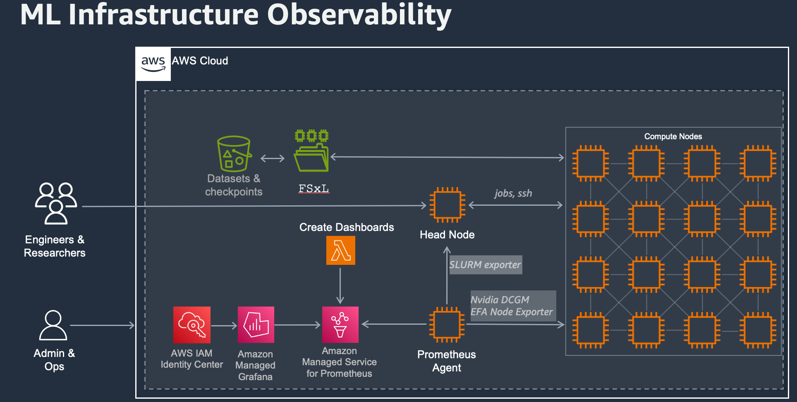

# Machine Learning Infrastructure Monitoring for Slurm based cluster <!-- omit from toc -->

This solution provides a "1 click" deployment observability stack to monitor your slurm based machine learning infrastructure. It automatically creates:
- Amazon Managed Grafana
- Amazon Managed Prometheus
- Setup a Prometheus Agent Collector
- Create data source and dashboard in Grafana


## Prerequisites

Install AWS Serverless Application Model Command Line Interface (AWS SAM CLI) version **>=1.135.0** by following the [instructions](<https://docs.aws.amazon.com/serverless-application-model/latest/developerguide/install-sam-cli.html>).

You will also require to have a VPC Id, Subnet Id in which your cluster is deployed as well as the cluster name.


## Architecture


## Deploy
You will begin by installing the necessary Python package needed for the lambda function.
In your shell:

```bash
cd dashboards
pip install -r requirements.txt -t .
cd ..
```

You are now ready to deploy the serverless application, run the following in your shell:

```
OBS_DASHBOARD_NAME="ml-obs-dashboard"
sam build -t managed-cluster-observability-pc.yaml
sam deploy -t managed-cluster-observability-pc.yaml\
    --stack-name ${OBS_DASHBOARD_NAME} \
    --guided \
    --capabilities CAPABILITY_IAM CAPABILITY_AUTO_EXPAND \
    --parameter-overrides \
    ParameterKey=PCClusterName,ParameterValue=<CLUSTER_NAME> \
    ParameterKey=SubnetId,ParameterValue=<SUBNET_ID> \
    ParameterKey=VpcId,ParameterValue=<VPC_ID>
```


## Clean up
To delete the SAM application deployment, you can use the terminal and enter:

```bash
sam delete
```