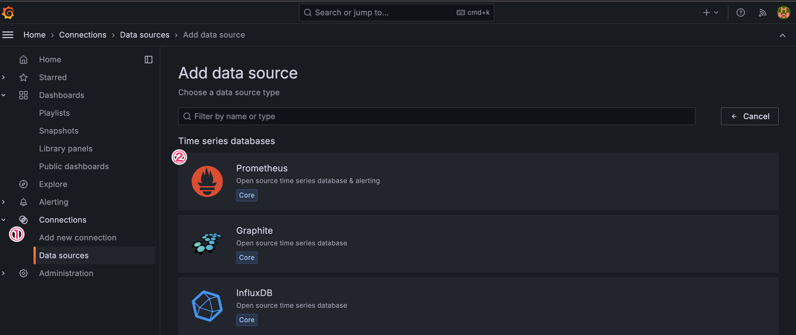

# SageMaker HyperPod Monitoring with OS Grafana <!-- omit from toc -->

Since Amazon Managed Service for Grafana requires authentication via AWS IAM Identity Center or SAML. Setting those authentication mechanism can be troublesome in some environment such as on AWS account used via partner. For such situation, this page guide you how to set up an EC2 instance and run Grafana container along with Amazon Managed Service for Prometheus workspace with a single cloudformation template. After the environment setup, you can follow this guide how to 1/ access to the EC2 instance securely with SSH over SSM and 2/ set the prometheus as datasource so that you can view the metrics.

To get started, you will initiate the provisioning of an Amazon CloudFormation Stack within your AWS Account. You can find the complete stack template in [cluster-observability-os-grafana.yaml](./cluster-observability-os-grafana.yaml). This CloudFormation stack will orchestrate the deployment of the following resources dedicated to cluster monitoring in your AWS environment:

  * [Amazon Manged Prometheus WorkSpace](https://aws.amazon.com/prometheus/)
  * [Amazon Managed Grafana Workspace](https://aws.amazon.com/grafana/)
  * Associated IAM roles and permissions

### Prerequisites

* Refer to the [original readme](./README.md) for exporter setup and other prerequisites.
* Set up the [SSM Session Manager Plugin](https://docs.aws.amazon.com/systems-manager/latest/userguide/session-manager-working-with-install-plugin.html) on your local environment to access the EC2 instance. Follow instruction in [here](https://catalog.workshops.aws/sagemaker-hyperpod/en-US/01-cluster/05-ssh).

### Deploy the CloudFormation Stack 

[<kbd> <br> 1-Click Deploy 🚀 <br> </kbd>](https://console.aws.amazon.com/cloudformation/home?#/stacks/quickcreate?templateURL=https://awsome-distributed-training.s3.amazonaws.com/templates/cluster-observability-os-grafana.yaml&stackName=Cluster-Observability-OS-Grafana)

>[!IMPORTANT]
> It is strongly recommended you deploy this stack into the same region and same account as your SageMaker HyperPod Cluster.This will ensure successful execution of the Lifecycle Scripts, specifically `install_prometheus.sh`, which relies on AWS CLI commands that assume same account and same region. 

### Connect to the EC2 instance running OS Grafana

Connect to the EC2 instance using SSM:

```bash
aws ssm start-session --target ${Instance_ID}  --region ${REGION}
```
Then switch to the `ec2-user`:

```bash
sudo su - ec2-user
```

Add your SSH public key to `~/.ssh/authorized_keys` on the instance.
Configure SSH access over SSM by adding the following to your local `~/.ssh/config`:

```bash
Host os-grafana
  User ec2-user
  ProxyCommand sh -c "aws ssm start-session --region ${REGION} --target ${INSTANCE_ID} --document-name AWS-StartSSHSession --parameters 'portNumber=%p'"
```

Connect to the instance:

```bash
ssh os-grafana
```

Set up port forwarding for port 3000 to access the Grafana dashboard from a web browser. For VS Code setup, refer to [this guide](https://code.visualstudio.com/docs/editor/port-forwarding). Default Grafana login credentials are `admin/admin`. Please change the password after the first login.

### Set Prometheus Workspace as datasource for the Grafana dashboard

Finally, you can connect the Prometheus workspace with the Grafana dashboard by setting workspace as a data source.

Navigate to "Data sources" in Grafana and select "Prometheus".



Set the "Prometheus server URL" with the value retrieved from the AWS console.


For authentication:
* Choose "SigV4 auth"
* Set "Authentication Provider" as "AWS SDK Default"
* Set "Default Region" to the region where you deployed the CloudFormation stack.


