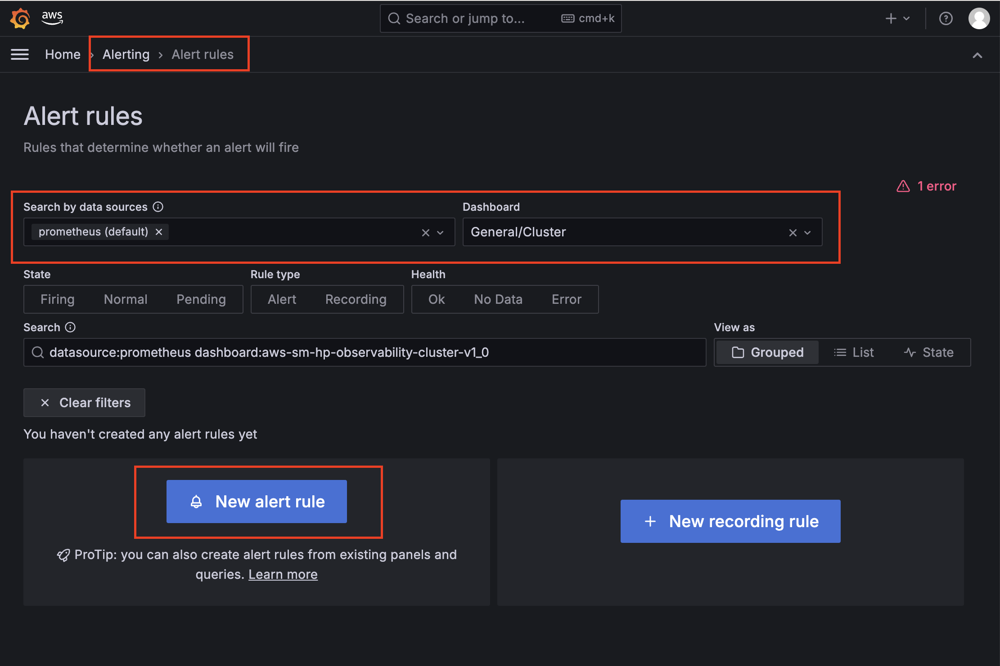
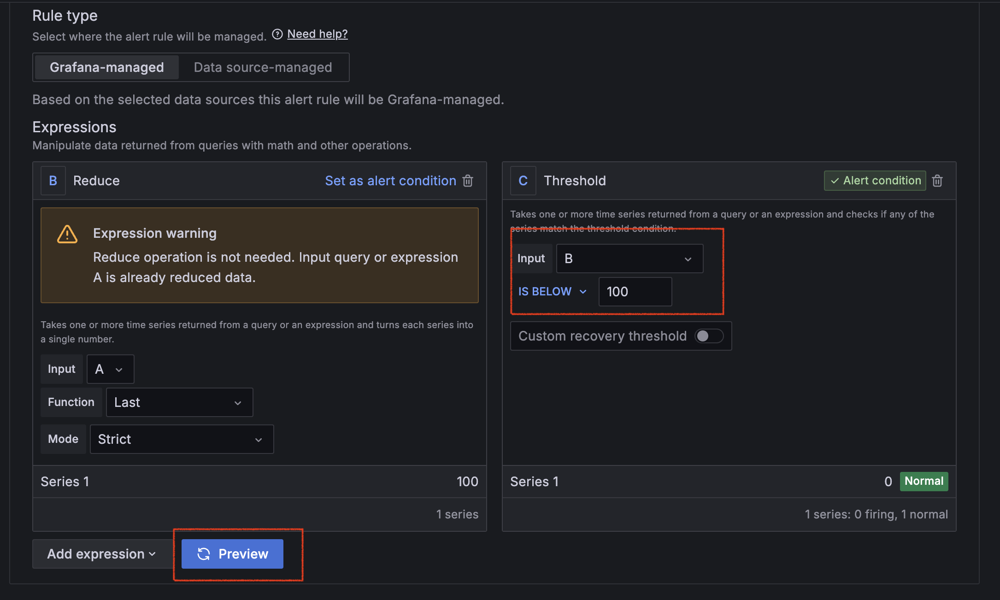
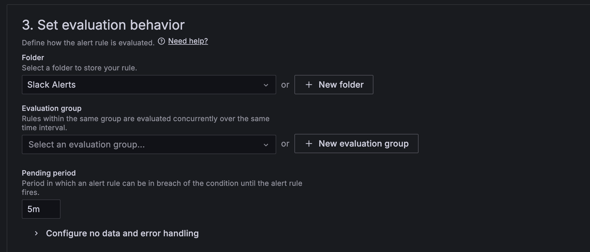

# Setup slack alerts for Amazon Managed Grafana Workspace

1. [Configure your Slack Workspace for Grafana Alerting](https://grafana.com/docs/grafana/latest/alerting/configure-notifications/manage-contact-points/integrations/configure-slack/#configure-slack-for-alerting)

Go to [slack API Quickstart](https://api.slack.com/quickstart).

1. On the Your Apps page, select Create New App.
2. Select From scratch.
3. Enter your App Name. For this example, enter "GPU Cluster Alerts".
4. Select the Workspace where you'll be developing your app. You'll be able to distribute your app to other workspaces later if you choose.
5. Select Create App.


2. Requesting scopes 

Next, you'll need to request scopes for your app. Scopes give your app permission to perform actions, such as posting messages in your workspace.

Slack apps can't post to any public channel by default; they gain that ability by asking for permission explicitly with the use of scopes. Request the chat:write.public scope to gain the ability to post in all public channels without joining. Otherwise, you'll need to use the conversations.join scope, or have your app invited into a channel by a user before it can post.

Within OAuth & Permissions, scroll down to Scopes.

1. Under Bot Token Scopes, select Add an OAuth Scope.
2. To allow your app to post messages, add the `chat:write` scope.
3. To allow your app to access public Slack channels, add the channels:read scope.


3. Add your slack app to your workspace

Return to the Basic Information section of the app management page.
Install your app by selecting the Install to Workspace button.
You'll now be sent through the Slack OAuth flow. Select Allow on the following screen.

Slack will provide you with an oauth token starting with "xoxb". Copy this token to your clipboard, we will use it later to configure with grafana.

Once authorized and added to your workspace, you should see the slack applicaiton in your slack workspace. Contact your slack adminstrator if you encounter issues with creating the slack applicaiton.


In your desired slack channel, such as a team slack channel, add this slack app by tagging it and selecting "add to channel".


4. Enable Grafana Alerting on your [Amazon Managed Grafana (AMG) Workspace](console.aws.amazon.com/grafana/home). 

Select your workspace in the AMG Console > Workspace Configuration Options > Edit Grafana Alerting > Turn on Grafana Alerting 


5. Create a new alert rule using Grafana alerting.

Select the datasource and dashboard for the rule you would like to create an alert for



6. Configure your new alert rule 

Name your alert rule, we will call this rule "GPU health", and configure a query for your alert. In this example, we will configure a rule to alert when Nvidia DCGM reports a GPU as unhealthy due to XID errors. 

Paste the following promql code into the metrics query box:

```
100 * count(
  DCGM_FI_DEV_GPU_UTIL unless 
  (DCGM_FI_DEV_XID_ERRORS > 0 or DCGM_FI_DEV_ECC_DBE_VOL_TOTAL > 0)
)
/
count(DCGM_FI_DEV_GPU_UTIL)
```


For this query, we want Grafana Alert to fire when the query threshold is below 100%, meaning not all GPUs are reporting healthy from the above query. Select preview to preview this alert rule.



Create a new folder, lets call it "slack alerts", and add a new evaluation period. For this "GPU health" rule, we will use default of 5 min. 



6. Create a contact point in grafana

To create your Slack integration in Grafana Alerting, complete the following steps.

Navigate to Alerts -> Alerting -> Contact points.

Click + Add contact point.

Enter a contact point name.

From the Integration list, select Slack.

If you are using a Slack API token:

In the Recipient field, copy in the channel ID.
In the Token field, copy in the Bot User OAuth Token that starts with “xoxb-”.
If you are using a Webhook URL, in the Webhook field, copy in your Slack app Webhook URL.


8. Test alert rule
Click Test to check that your integration works. 


Optionally, you can modify the alert threshold to below 100 to trigger the alert to Fire. 


9. Next Steps

Congratulations, you have successfully configured a slack alert to alert when GPU Health is not at 100%. You can optionally configure additional alert rules to alert on key metrics such as File System Utilization above 100%, GPU Thermal Throttling Errors, or CPU % at 100% for extended periods of time.  