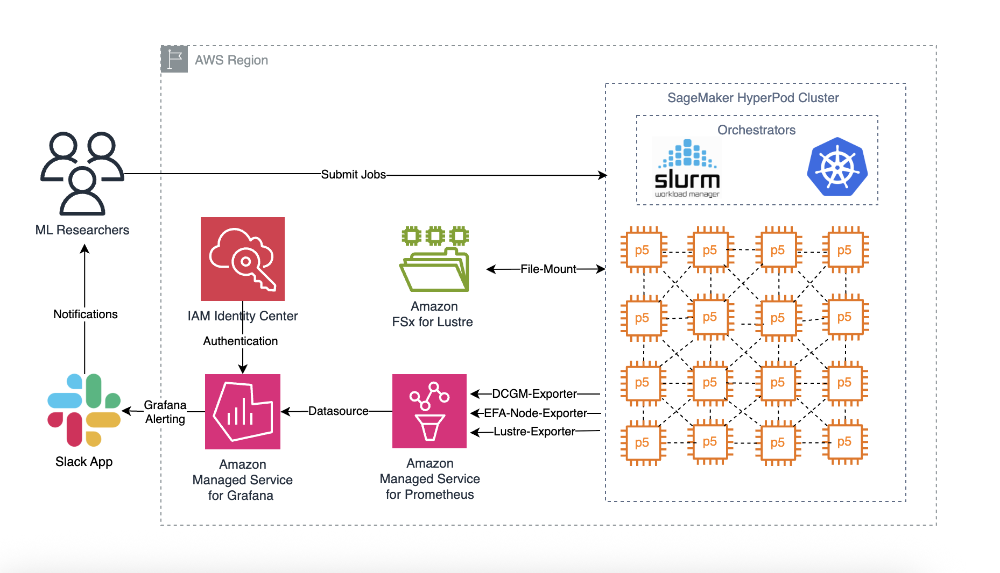
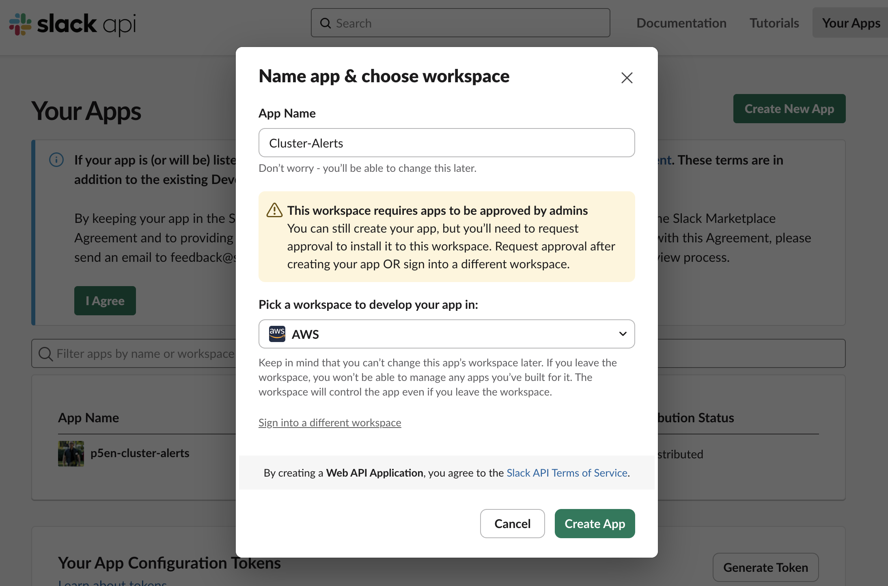
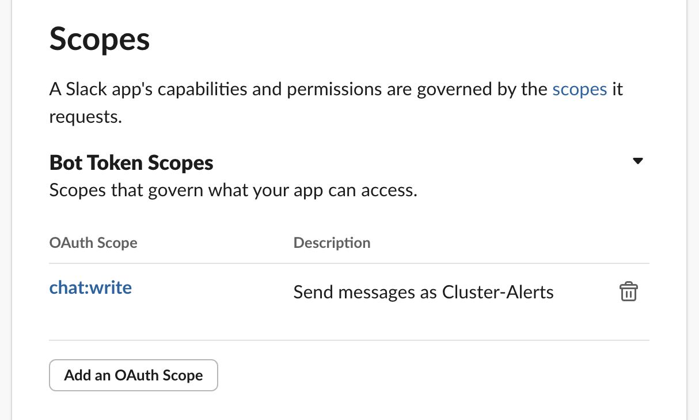
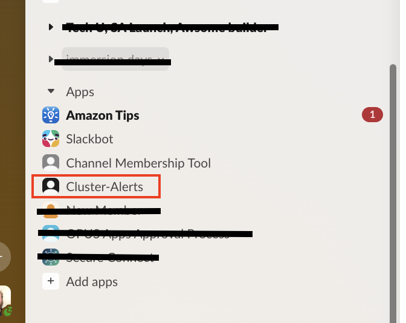
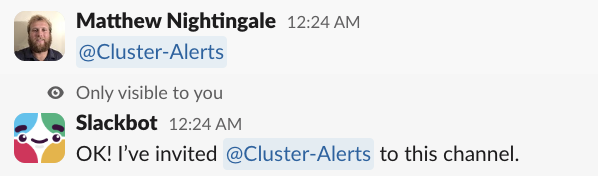
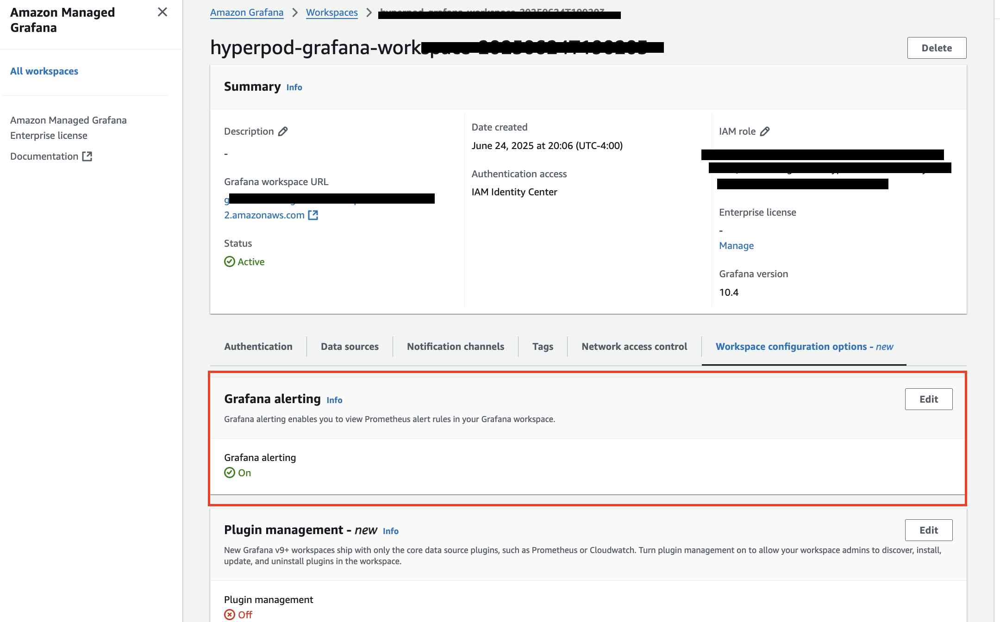
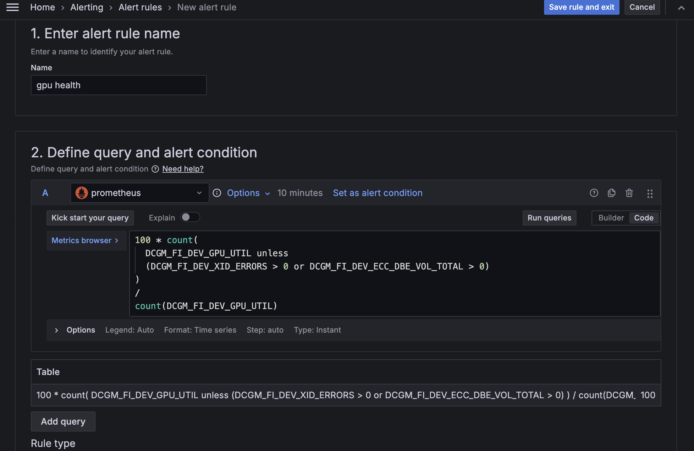
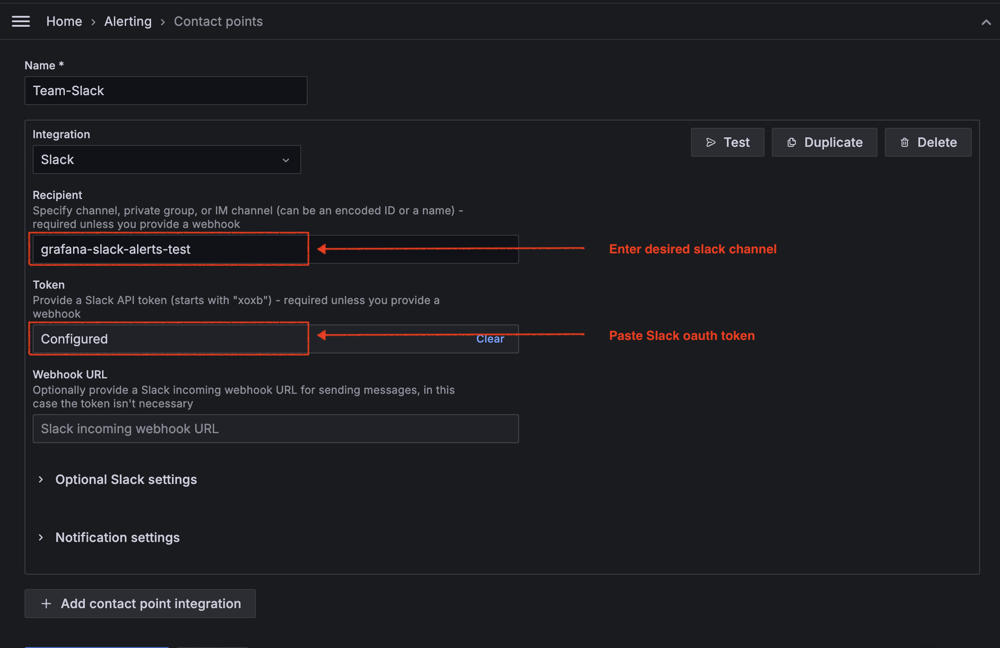
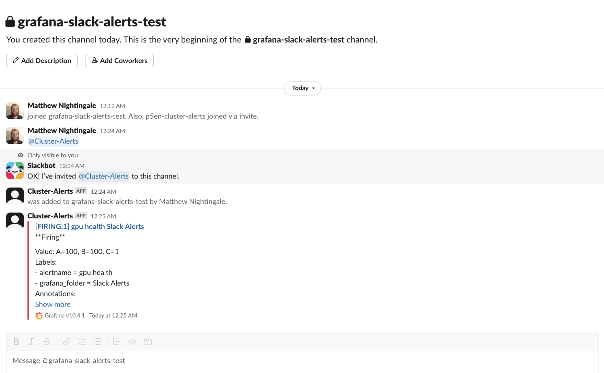
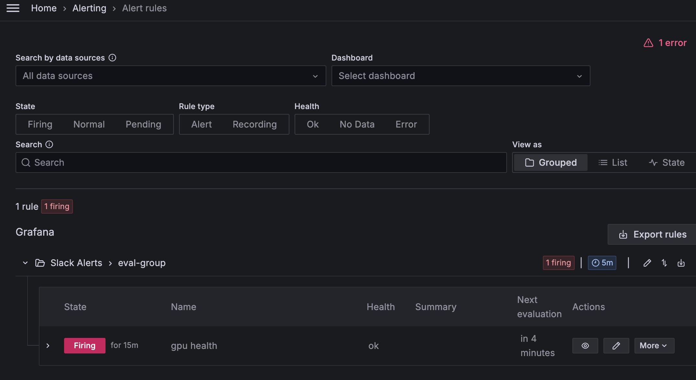

# Setting Up Slack Alerts for Amazon Managed Grafana

This guide walks you through how to configure Slack notifications for alerts generated by your Amazon Managed Grafana (AMG) workspace. It’s especially useful for monitoring GPU clusters, system health, and infrastructure metrics in real time.

**time to complete:** approx 30 minutes

---

## Prerequisites

- A Slack workspace with permissions to create a slack app
- An Amazon Managed Grafana workspace
- Administrator access to your AMG workspace to configure alerting and contact points

---

## Architecture



---

## Step 1: Create a Slack App

1. Visit the [Slack API Quickstart](https://api.slack.com/quickstart)
2. Click “Create New App” → “From scratch”
3. Configure your app:
   - App name: e.g., `GPU Cluster Alerts`
   - Workspace: Select your Slack workspace
   - Click Create App



---

## Step 2: Add Required App Permissions

1. In your Slack app, go to **OAuth & Permissions**
2. Under **Bot Token Scopes**, add:
   - `chat:write` – to post messages
   - `channels:read` – to access channel list

> For posting to public channels without joining them, also add: `chat:write.public`



---

## Step 3: Install the App and Add It to a Channel

1. Go to **Basic Information**
2. Click **Install to Workspace**
3. Complete the OAuth flow to authorize the app
4. Copy the Bot User OAuth Token (starts with `xoxb-`)



Then:
1. Open your target Slack channel
2. Mention the app (`@YourAppName`)
3. Click **Add to channel** when prompted



---

## Step 4: Enable Grafana Alerting

1. Open the [Amazon Managed Grafana Console](https://console.aws.amazon.com/grafana/)
2. Select your workspace
3. Go to **Workspace Configuration Options**
4. Enable **Grafana Alerting**



---

## Step 5: Create a GPU Health Alert Rule

1. In your dashboard, click **Alert** → **Create alert rule**
2. Choose your data source and define the rule:
   - Name: `GPU Health`
   - Query:

```promql
100 * count(
  DCGM_FI_DEV_GPU_UTIL unless 
  (DCGM_FI_DEV_XID_ERRORS > 0 or DCGM_FI_DEV_ECC_DBE_VOL_TOTAL > 0)
)
/
count(DCGM_FI_DEV_GPU_UTIL)
```



Set a threshold below 100% to detect unhealthy GPUs.

Create a folder (e.g., `slack alerts`)

Set evaluation interval (default: 5 minutes)

---

## Step 6: Configure Slack Contact Point in Grafana

1. Go to **Alerts** → **Alerting** → **Contact points**
2. Click **+ Add contact point**
3. Configure the contact point:
   - **Name**: `Slack-GPU-Alerts`
   - **Type**: Slack
   - **Recipient**: Slack channel ID (e.g., `#gpu-alerts`)
   - **Token**: Paste your `xoxb-` Bot User OAuth Token

> Alternatively, use a Webhook URL if preferred.



---

## Step 7: Test the Integration

1. Click **Test** to send a test alert
2. A test message should appear in your Slack channel



To simulate a real alert, temporarily reduce your alert threshold.



---

## Next Steps

You’ve successfully set up Slack alerts for GPU health monitoring. Consider creating additional alert rules for:

- Disk usage (e.g., > 90%)
- GPU thermal throttling
- CPU and memory saturation
- Network degradation
- File system errors

These alerts help you maintain a healthy, performant infrastructure and respond to issues before they escalate.

---

## Support

For more on managing alerts in AMG, check the [Grafana Alerting documentation](https://grafana.com/docs/grafana/latest/alerting/).
