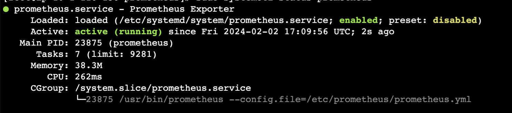
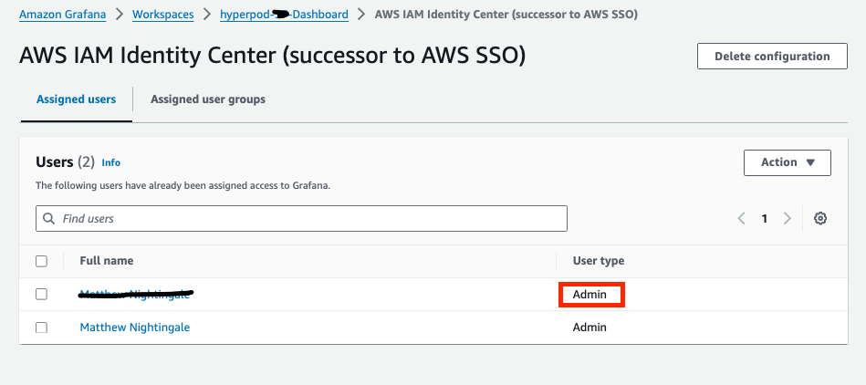
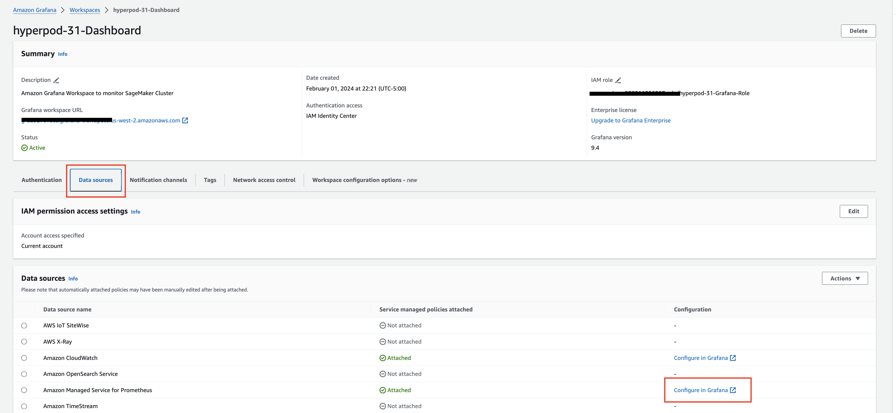
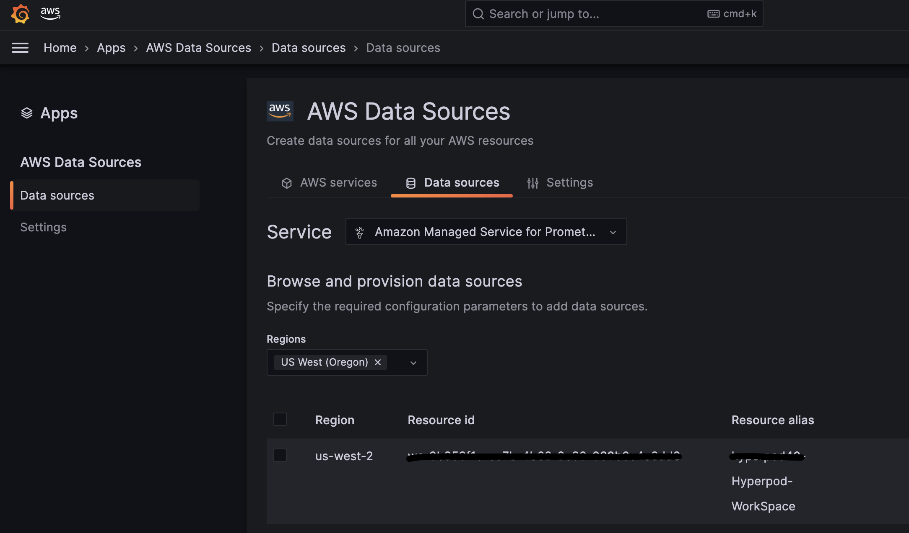
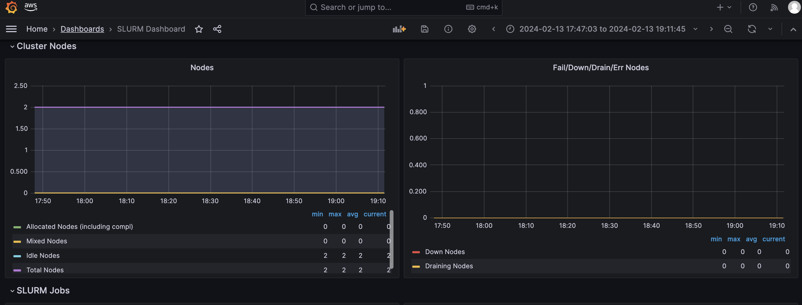
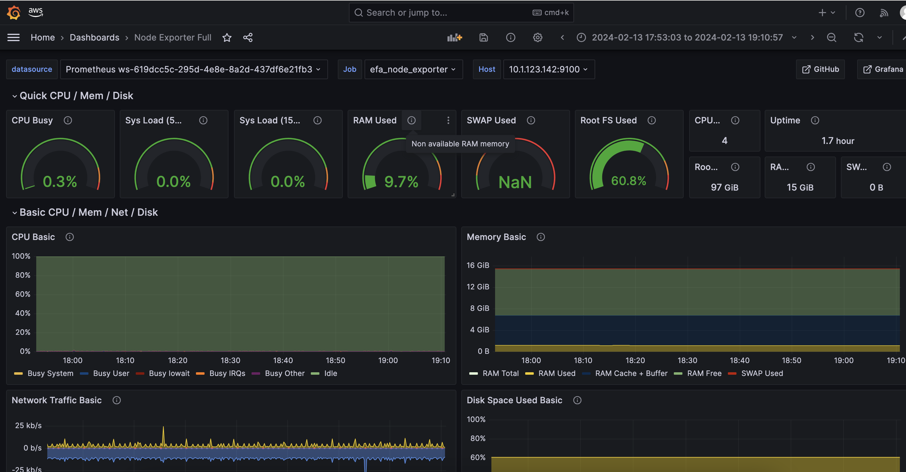
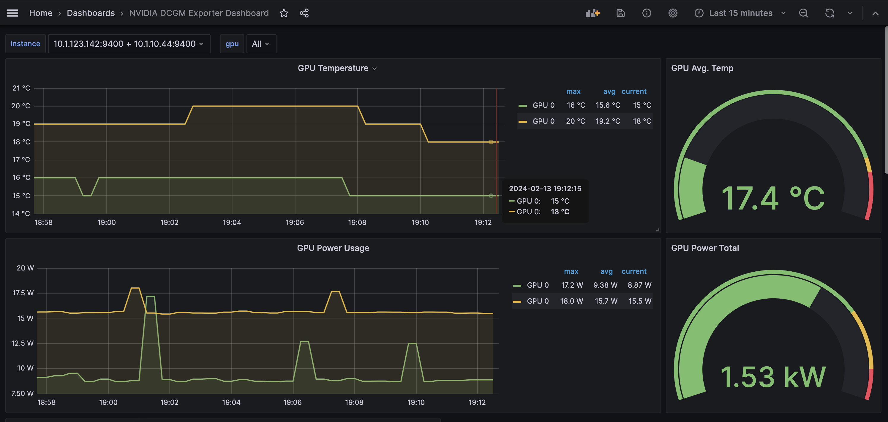
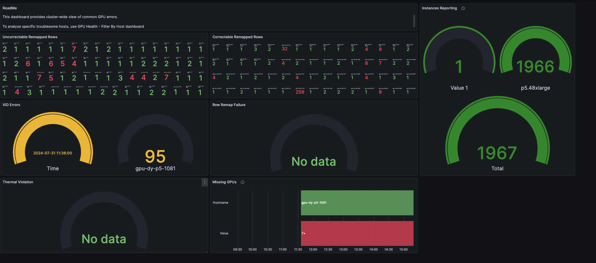
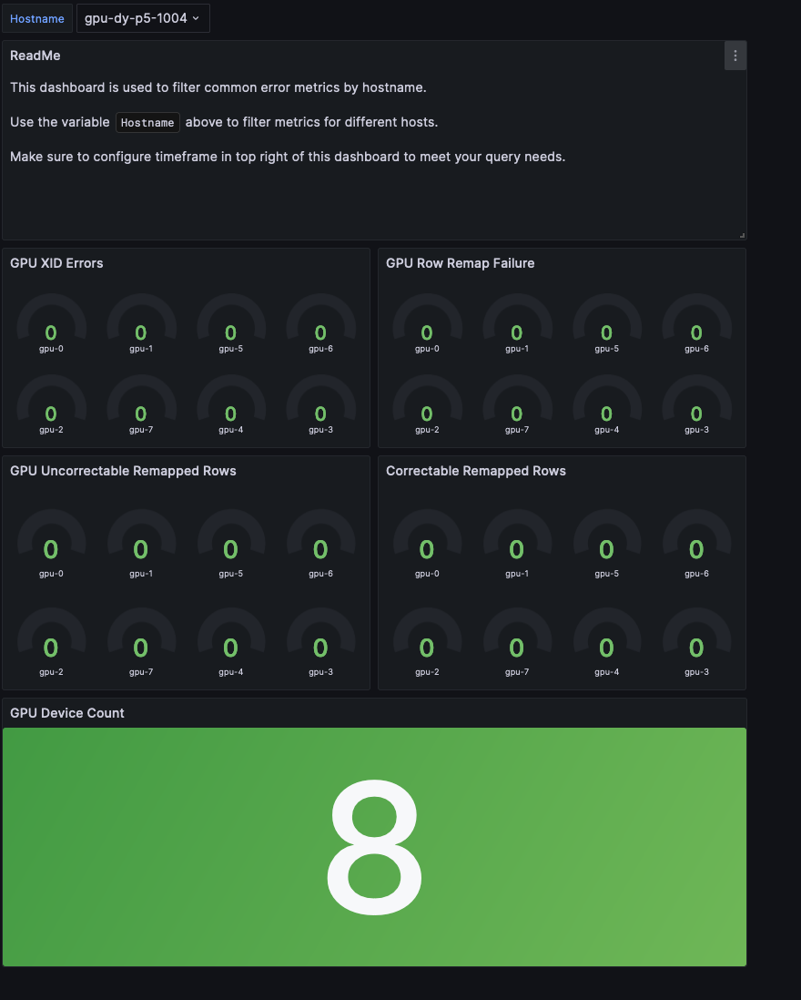

# SageMaker HyperPod Monitoring <!-- omit from toc -->

This repository provides a comprehensive guide for deploying an observability stack tailored to enhance monitoring capabilities for your SageMaker HyperPod cluster. It demonstrates how to export both cluster metrics (SLURM-exporter) and node metrics (DCGM-exporter, EFA-node-exporter) to a Prometheus/Grafana monitoring stack. This setup enables your administrators, ML-ops teams, and model developers to access real-time metrics, offering valuable insights into your cluster's performance.


To get started, you will initiate the provisioning of an Amazon CloudFormation Stack within your AWS Account. You can find the complete stack template in [cluster-observability.yaml](./cluster-observability.yaml). This CloudFormation stack will orchestrate the deployment of the following resources dedicated to cluster monitoring in your AWS environment:

  * [Amazon Manged Prometheus WorkSpace](https://aws.amazon.com/prometheus/)
  * [Amazon Managed Grafana Workspace](https://aws.amazon.com/grafana/)
  * Associated IAM roles and permissions


The solution uses SageMaker HyperPod [Lifecycle Scripts](https://github.com/aws-samples/awsome-distributed-training/tree/main/1.architectures/5.sagemaker-hyperpod#31-lifecycle-scripts), to bootstrap your cluster with the following open-source exporter services: 

| Name                                                               | Script Deployment Target | Metrics Description                                             |
| ------------------------------------------------------------------ | -------- | --------------------------------------------------- |
| [`0.Prometheus Slurm Exporter`](https://github.com/vpenso/prometheus-slurm-exporter)                                   | controller-node  | SLURM Accounting metrics (sinfo, sacct)                                |
| [`1.EFA-Node-Exporter`](https://github.com/aws-samples/awsome-distributed-training/tree/main/4.validation_and_observability/3.efa-node-exporter)                 | cluster-nodes  | Fork of Node exporter to include metrics from emitted from EFA         |
| [`2.NVIDIA-DCGM-Exporter`](https://github.com/NVIDIA/dcgm-exporter) | cluster-nodes  | Nvidia DCGM Metrics about Nvidia Enabled GPUs |

### Prerequisites 
To enable these exporter services, modify the [config.py](https://github.com/aws-samples/awsome-distributed-training/blob/main/1.architectures/5.sagemaker-hyperpod/LifecycleScripts/base-config/config.py) file to configure `enable_observability = True`. Save this file, and [upload it to the s3 bucket path](https://catalog.workshops.aws/sagemaker-hyperpod/en-US/01-cluster/03-s3) referenced in your [`cluster-config.json`](https://catalog.workshops.aws/sagemaker-hyperpod/en-US/01-cluster/04-create-cluster#create-cluster) file. By modifying `config.py` and uploading to S3, this will ensure that any new nodes added or replaced in the HyperPod cluster will also be created with the metric exporter scripts running  

If you have already created your HyperPod cluster, you can follow [these instructions](https://catalog.workshops.aws/sagemaker-hyperpod/en-US/06-observability/09-update) to update your existing HyperPod cluster with Observabiltiy. 

> [!IMPORTANT]
>Before proceeding, you will need to add the following AWS Managed IAM Policies to your AmazonSagemakerClusterExecutionRole:
>* [AmazonPrometheusRemoteWriteAccess](https://us-east-1.console.aws.amazon.com/iam/home?/policies/details/arn%3Aaws%3Aiam%3A%3Aaws%3Apolicy%2FAmazonPrometheusRemoteWriteAccess?section=permissions#/policies/details/arn%3Aaws%3Aiam%3A%3Aaws%3Apolicy%2FAmazonPrometheusRemoteWriteAccess?section=permissions): *this will give the control node access to write cluster metrics to the Amazon Managed Prometheus Workspace you will create.*
>* [AWSCloudFormatinoReadOnlyAccess](https://us-east-1.console.aws.amazon.com/iam/home?policies/details/arn%3Aaws%3Aiam%3A%3Aaws%3Apolicy%2FAWSCloudFormationReadOnlyAccess?section=permissions#/policies/details/arn%3Aaws%3Aiam%3A%3Aaws%3Apolicy%2FAWSCloudFormationReadOnlyAccess?section=permissions) *this will give the install_prometheus.sh file permissions to read stack outputs (remotewriteurl, region) from your cloudformation stack*

### Deploy the CloudFormation Stack 

[<kbd> <br> 1-Click Deploy 🚀 <br> </kbd>](https://console.aws.amazon.com/cloudformation/home?#/stacks/quickcreate?templateURL=https://awsome-distributed-training.s3.amazonaws.com/templates/cluster-observability.yaml&stackName=Cluster-Observability)

>[!IMPORTANT]
> It is strongly recommended you deploy this stack into the same region and same account as your SageMaker HyperPod Cluster.This will ensure successful execution of the Lifecycle Scripts, specifically `install_prometheus.sh`, which relies on AWS CLI commands that assume same account and same region. 

### Connect to the cluster
Connect to the controller node of your cluster via ssm:
>[!NOTE]
>You can find the ClusterID, WorkerGroup, and Instance ID of your controller node in the SageMaker Console or via the AWS CLI

```bash
aws ssm start-session —target sagemaker-cluster:<CLUSTER_ID>_<WORKER_GROUP>-<INSTANCE_ID>
```

Verify the new prometheus config and service file created by `install_prometheus.sh` is running on the controller node:
```bash
sudo systemctl status prometheus
```
The output should show active (running):


You can validate the prometheus confiugration file with: 
```bash
cat /etc/prometheus/prometheus.yml
```

Your file should look similar to the following:
```yaml
global:
  scrape_interval: 15s
  evaluation_interval: 15s
  scrape_timeout: 15s

scrape_configs:
  - job_name: 'slurm_exporter'
    static_configs:
      - targets:
          - 'localhost:8080'
  - job_name: 'dcgm_exporter'
    static_configs:
      - targets:
          - '<ComputeNodeIP>:9400'
          - '<ComputeNodeIP>:9400'
  - job_name: 'efa_node_exporter'
    static_configs:
      - targets:
          - '<ComputeNodeIP>:9100'
          - '<ComputeNodeIP>:9100'

remote_write:
  - url: <AMPReoteWriteURL>
    queue_config:
      max_samples_per_send: 1000
      max_shards: 200
      capacity: 2500
    sigv4:
      region: <Region>
```

You can curl for relevant Promtetheus metrics on the controller nodes using: 
```bash
curl -s http://localhost:9090/metrics | grep -E 'slurm|dcgm|efa'
```

With node and cluster metrics now being exported to Amazon Managed Prometheus Workspace via prometheus remote write from the control node, next you will set up the Amazon Managed Grafana Workspace. 

### Setup the Grafana Workspace
>[!IMPORTANT] 
>Before proceeding, ensure your AWS Account has been setup with [AWS Identity Center](https://docs.aws.amazon.com/singlesignon/latest/userguide/get-set-up-for-idc.html). It will be used to authenticate to the Amazon Managed Grafana Workspace in the final steps: 

Navigate to [Amazon Managed Grafana](https://console.aws.amazon.com/grafana/home?#/workspaces) in the AWS Management Console

In the Authentication Tab, configure Authentication using AWS IAM Identity Center:

>[!NOTE]
>Configure your AWS IAM Identity Center User as User type: Admin.



Within the DataSources Tab of your Grafana workspace, click the “Configure in Grafana” link to Configure Prometheus as a data source. 



You will prompted to authenticate to the Grafana workspace with the IAM Identity Center Username and Password. This is the you set up for the workspace. 

>[!NOTE]
>If you have forgotten username and password, you can find and reset them within [IAM Identity Center](https://us-east-1.console.aws.amazon.com/singlesignon/identity)


Once you are in the Amazon Managed Grafana Workspace "datasources" page, select the AWS Region and Prometheus Workspace ID of your Amazon Managed Prometheus Workspace ID. 



### Build Grafana Dashboards

Finally, with authentication and data sources setup, within your grafana workspace, select dashboards > new > import.

To display metrics for the exporter services, you can start by configuring and customizing the following 3 open source Grafana Dashboards by copying and pasting the below links: 

#### Slurm Exporter Dashboard:

https://grafana.com/grafana/dashboards/4323-slurm-dashboard/



#### Node Exporter Dashboard:

https://grafana.com/grafana/dashboards/1860-node-exporter-full/



#### DCGM Exporter Dashboard:

https://grafana.com/grafana/dashboards/12239-nvidia-dcgm-exporter-dashboard/



#### GPU Health (Xid) Dashboard:

https://grafana.com/grafana/dashboards/21645-gpu-health-cluster/




#### GPU Health (Xid) ny Node Dashboard:

https://grafana.com/grafana/dashboards/21646-gpu-health-filter-by-host/



Congratulations, you can now view real time metrics about your Sagemaker HyperPod Cluster and compute nodes in Grafana!
