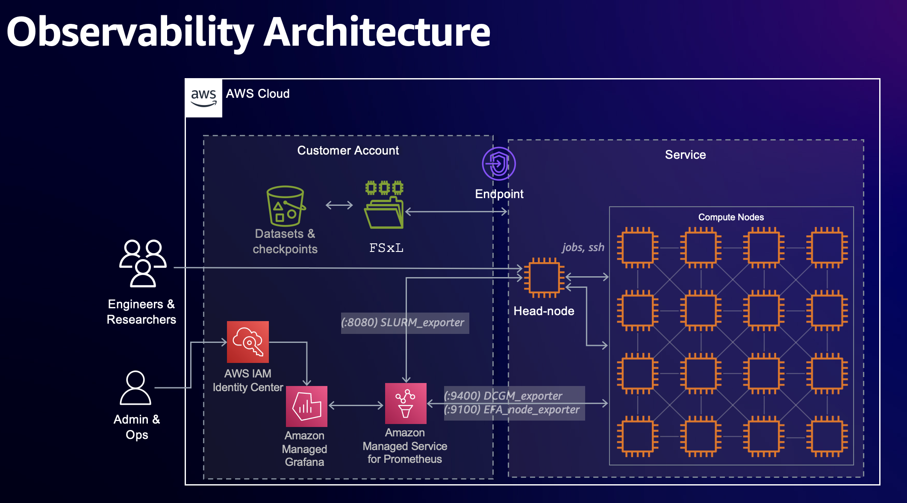

# EKS GPU Observability with Amazon Managed Services

Monitor EKS GPU workloads using Amazon Managed Prometheus (AMP) and Amazon Managed Grafana (AMG) with DCGM Exporter.

## Architecture

**Data Flow:** DCGM Exporter → ADOT Collector → Amazon Managed Prometheus → Amazon Managed Grafana

**Key Benefits:**
- No in-cluster Prometheus/Grafana deployment (minimal resource overhead ~200-500MB)
- Multi-cluster monitoring capability
- AWS IAM integrated authentication
- Managed service reliability and scalability
- Cross-region support (deploy AMP/AMG in regions that support AMG)



## Prerequisites

- EKS cluster with GPU nodes
- AWS CLI and `kubectl` configured
- AWS IAM Identity Center configured (for Grafana authentication)

## Installing DCGM Exporter

Before setting up observability, you need to install DCGM Exporter to expose GPU metrics. Choose one of the following methods:

### Option 1: NVIDIA GPU Operator

The GPU Operator is a comprehensive solution that manages all NVIDIA software components, including DCGM Exporter, GPU drivers, and the container toolkit.

**Installation:**

```bash
# Add NVIDIA Helm repository
helm repo add nvidia https://helm.ngc.nvidia.com/nvidia
helm repo update

# Install GPU Operator
helm install gpu-operator nvidia/gpu-operator \
  --namespace gpu-operator \
  --create-namespace \
  --set dcgmExporter.enabled=true
```

**Verify installation:**

```bash
kubectl get pods -n gpu-operator
```

**Documentation:**
- [NVIDIA GPU Operator GitHub](https://github.com/NVIDIA/gpu-operator)
- [GPU Operator Documentation](https://docs.nvidia.com/datacenter/cloud-native/gpu-operator/latest/index.html)

### Option 2: Standalone DCGM Exporter

If you already have GPU drivers and the NVIDIA Container Toolkit installed, you can deploy DCGM Exporter standalone.

**Installation:**

```bash
# Add DCGM Exporter Helm repository
helm repo add gpu-helm-charts https://nvidia.github.io/dcgm-exporter/helm-charts
helm repo update

# Install DCGM Exporter
helm install dcgm-exporter gpu-helm-charts/dcgm-exporter \
  --namespace dcgm-exporter \
  --create-namespace
```

**Verify installation:**

```bash
kubectl get pods -n dcgm-exporter
```

**Documentation:**
- [DCGM Exporter GitHub](https://github.com/NVIDIA/dcgm-exporter)
- [DCGM Exporter Documentation](https://docs.nvidia.com/datacenter/dcgm/latest/gpu-telemetry/dcgm-exporter.html)

### Verify DCGM Exporter is Working

Test that metrics are being exposed:

```bash
# Get DCGM Exporter pod name
DCGM_POD=$(kubectl get pods -n gpu-operator -l app=nvidia-dcgm-exporter -o jsonpath='{.items[0].metadata.name}')

# Or if using standalone installation:
# DCGM_POD=$(kubectl get pods -n dcgm-exporter -l app.kubernetes.io/name=dcgm-exporter -o jsonpath='{.items[0].metadata.name}')

# Port forward to access metrics
kubectl port-forward -n gpu-operator $DCGM_POD 9400:9400 &

# Check metrics
curl http://localhost:9400/metrics | grep DCGM

# Stop port forward
pkill -f "port-forward.*9400"
```

You should see GPU metrics like `DCGM_FI_DEV_GPU_UTIL`, `DCGM_FI_DEV_GPU_TEMP`, etc.

---

## Quick Start

### Automated Deployment

Use the provided script for automated setup:

```bash
cd awsome-distributed-training/4.validation_and_observability/4.prometheus-grafana/eks-managed-observability
./deploy-obs.sh
```

The script will prompt for:
- EKS cluster region
- AMP/AMG region (must support Amazon Managed Grafana)
- Cluster name
- CloudFormation stack name

### Manual Deployment

If you prefer step-by-step control, follow the manual instructions below.

## Manual Setup Instructions

### 1. Set Environment Variables

```bash
export AWS_REGION="us-east-1"              # Your EKS cluster region
export AWS_REGION_AMGP="us-east-1"         # AMP/AMG region (must support AMG)
export CLUSTER_NAME="your-cluster-name"
export STACK_NAME="eks-observability"
```

**Note:** Amazon Managed Grafana is not available in all regions. If your EKS cluster is in a region without AMG support (e.g., ap-southeast-3), deploy AMP/AMG in a nearby supported region (e.g., ap-southeast-1). Cross-region setup is fully supported.

### 2. Deploy Amazon Managed Prometheus & Grafana

Deploy the CloudFormation stack to create AMP workspace and AMG workspace:

```bash
aws cloudformation create-stack \
  --stack-name $STACK_NAME \
  --template-body file://cluster-observability.yaml \
  --capabilities CAPABILITY_NAMED_IAM \
  --region $AWS_REGION_AMGP

# Wait for stack creation (takes ~5 minutes)
aws cloudformation wait stack-create-complete \
  --stack-name $STACK_NAME \
  --region $AWS_REGION_AMGP
```

Retrieve stack outputs:

```bash
export AMP_ENDPOINT=$(aws cloudformation describe-stacks \
  --stack-name $STACK_NAME \
  --query 'Stacks[0].Outputs[?OutputKey==`AMPRemoteWriteURL`].OutputValue' \
  --output text \
  --region $AWS_REGION_AMGP)

export GRAFANA_WORKSPACE_URL=$(aws cloudformation describe-stacks \
  --stack-name $STACK_NAME \
  --query 'Stacks[0].Outputs[?OutputKey==`GrafanaWorkspaceURL`].OutputValue' \
  --output text \
  --region $AWS_REGION_AMGP)

echo "AMP Endpoint: $AMP_ENDPOINT"
echo "Grafana URL: $GRAFANA_WORKSPACE_URL"
```

### 3. Install EKS Pod Identity Agent

The Pod Identity Agent enables pods to assume IAM roles:

```bash
aws eks create-addon \
  --cluster-name $CLUSTER_NAME \
  --addon-name eks-pod-identity-agent \
  --region $AWS_REGION

aws eks wait addon-active \
  --cluster-name $CLUSTER_NAME \
  --addon-name eks-pod-identity-agent \
  --region $AWS_REGION
```

### 4. Install cert-manager

Required for ADOT Operator certificate management:

```bash
kubectl apply -f https://github.com/cert-manager/cert-manager/releases/download/v1.19.2/cert-manager.yaml

kubectl wait --for=condition=ready pod \
  -l app.kubernetes.io/instance=cert-manager \
  -n cert-manager \
  --timeout=300s
```

### 5. Install ADOT Operator

#### Create IAM Role for ADOT Collector

```bash
# Create trust policy
cat > adot-pod-identity-trust-policy.json <<EOF
{
  "Version": "2012-10-17",
  "Statement": [{
    "Effect": "Allow",
    "Principal": {"Service": "pods.eks.amazonaws.com"},
    "Action": ["sts:AssumeRole", "sts:TagSession"]
  }]
}
EOF

# Create IAM role
aws iam create-role \
  --role-name adot-collector-prometheus-role \
  --assume-role-policy-document file://adot-pod-identity-trust-policy.json

# Attach required policies
aws iam attach-role-policy \
  --role-name adot-collector-prometheus-role \
  --policy-arn arn:aws:iam::aws:policy/AmazonPrometheusRemoteWriteAccess

aws iam attach-role-policy \
  --role-name adot-collector-prometheus-role \
  --policy-arn arn:aws:iam::aws:policy/CloudWatchAgentServerPolicy

export ADOT_ROLE_ARN=$(aws iam get-role \
  --role-name adot-collector-prometheus-role \
  --query 'Role.Arn' \
  --output text)
```

#### Install ADOT Add-on

```bash
aws eks create-addon \
  --cluster-name $CLUSTER_NAME \
  --addon-name adot \
  --addon-version v0.141.0-eksbuild.1 \
  --region $AWS_REGION

aws eks wait addon-active \
  --cluster-name $CLUSTER_NAME \
  --addon-name adot \
  --region $AWS_REGION
```

#### Create Pod Identity Association

```bash
aws eks create-pod-identity-association \
  --cluster-name $CLUSTER_NAME \
  --namespace adot-col \
  --service-account adot-col-prom-metrics \
  --role-arn $ADOT_ROLE_ARN \
  --region $AWS_REGION
```

### 6. Deploy ADOT Collector

The ADOT Collector scrapes DCGM Exporter metrics and sends them to Amazon Managed Prometheus.

**Important:** The `adot-collector-prometheus.yaml` file contains environment variables that need substitution:
- `$AMP_ENDPOINT` - Your AMP remote write endpoint
- `$AWS_REGION_AMGP` - Your AMP region

**Note:** The default configuration scrapes DCGM Exporter from the `gpu-operator` namespace. If you installed DCGM Exporter standalone in a different namespace (e.g., `dcgm-exporter`), edit the YAML file and update the namespace in the `kubernetes_sd_configs` section before deploying.

Deploy with variable substitution:

```bash
envsubst < adot-collector-prometheus.yaml | kubectl apply -f -
```

Verify deployment:

```bash
kubectl get pods -n adot-col
kubectl logs -n adot-col -l app.kubernetes.io/component=opentelemetry-collector --tail=50
```

**Key Configuration Notes:**
- The collector uses Kubernetes service discovery to find DCGM Exporter endpoints
- TLS config and bearer token are required for Kubernetes API authentication
- Metrics are scraped every 30 seconds by default
- SigV4 authentication is used for AMP remote write

### 7. Configure Custom DCGM Metrics

Enable advanced GPU metrics including XID errors, power violations, thermal violations, and profiling metrics.

#### For GPU Operator Installation:

```bash
# Create ConfigMap (key must be dcgm-metrics.csv)
kubectl create configmap custom-dcgm-metrics \
  --from-file=dcgm-metrics.csv=custom-dcgm-metrics.csv \
  -n gpu-operator

# Update GPU Operator to use custom metrics
helm upgrade gpu-operator nvidia/gpu-operator \
  -n gpu-operator \
  --reuse-values \
  --set dcgmExporter.config.name=custom-dcgm-metrics

# Restart DCGM Exporter to apply changes
kubectl rollout restart daemonset/nvidia-dcgm-exporter -n gpu-operator
kubectl rollout status daemonset/nvidia-dcgm-exporter -n gpu-operator
```

#### For Standalone DCGM Exporter Installation:

```bash
# Create ConfigMap
kubectl create configmap custom-dcgm-metrics \
  --from-file=default-counters.csv=custom-dcgm-metrics.csv \
  -n dcgm-exporter

# Upgrade DCGM Exporter to use custom metrics
helm upgrade dcgm-exporter gpu-helm-charts/dcgm-exporter \
  -n dcgm-exporter \
  --reuse-values \
  --set-file arguments.configMap.data=custom-dcgm-metrics.csv

# Restart DCGM Exporter
kubectl rollout restart daemonset/dcgm-exporter -n dcgm-exporter
kubectl rollout status daemonset/dcgm-exporter -n dcgm-exporter
```

#### Verify Custom Metrics:

```bash
# For GPU Operator
DCGM_POD=$(kubectl get pods -n gpu-operator -l app=nvidia-dcgm-exporter -o jsonpath='{.items[0].metadata.name}')
kubectl port-forward -n gpu-operator $DCGM_POD 9400:9400 &

# For standalone installation
# DCGM_POD=$(kubectl get pods -n dcgm-exporter -l app.kubernetes.io/name=dcgm-exporter -o jsonpath='{.items[0].metadata.name}')
# kubectl port-forward -n dcgm-exporter $DCGM_POD 9400:9400 &

curl http://localhost:9400/metrics | grep -E "DCGM_FI_DEV_POWER_VIOLATION|DCGM_EXP_XID_ERRORS_COUNT"
pkill -f "port-forward.*9400"
```

### 8. Configure Amazon Managed Grafana

#### Setup Authentication

1. Navigate to [Amazon Managed Grafana](https://console.aws.amazon.com/grafana/home) in AWS Console
2. Select your Grafana workspace
3. In the **Authentication** tab, configure AWS IAM Identity Center
4. Add users and assign **Admin** role

#### Add Prometheus Data Source

1. Open your Grafana workspace URL (from `$GRAFANA_WORKSPACE_URL`)
2. Sign in with AWS IAM Identity Center credentials
3. Navigate to **Configuration** → **Data Sources**
4. Click **Add data source**
5. Select **Amazon Managed Service for Prometheus**
6. Configure:
   - **Region:** Select your AMP region (`$AWS_REGION_AMGP`)
   - **Workspace:** Select your AMP workspace
7. Click **Save & Test**

#### Import DCGM Dashboard

1. Navigate to **Dashboards** → **Import**
2. Enter dashboard ID: **12239** (NVIDIA DCGM Exporter Dashboard)
3. Select your Prometheus data source
4. Click **Import**

Alternative dashboard: Try ID **22515** ("Better NVIDIA DCGM Dashboard") for enhanced visualizations.

### 9. Add Custom Metric Panels

The default DCGM dashboard doesn't include all custom metrics. Add panels for:

#### XID Errors (GPU Hardware Errors)
```promql
DCGM_EXP_XID_ERRORS_COUNT_total
sum(rate(DCGM_EXP_XID_ERRORS_COUNT_total[5m])) by (gpu, Hostname)
```

#### Power Violations
```promql
DCGM_FI_DEV_POWER_VIOLATION_total
sum(rate(DCGM_FI_DEV_POWER_VIOLATION_total[5m])) by (gpu, Hostname)
```

#### Thermal Violations
```promql
DCGM_FI_DEV_THERMAL_VIOLATION_total
sum(rate(DCGM_FI_DEV_THERMAL_VIOLATION_total[5m])) by (gpu, Hostname)
```

**Note:** Prometheus automatically adds `_total` suffix to counter metrics.

## Troubleshooting

### No Metrics in Amazon Managed Prometheus

Check ADOT Collector logs:
```bash
kubectl logs -n adot-col -l app.kubernetes.io/component=opentelemetry-collector --tail=100
```

Verify Pod Identity association:
```bash
aws eks list-pod-identity-associations --cluster-name $CLUSTER_NAME --region $AWS_REGION
```

### DCGM Exporter Not Being Scraped

Check service and endpoints:
```bash
# For GPU Operator installation
kubectl get svc,endpoints -n gpu-operator | grep dcgm

# For standalone installation
kubectl get svc,endpoints -n dcgm-exporter | grep dcgm
```

Test metrics endpoint directly:
```bash
# For GPU Operator installation
DCGM_POD=$(kubectl get pods -n gpu-operator -l app=nvidia-dcgm-exporter -o jsonpath='{.items[0].metadata.name}')
kubectl port-forward -n gpu-operator $DCGM_POD 9400:9400 &

# For standalone installation
# DCGM_POD=$(kubectl get pods -n dcgm-exporter -l app.kubernetes.io/name=dcgm-exporter -o jsonpath='{.items[0].metadata.name}')
# kubectl port-forward -n dcgm-exporter $DCGM_POD 9400:9400 &

curl http://localhost:9400/metrics
pkill -f "port-forward.*9400"
```

**Note:** If using standalone DCGM Exporter, update the ADOT Collector configuration to scrape from the `dcgm-exporter` namespace instead of `gpu-operator`.

### Common Issues

1. **Missing TLS config in ADOT Collector:** Required for Kubernetes API authentication. Ensure `tls_config` and `bearer_token_file` are present in the collector configuration.

2. **Wrong ConfigMap key name:** The key must be exactly `dcgm-metrics.csv` when creating the ConfigMap.

3. **IAM permissions not attached:** Verify the ADOT collector role has `AmazonPrometheusRemoteWriteAccess` policy attached via Pod Identity.

4. **Cross-region connectivity:** If AMP is in a different region than EKS, ensure the cluster has internet access and proper routing.

## Cleanup

Remove all observability components:

```bash
# Delete ADOT Collector
kubectl delete -f adot-collector-prometheus.yaml

# Remove ADOT add-on
aws eks delete-addon --cluster-name $CLUSTER_NAME --addon-name adot --region $AWS_REGION

# Remove Pod Identity Agent
aws eks delete-addon --cluster-name $CLUSTER_NAME --addon-name eks-pod-identity-agent --region $AWS_REGION

# Remove cert-manager
kubectl delete -f https://github.com/cert-manager/cert-manager/releases/download/v1.19.2/cert-manager.yaml

# Delete CloudFormation stack (AMP & AMG)
aws cloudformation delete-stack --stack-name $STACK_NAME --region $AWS_REGION_AMGP

# Delete IAM role
aws iam detach-role-policy --role-name adot-collector-prometheus-role --policy-arn arn:aws:iam::aws:policy/AmazonPrometheusRemoteWriteAccess
aws iam detach-role-policy --role-name adot-collector-prometheus-role --policy-arn arn:aws:iam::aws:policy/CloudWatchAgentServerPolicy
aws iam delete-role --role-name adot-collector-prometheus-role
```

Or use the provided cleanup script:

```bash
./cleanup-obs.sh
```

## Architecture Comparison

### This Solution (EKS + Managed Services)
- **Target:** Amazon EKS clusters
- **Metrics Collection:** ADOT Collector with Kubernetes service discovery
- **Storage:** Amazon Managed Prometheus
- **Visualization:** Amazon Managed Grafana
- **Authentication:** AWS IAM Identity Center
- **Resource Overhead:** Minimal (~200-500MB for ADOT Collector)

### Alternative: In-Cluster Prometheus/Grafana
See the parent directory for in-cluster Prometheus/Grafana deployment using kube-prometheus-stack. This approach:
- Deploys Prometheus and Grafana as pods in your cluster
- Higher resource overhead (several GB)
- Suitable for single-cluster monitoring
- No AWS managed service dependencies

### SageMaker HyperPod Observability
See the parent directory README for SageMaker HyperPod monitoring with SLURM exporter. This is a different architecture designed for HyperPod clusters with SLURM workload manager.

## Additional Resources

### NVIDIA GPU Monitoring
- [NVIDIA GPU Operator GitHub](https://github.com/NVIDIA/gpu-operator)
- [GPU Operator Documentation](https://docs.nvidia.com/datacenter/cloud-native/gpu-operator/latest/index.html)
- [DCGM Exporter GitHub](https://github.com/NVIDIA/dcgm-exporter)
- [DCGM Exporter Documentation](https://docs.nvidia.com/datacenter/dcgm/latest/gpu-telemetry/dcgm-exporter.html)
- [NVIDIA DCGM Documentation](https://docs.nvidia.com/datacenter/dcgm/latest/)

### AWS Observability
- [AWS Blog: Monitoring GPU workloads on EKS](https://aws.amazon.com/blogs/mt/monitoring-gpu-workloads-amazon-eks-aws-managed-open-source-services/)
- [Amazon Managed Prometheus Documentation](https://docs.aws.amazon.com/prometheus/)
- [Amazon Managed Grafana Documentation](https://docs.aws.amazon.com/grafana/)
- [ADOT Collector Documentation](https://aws-otel.github.io/docs/introduction)
- [EKS Pod Identity Documentation](https://docs.aws.amazon.com/eks/latest/userguide/pod-identities.html)
