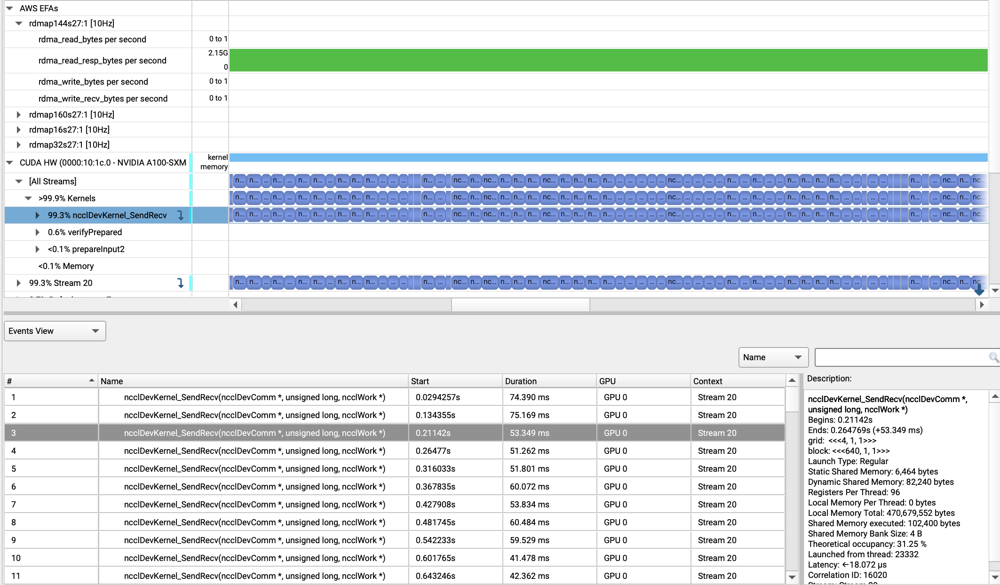
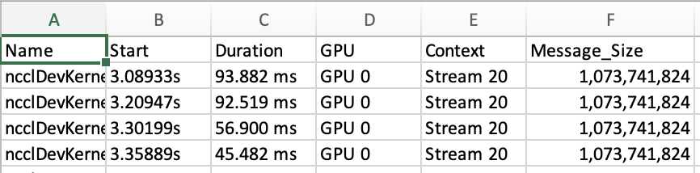
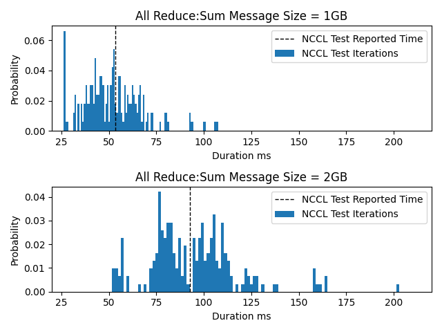
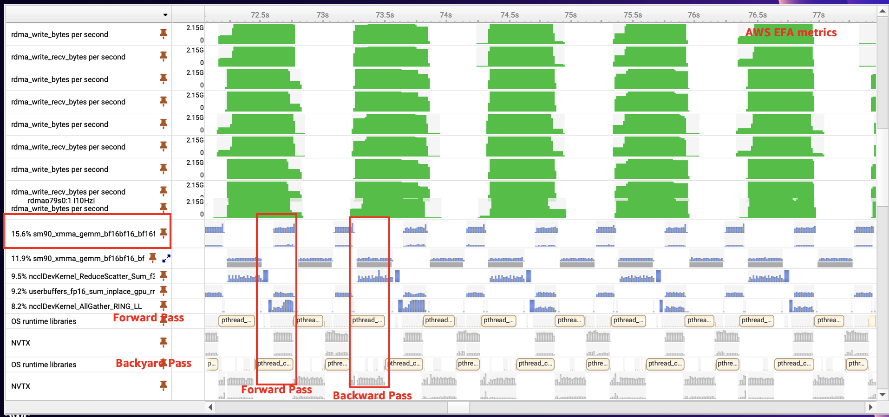
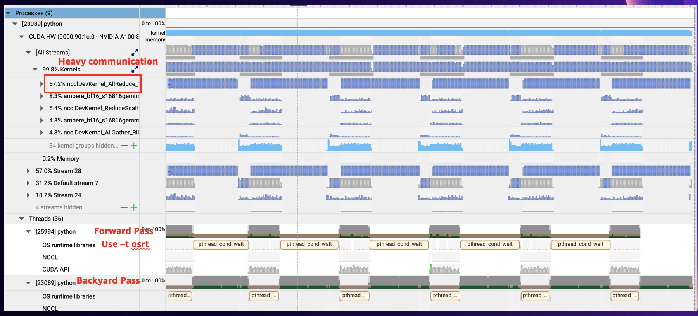
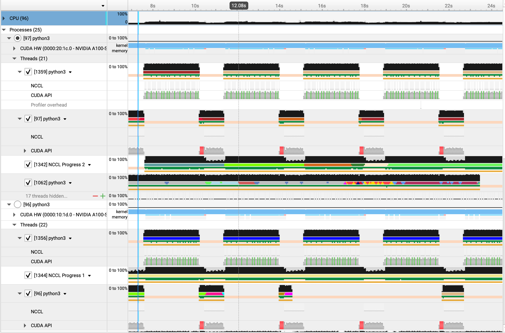

# Profile Distributed Training Applications with Nsight 

[Nsight Systems](https://developer.nvidia.com/nsight-systems) is a system-wide performance analysis tool designed to profile and visualize multi-node CPU and GPU workloads such as distributed training and inference to identify the largest opportunities to optimize, and tune to scale efficiently across the cluster. It also enables researchers to add their own markers into their code to surface application-level metrics into the profiler and gain further observability.

We will show how to profile and analyze:

1. [NCCL Tests](https://github.com/aws-samples/awsome-distributed-training/tree/main/micro-benchmarks/nccl-tests/slurm)
2. [Distributed training run with NeMo](https://github.com/aws-samples/awsome-distributed-training/tree/main/3.test_cases/2.nemo-launcher)
3. [Distributed training run with FSDP](https://github.com/aws-samples/awsome-distributed-training/tree/main/3.test_cases/10.FSDP)
4. Setup Nsight on an EKS cluster

# 0. Prerequisities

1. A cluster created with P4de or P5 nodes with AWS ParallelCluster or EKS
2. Before profiling the above workloads, make sure you can run them on your cluster.
3. For EKS, we will be using a 2 node P4de cluster with EFA enabled and FSx for Lustre mounted on the cluster

# 1. Export Environment Variables

Export the following variables to setup the profiling:

```bash
# Nsight Version
export Nsight_version=2024.4.1
export Nsight_download_url=https://developer.nvidia.com/downloads/assets/tools/secure/nsight-systems/2024_4/NsightSystems-linux-cli-public-2024.4.1.61-3431596.deb
export Nsight_cli_installer=$(basename "$Nsight_download_url")
export Nsight_Path=/fsx/nsight-efa
```

# 2. Installation

If you created the cluster with DLAMI or are using the default ParallelCluster base image, Nsight comes pre-installed. You can check the version in the `/usr/local/cuda/` folder you should see `nsight-systems-202x.x.x` folder. ParallelCluster 3.8.0 has the version 2023.2 version pre-installed. 

To get the latest Nsight 2024.3 version from [here](https://developer.nvidia.com/nsight-systems/get-started). If you are installing it on a remote cluster, then the CLI version would suffice. To install it on a Ubuntu based OS node:

```bash
# Download Nsight CLI
wget ${Nsight_download_url}

# Install
sudo dpkg -i ${Nsight_cli_installer}

# This would place the nsys binay at /opt/nvidia/nsight-systems-cli/2024.3.1/target-linux-x64/nsys
# Move to FSx filesystem
mkdir -p ${Nsight_Path}
cp -r /opt/nvidia/nsight-systems-cli/${Nsight_version}/* ${Nsight_Path}
```

The `nsight-efa`folder will have the necessary dependencies for the `host` which is the head node in a Slurm cluster from which the user works and controls the profiling session and `target` which refers to the GPU on which profiling happens. This latest version also has the `nic_sampler` in `/nsight-efa/target-linux-x64/plugins/` which collects the EFA metrics.


# 3. Profiling NCCL tests
In this section we will show how to generate Nsight reports for NCCL tests. Follow the instructions [here](https://github.com/aws-samples/awsome-distributed-training/tree/main/4.validation_and_observability/0.nccl-tests) to setup NCCL tests and generate the Enroot image `nccl.sqsh`. The `0.nsight_nccl.sbatch` script shows an example on how to profile the NCCL run with Nsight and collect EFA metrics. Key differences between `0.nsight_nccl.sbatch` and [this](https://github.com/aws-samples/awsome-distributed-training/blob/main/4.validation_and_observability/0.nccl-tests/1.nccl-tests.sbatch) are:

1. `/fsx` needs to be mounted to the container as this is where our Nsight binaries are located.
2. The `0.nsight_nccl.sbatch` script references the executable `nsys-slurm-exec` which is given below and should exist in `/fsx`

```bash
#! /bin/bash -x

NSYS_EXTRAS=""
if [ "$SLURM_LOCALID" == "0" ]; then
NSYS_EXTRAS="--enable efa_metrics"
fi

/fsx/nsight-efa/target-linux-x64/nsys profile $NSYS_EXTRAS --sample none --delay <DELAY-PERIOD> \
    --force-overwrite true --output <PATH-TO-SAVE-REPORT>/report_<REPORT-NAME-TAG>_job%q{SLURM_JOB_ID}_rank%q{SLURM_PROCID}_on_%q{HOSTNAME}.nsys-rep \
   "$@"
```
The above executable needs the following:

```bash
1. DELAY-PERIOD: Collection start delay in seconds. Typically the multi-node workload takes a few seconds before collection of relevant metrics start. Typically for distributed training applications delaying by ~30sec avoids having empty gaps in the timeline view of the Nsight report. For the NCCL test a delay of less than 5 seconds works. You can also specify --duration in seconds to collect metrics.

2. PATH-TO-SAVE-REPORT: One report is generated per GPU. Provide a path to save all reports.
3. REPORT-NAME-TAG: Unique name tag to group all reports. Use %q{} to include environment variables in report names.
```
Here, we are running the Nsight profile with 2 p4de nodes where each node has 4 EFA devices and 8 GPUs. The `nic sampler` metrics from all 4 EFA devices show up in every report so it is okay to collect these metrics only for 1 rank.

Below is a screenshot of the generated Nsight report:

<center> </br>
</center>

Here there are the following things to note:

•   The RDMA read bytes per second shown in green are from the EFA NIC samplers. You can see there are 4 `rdma*` rows in the report, one corresponding to each of the EFA devices one 1 node. For a P5.48xlarge node, you will see 32 rows.
•   This report is generated for the [Scatter Performance NCCL test](https://github.com/NVIDIA/nccl-tests/blob/2cbb968101e2bfc7d3a7f0f1826c0189355de6fe/src/scatter.cu#L34), which essentially calls the ncclSendRecv kernels again and again which is why ncclDevKernel_SendRecv takes 99.3% utilization among all kernels.
•   You can right click on any row to see the meta-data over time in the Events View which shows start times, durations and other meta-data for each kernel

> [!TIP]
> The *.qdstrm files are temporarily generated first using the nsys binaries in `.../target-linux-x64` while the `*.nsys-rep` report file is generated using the `/host-linux-x64/QdstrmImporter` binary. If for some reason, only `*.qdstrm` files are generated, use the above importer like below to generate a `*.nsys-rep report`
```bash
<Path-to-host-linux-x64>/host-linux-x64/QdstrmImporter –input-file <file-name>.qdstrm
```


## 3.1 NCCL All Reduce Test

Following the steps above, you can generate a similar result for NCCL All Reduce Test also see NCCL test output in the logs. Here we will visualize the spread in NCCL All Reduce communication for 1GB and 2GB message sizes. To do so you can:
1. Run NCCL test and generate report. Save the result for 1GB and 2GB message sizes.
2. Right click on `all_reduce_perf > NCCL` row to show in Events View. This Events View shows NCCL Kernel API calls on the CPU. You can see the NCCL Message Size for each call. Note row numbers where NCCL Message Sizes change.
3. Right click on `ncclDevKernel_AllReduce_Sum_f32_TREE_LL(ncclDevComm *, unsigned long, ncclWork *)` row and show in Events View. This Events View shows NCCL Kernel calls executed on the GPU, it start time and duration. Copy paste the entire table in a csv.
4. You should see 1-on-1 correlation between 3 and 4. Meaning for each NCCL call on the CPU there is a call executed on the GPU. Or in other words, the number of rows in Events View from 3 and 4 should exactly be the same.
5. Add NCCL Message Sizes from Step 3 to csv from Step 4. Save the csv as `all_reduce.csv` which should look like below:

<center> </br>
</center>

You can generate the plot below using the python script `/nccl/plot_nccl.py`

<center> </br>
</center>

# 4. Multi-node training with Slurm and Pyxis

In this section, we will show how to generate Nsight reports for a distributed training run with containers on Slurm. We will use the [NeMo launcher](https://github.com/NVIDIA/NeMo-Framework-Launcher/tree/main) to train the [Nemotron-15b](https://github.com/NVIDIA/NeMo-Framework-Launcher/blob/main/launcher_scripts/conf/training/nemotron/nemotron_15b.yaml) model on mock data. To setup NeMo launcher on Parallelcluster please refer to this [README](https://github.com/aws-samples/awsome-distributed-training/tree/main/3.test_cases/2.nemo-launcher). You can specify [nsys_profile.enabled:True](https://github.com/NVIDIA/NeMo-Framework-Launcher/blob/main/launcher_scripts/conf/training/nemotron/nemotron_15b.yaml#L162) in the model config and launch the training run. 

You can either generate the Nsight profile either by turning on the nsys_profile flag or if you want to generate the nsys report with a different Nsight version, then you can use the run script `/nemotron/1.nemotron.sbatch`


Below is a screenshot of the generated Nsight report:

<center> </br>
</center>

# 5. Working with the report

1. The Nsight Systems GUI offers to view the following. You can see these options by clicking on the Timeline View menu button.
a.  Output and error logfiles from the training run
b.  Analysis summary that gives a summary of the profiling session.
c.  Timeline view of the report
d.  Diagnostics summary view
2.  You can right click and pin any row at the top. This helps in analyzing multiple rows simultaneously.
3.  You can view start and execution times of any kernel by viewing them in the Events view.
4.  From the Events View, you can zoom to that specific kernel event by right clicking. This provides an easy way to look into kernel events preceding and following a specific kernel even if their durations are in nanoseconds.
5.  You can export the report in different formats such as sqllite and others as well for custom analysis.

# 6. Nsight Recipes

Once the report is generated, we can generate [recipes](https://docs.nvidia.com/nsight-systems/UserGuide/index.html#available-multi-report-recipes) to analyze the data in the report. We provide the script ` 2.generate_recipes.sh` which will generate multiple recipes for the report and upload to S3. Each recipe run will summarize the relevant data from the report and provide python scripts and jupyter notebooks to analyze the data.

Next, we will show what kind of analysis can be generated from the recipes.

To install requirements to generate recipes:

```bash
pip3 install -r ${Nsight_Path}/target-linux-x64/python/packages/nsys_recipe/requirements/common.txt
pip3 install -r ${Nsight_Path}/target-linux-x64/python/packages/nsys_recipe/requirements/dask.txt

```
With Nsight 2024.3, the following recipes are available:

```bash
The following built-in recipes are available:

  cuda_api_sum -- CUDA API Summary
  cuda_api_sync -- CUDA Synchronization APIs
  cuda_gpu_kern_pace -- CUDA GPU Kernel Pacing
  cuda_gpu_kern_sum -- CUDA GPU Kernel Summary
  cuda_gpu_mem_size_sum -- CUDA GPU MemOps Summary (by Size)
  cuda_gpu_mem_time_sum -- CUDA GPU MemOps Summary (by Time)
  cuda_gpu_time_util_map -- CUDA GPU Time Utilization Heatmap
  cuda_memcpy_async -- CUDA Async Memcpy with Pageable Memory
  cuda_memcpy_sync -- CUDA Synchronous Memcpy
  cuda_memset_sync -- CUDA Synchronous Memset
  diff -- Statistics Diff
  dx12_mem_ops -- DX12 Memory Operations
  gpu_gaps -- GPU Gaps
  gpu_metric_util_map -- GPU Metric Utilization Heatmap
  gpu_time_util -- GPU Time Utilization
  mpi_gpu_time_util_map -- MPI and GPU Time Utilization Heatmap
  mpi_sum -- MPI Summary
  nccl_gpu_overlap_trace -- NCCL GPU Overlap Trace
  nccl_gpu_proj_sum -- NCCL GPU Projection Summary
  nccl_gpu_time_util_map -- NCCL GPU Time Utilization Heatmap
  nccl_sum -- NCCL Summary
  network_traffic_map -- Network Devices Traffic Heatmap
  nvtx_gpu_proj_pace -- NVTX GPU Projection Pacing
  nvtx_gpu_proj_sum -- NVTX GPU Projection Summary
  nvtx_gpu_proj_trace -- NVTX GPU Projection Trace
  nvtx_pace -- NVTX Pacing
  nvtx_sum -- NVTX Range Summary
  osrt_sum -- OS Runtime Summary
  ucx_gpu_time_util_map -- UCX and GPU Time Utilization Heatmap
```

Please see the `2.generate_recipes.sh` to generate multiple recipes from a given report as below:

```bash
# Do not include nsys-rep extension
export NSIGHT_REPORT_NAME=
./2.generate_recipes.sh
```

# 7. Distributed training run with FSDP

Next we will show how to profile the [10.FSDP](https://github.com/aws-samples/awsome-distributed-training/tree/main/3.test_cases/10.FSDP) test case. We will show explicitly how to generate a profile for specific training steps rather than providing `--delay` and `--duration` parameters. To this end, we provide the relevant files in the `fsdp-llama2` folder. To profile speciific training steps:

1. Add `nsys_start_step` and `nsys_end_step` as input arguments to your train.py
2. Add the following in the training loop to start collecting data from Cuda and OSRT traces:
```python
if batch_idx == args.nsys_start_step and global_rank == 0:
    logger.info("====== Start nsys profiling ======")
    torch.cuda.cudart().cudaProfilerStart()
```
3. Add to stop collection:
```python
if batch_idx == args.nsys_end_step and global_rank == 0:
    logger.info("====== Stop nsys profiling ======")
    torch.cuda.cudart().cudaProfilerStop()
```
4. Add `--capture-range=cudaProfilerApi --capture-range-end=stop` to the `nsys profile ...` command.

Below is a screenshot of the generated Nsight report:

<center> </br>
</center>

# 8. Nsight on EKS

We will use the [Nvidia Devtools Sidecar Injector](https://catalog.ngc.nvidia.com/orgs/nvidia/teams/devtools/helm-charts/devtools-sidecar-injector) to profile containerized applications.

Pull the Nsight docker image - This step will not be needed once the 2024.4 version is released.

```bash
docker pull nvcr.io/nvstaging/devtools/nsight-systems-cli:2024.4.1-ubuntu22.04

# Push image to ECR
```

## 8.1 Make changes to the `custom_values.yaml`

```bash
# If we dont specify the Nsight image, 2024.2 version is used by default.
# Will use 2024.4 version which is planned to be released by 5/24/2024
devtoolBinariesImage:
  image: ${REGISTRY}.dkr.ecr.${REGION}.amazonaws.com/nsight-systems-cli:2024.4.1-ubuntu22.04
  imagePullPolicy: Always

# Assuming EKS cluster has a FSx for Lustre filesystem mounted on it. Nsight reports will be saved in /fsx_shared
profile:
  volumes:
    [
      {
        "name": "nsys-output-volume",
        "persistentVolumeClaim": { "claimName": "fsx-pvc" }
      }
    ]
  volumeMounts:
    [
      {
        "name": "nsys-output-volume",
        "mountPath": "/fsx_shared"
      }
    ]

  # CLI options: https://docs.nvidia.com/nsight-systems/UserGuide/index.html#cli-command-switches
  # delay and duration values in secs

  # Use %{} to include environment variables in the Nsight report filename

  # The arguments for the Nsight Systems. The placeholders will be replaced with the actual values.
  devtoolArgs: "profile --force-overwrite true --trace nvtx,cuda  --delay 150 --duration 60 \
  -o /fsx_shared/fsdp/auto_{PROCESS_NAME}_%{POD_FULLNAME}_%{CONTAINER_NAME}_{TIMESTAMP}_{UID}.nsys-rep"

  injectionMatch: "^/usr/bin/python3 /usr/local/bin/torchrun.*$"
  #injectionMatch: "^.*torchrun.*$"
```

## 8.2 Install injector

Install helm chart for the sidecar injector as below:
```bash
helm install -f custom_values.yaml \
    devtools-sidecar-injector https://helm.ngc.nvidia.com/nvidia/devtools/charts/devtools-sidecar-injector-1.0.0.tgz
```

## 8.3 Add label to training job manifest

Add the following label:

```bash
pytorchReplicaSpecs:
    Worker:
      replicas: 2
      restartPolicy: OnFailure
      template:
        metadata:
          labels:
            app: fsdp
            nvidia-devtools-sidecar-injector: enabled
```

## 8.4 Run Training job

Run the training job as:

```bash
kubectl apply -f fsdp.yaml
```
The report will get saved to `/fsx_shared`

Below is a screenshot of the generated Nsight report:

<center> </br>
</center>

## 8.5 Uninstall injector

To uninstall injector:

```bash
helm uninstall devtools-sidecar-injector

kubectl delete namespace nvidia-devtools-sidecar-injector

kubectl delete mutatingwebhookconfigurations sidecar-injector-webhook
kubectl delete mutatingwebhookconfiguration nvidia-devtools-sidecar-injector-webhook

kubectl delete cm -n example-ns nvidia-devtools-sidecar-injector
kubectl delete cm -n example-ns nvidia-devtools-sidecar-injector-custom

kubectl delete cm nvidia-devtools-sidecar-injector
kubectl delete cm nvidia-devtools-sidecar-injector-custom
```